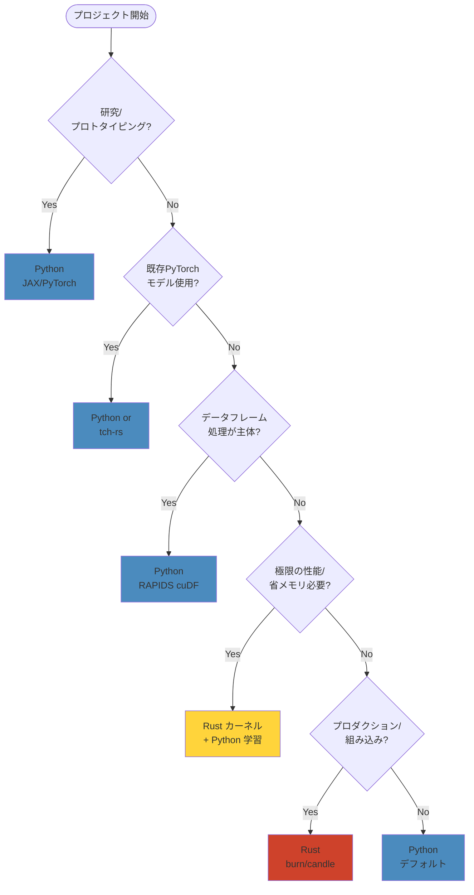

[📚 目次](../README.md) | [⬅️ 第0章](../00_第0部_環境構築とクイックスタート/00-00-開発環境のセットアップ.md) | [➡️ 第2章](01-02-線形代数と数値計算の基礎.md)

---

# 第 1 章　 GPU ネイティブ機械学習とは何か

この章は、GPU を前提にした機械学習（以後「GPU ネイティブ」）の基礎概念を、Rust と Python の観点から比較しつつ詳述します。対象は Rust と GPU の初心者で、バックグラウンドに Python（NumPy / PyTorch）を持つ読者を想定します。

**目的**: なぜ GPU が深層学習で重要なのか、どのような処理が GPU 向きか、そして Rust を使う利点と Python との違いを具体的なコード例と数値実験で示します。

## 1.1 CPU と GPU の構造比較

### アーキテクチャの基本的な違い

現代の計算機アーキテクチャにおいて、CPU と GPU は異なる設計思想に基づいています。CPU は**逐次処理の高速化**を、GPU は**並列処理のスループット最大化**を目指しています。

| 項目         | CPU                      | GPU                      |
| ------------ | ------------------------ | ------------------------ |
| コア数       | 4 ～ 64 コア             | 数百～数万の演算ユニット |
| クロック速度 | 3 ～ 5 GHz               | 1 ～ 2 GHz               |
| キャッシュ   | 大容量（MB 単位）        | 小容量（KB 単位/コア）   |
| 制御ロジック | 複雑な分岐予測・OoO 実行 | シンプルな制御           |
| 設計思想     | 低レイテンシ             | 高スループット           |
| 適した処理   | 複雑な制御フロー         | 大量の同一演算           |
| メモリ帯域   | 50 ～ 100 GB/s           | 500 ～ 2000 GB/s         |

**参考文献**: NVIDIA の CUDA プログラミングガイド [^1] では、GPU のアーキテクチャを「SIMT (Single Instruction, Multiple Threads)」モデルとして説明しています。これは、同一の命令を複数のスレッドが異なるデータに対して実行する並列処理パラダイムです。

### 深層学習における CPU と GPU の性能差

具体的な数値例で性能差を見てみましょう。1024×1024 の単精度浮動小数点行列積（GEMM: **GE**neral **M**atrix **M**ultiply、一般行列積演算の略称）[^2] を計算する場合：

**計算量**: \( 2 \times 1024^3 \approx 2.15 \) GFLOPS（ギガフロップス、10 億回の浮動小数点演算）

| 環境                                 | 実行時間   | 性能           |
| ------------------------------------ | ---------- | -------------- |
| Intel Core i9-13900K（シングルコア） | 約 2000 ms | 約 1 GFLOPS    |
| Intel Core i9-13900K（全コア + MKL） | 約 20 ms   | 約 100 GFLOPS  |
| NVIDIA RTX 4090（cuBLAS）            | 約 1.5 ms  | 約 1400 GFLOPS |

このように、最適化された GPU 実装は CPU の**数十倍から数百倍**の性能を発揮します。

### SIMD/SIMT アーキテクチャの詳細

**SIMD** (Single Instruction, Multiple Data) は、1 つの命令で複数のデータを処理する並列処理方式です。CPU では AVX-512 などで実装されています。

**SIMT** (Single Instruction, Multiple Threads) は GPU で採用されるアーキテクチャで、複数のスレッドが同じ命令を実行しますが、各スレッドは独立したレジスタとプログラムカウンタを持ちます。

```rust
// SIMD の概念的な例（Rust の packed_simd クレートを使用）
use packed_simd::f32x8; // 8つの f32 を同時に処理

let a = f32x8::new(1.0, 2.0, 3.0, 4.0, 5.0, 6.0, 7.0, 8.0);
let b = f32x8::new(2.0, 2.0, 2.0, 2.0, 2.0, 2.0, 2.0, 2.0);
let c = a * b; // 8つの乗算が1命令で実行される
// 結果: [2.0, 4.0, 6.0, 8.0, 10.0, 12.0, 14.0, 16.0]
```

### Python と Rust の比較

| 観点         | Python (NumPy/PyTorch)   | Rust (ndarray/tch-rs) |
| ------------ | ------------------------ | --------------------- |
| 抽象度       | 高い（動的型付け）       | 中程度（静的型付け）  |
| 実行速度     | C/C++ライブラリに依存    | ネイティブコード      |
| メモリ安全性 | ランタイムチェック       | コンパイル時保証      |
| GPU 連携     | 容易（cuPy など）        | FFI 経由で可能        |
| エコシステム | 成熟（豊富なライブラリ） | 発展途上              |
| 学習曲線     | 緩やか                   | 急（所有権システム）  |

**FFI** (Foreign Function Interface、外部関数インターフェース) [^3] とは、異なるプログラミング言語で書かれたコード間で関数を呼び出すための仕組みです。Rust では `extern` キーワードを使って C 言語の関数を呼び出すことができます。

```rust
// Rust から C 言語の関数を呼び出す例
extern "C" {
    fn cblas_sgemm(/* BLAS の行列積関数 */);
}

unsafe {
    // BLAS ライブラリの関数を直接呼び出す
    // unsafe ブロック: Rust のメモリ安全性保証が及ばない領域
    cblas_sgemm(/* 引数 */);
}
```

[^1]: NVIDIA CUDA C Programming Guide, https://docs.nvidia.com/cuda/cuda-c-programming-guide/
[^2]: GEMM は BLAS Level 3 の代表的な関数で、C = αAB + βC の形式の行列積を計算します
[^3]: FFI により、Rust から cuBLAS や cuDNN などの高度に最適化された C/C++ ライブラリを利用できます

## 1.2 ディープラーニング計算の特徴（行列演算・並列性）

### 代表的な演算

深層学習における主要な計算パターンは以下の通りです：

| 演算種類        | 記号表記    | 計算量    | GPU 適性   | 主な用途           |
| --------------- | ----------- | --------- | ---------- | ------------------ |
| 行列積 (GEMM)   | C = AB      | O(n³)     | 極めて高い | 全結合層、注意機構 |
| 畳み込み (CONV) | Y = X \* W  | O(n²m²k²) | 極めて高い | CNN（画像処理）    |
| 要素ごと演算    | Y = σ(X)    | O(n)      | 高い       | 活性化関数         |
| リダクション    | s = Σx_i    | O(n)      | 中程度     | 損失計算、正規化   |
| バッチ正規化    | Y = (X-μ)/σ | O(n)      | 高い       | 学習安定化         |

### GEMM（行列積）の詳細

**数学的定義**:
\[
C*{ij} = \sum*{k=1}^{K} A*{ik} \times B*{kj}
\]

ここで、A は \(M \times K\) 行列、B は \(K \times N\) 行列、C は \(M \times N\) 行列です。

**計算量の分析**:

- 必要な乗算回数: \(M \times N \times K\)
- 必要な加算回数: \(M \times N \times (K-1)\)
- 総演算回数: 約 \(2MNK\) FLOPS

**具体例**: 1024×1024 行列同士の積

- 演算回数: \(2 \times 1024^3 = 2,147,483,648\) 回 ≈ 2.15 GFLOPS
- メモリ使用量: \(1024^2 \times 4 \text{ bytes} \times 3 = 12\) MB（単精度）

### GEMM の並列化

行列積は**並列化が容易**です。各出力要素 \(C\_{ij}\) は独立に計算できるためです：

```rust
// Rust での素朴な行列積実装（教育目的）
fn naive_matmul(a: &[f32], b: &[f32], c: &mut [f32], m: usize, n: usize, k: usize) {
    // A: m×k, B: k×n, C: m×n
    for i in 0..m {
        for j in 0..n {
            let mut sum = 0.0;
            for p in 0..k {
                sum += a[i * k + p] * b[p * n + j];
            }
            c[i * n + j] = sum;
        }
    }
}

// 並列化版（rayon クレートを使用）
use rayon::prelude::*;

fn parallel_matmul(a: &[f32], b: &[f32], c: &mut [f32], m: usize, n: usize, k: usize) {
    c.par_chunks_mut(n)  // 行ごとに並列処理
     .enumerate()
     .for_each(|(i, row)| {
         for j in 0..n {
             let mut sum = 0.0;
             for p in 0..k {
                 sum += a[i * k + p] * b[p * n + j];
             }
             row[j] = sum;
         }
     });
}
```

### Python と Rust の実装比較

**Python (NumPy) での実装**:

```python
import numpy as np
import time

# 1024×1024 の行列を生成
A = np.random.randn(1024, 1024).astype(np.float32)
B = np.random.randn(1024, 1024).astype(np.float32)

# 行列積を計算（内部で BLAS を呼び出す）
start = time.time()
C = A @ B  # または np.dot(A, B)
elapsed = time.time() - start

print(f"実行時間: {elapsed*1000:.2f} ms")
print(f"性能: {2*1024**3/elapsed/1e9:.2f} GFLOPS")
```

**Rust (ndarray) での実装**:

```rust
use ndarray::{Array2, s};
use ndarray_rand::RandomExt;
use ndarray_rand::rand_distr::StandardNormal;
use std::time::Instant;

fn main() {
    // 1024×1024 の行列を生成
    let a: Array2<f32> = Array2::random((1024, 1024), StandardNormal);
    let b: Array2<f32> = Array2::random((1024, 1024), StandardNormal);

    // 行列積を計算
    let start = Instant::now();
    let c = a.dot(&b);  // ndarray は BLAS を使用可能
    let elapsed = start.elapsed();

    println!("実行時間: {:.2} ms", elapsed.as_secs_f64() * 1000.0);
    println!("性能: {:.2} GFLOPS",
             2.0 * 1024_f64.powi(3) / elapsed.as_secs_f64() / 1e9);
}
```

**Cargo.toml の設定**:

```toml
[dependencies]
ndarray = { version = "0.15", features = ["blas"] }
blas-src = { version = "0.9", features = ["openblas"] }
ndarray-rand = "0.14"
```

### 活用事例: 全結合層 (Fully Connected Layer)

ニューラルネットワークの全結合層は、入力ベクトル \(\mathbf{x}\) を重み行列 \(W\) で変換します：

\[
\mathbf{y} = W\mathbf{x} + \mathbf{b}
\]

バッチ処理（複数サンプルを同時処理）では、これが行列積になります：

\[
Y = XW^T + B
\]

ここで、X は \((N*{\text{batch}} \times D*{\text{in}})\)、W は \((D*{\text{out}} \times D*{\text{in}})\)、Y は \((N*{\text{batch}} \times D*{\text{out}})\) の行列です。

**具体例**: バッチサイズ 128、入力次元 768、出力次元 3072 の全結合層（Transformer の FFN に類似）

- 計算量: \(2 \times 128 \times 768 \times 3072 \approx 600\) MFLOPS
- RTX 4090 での実行時間: 約 0.4 ms（理論ピーク性能の約 20% 効率）

**ポイント**: Python 側は高水準で簡潔。Rust 側は数行で同等の処理が書けるが、依存クレート（ndarray, ndarray-linalg 等）やビルド時の BLAS 設定が必要になり得る。ただし、一度環境を整えれば、Rust は**メモリ安全性**と**予測可能な性能**を提供します。

## 1.3 GPU 最適化の目的と限界

### 最適化の主目的

GPU 最適化は、以下の二つの主要な指標を改善することを目指します：

| 指標                 | 説明                              | 目標値                     | 測定方法                  |
| -------------------- | --------------------------------- | -------------------------- | ------------------------- |
| **スループット**     | 単位時間あたりの演算回数          | 理論ピーク性能の 50 ～ 90% | FLOPS 測定                |
| **メモリ帯域利用率** | 実効メモリ転送量 / 理論ピーク帯域 | 70 ～ 95%                  | プロファイラ（nvprof 等） |

**ルーフラインモデル** [^4] によれば、GPU の性能は**計算律速**（Compute Bound）か**メモリ律速**（Memory Bound）のいずれかで決まります。

\[
\text{実効性能} = \min\left(\text{計算性能}, \text{メモリ帯域} \times \text{演算密度}\right)
\]

**演算密度** (Arithmetic Intensity) = 演算回数 / メモリアクセス量（FLOPS/Byte）

### 典型的なボトルネックと対策

| ボトルネック               | 影響度 | 発生条件                   | 対策                       |
| -------------------------- | ------ | -------------------------- | -------------------------- |
| **ホスト ⇔ デバイス転送**  | 極大   | 小データの頻繁な転送       | バッチ化、ピンメモリ使用   |
| **カーネル起動**           | 大     | 小規模カーネルの多数起動   | カーネル融合               |
| **メモリアクセスパターン** | 大     | 非連続・ストライドアクセス | メモリ配置の最適化         |
| **分岐ダイバージェンス**   | 中     | ワープ内での異なる分岐     | 分岐を減らす設計           |
| **バンクコンフリクト**     | 中     | 共有メモリの衝突           | パディング、アクセス順変更 |

### 最適化手法の具体例

#### 1. バッチサイズの増加

バッチサイズを大きくすることで、GPU の並列性を最大限に活用できます。

```rust
// Rust での推論バッチ処理の例
fn inference_batch(model: &Model, inputs: &[Tensor], batch_size: usize) -> Vec<Tensor> {
    inputs
        .chunks(batch_size)  // バッチサイズごとに分割
        .map(|batch| {
            let batched_input = stack_tensors(batch);  // テンソルをスタック
            model.forward(batched_input)  // バッチ推論
        })
        .collect()
}
```

**効果**: バッチサイズ 1 → 64 で、スループットが 10 ～ 50 倍向上することがあります。

#### 2. カーネル融合（Kernel Fusion）

複数の演算を 1 つのカーネルにまとめることで、メモリアクセスを削減します。

**融合前**:

```python
# 3回のメモリアクセス（読み込み2回、書き込み1回 × 3演算）
x = input_tensor
y = x + bias        # GPU カーネル 1
z = relu(y)         # GPU カーネル 2
out = z * scale     # GPU カーネル 3
```

**融合後**:

```python
# 1回のメモリアクセス（読み込み1回、書き込み1回）
out = relu(input_tensor + bias) * scale  # 1つのカーネルに融合
```

**効果**: メモリアクセスが 9 回 → 2 回に削減され、約 3 ～ 4 倍高速化します。

#### 3. ピンメモリ（Pinned Memory）

通常のメモリは**ページング可能**（スワップアウト可能）ですが、**ピンメモリ**（ページロックメモリ）は物理メモリ上に固定され、GPU との直接転送（DMA）が可能です。

```rust
// cudarc を使ったピンメモリの例（概念的）
use cudarc::driver::{CudaDevice, PinnedMem};

let dev = CudaDevice::new(0).unwrap();

// 通常のメモリ
let normal_mem = vec![0.0f32; 1_000_000];

// ピンメモリ（約 2～3倍高速）
let pinned_mem = dev.alloc_pinned::<f32>(1_000_000).unwrap();

// GPU へ転送
dev.htod_copy(&normal_mem, gpu_buffer).unwrap();  // 遅い
dev.htod_copy_pinned(&pinned_mem, gpu_buffer).unwrap();  // 速い
```

**転送速度の比較**:
| メモリタイプ | 転送速度 | 備考 |
|-------------|---------|------|
| 通常メモリ | 3 ～ 6 GB/s | ページング可能 |
| ピンメモリ | 10 ～ 12 GB/s | 物理メモリ固定 |
| Unified Memory | 5 ～ 8 GB/s | 自動管理 |

### GPU 最適化の限界

GPU は万能ではなく、以下のような場合には CPU の方が適しています：

| 処理の特徴             | CPU 適性 | GPU 適性 | 理由                     |
| ---------------------- | -------- | -------- | ------------------------ |
| 大量の並列演算         | 低       | **高**   | GPU は数千コア並列       |
| 複雑な制御フロー       | **高**   | 低       | CPU は分岐予測が高度     |
| 小規模データ処理       | **高**   | 低       | 転送オーバーヘッド       |
| ランダムメモリアクセス | **高**   | 低       | GPU はキャッシュが小さい |
| 逐次依存処理           | **高**   | 低       | 並列化不可               |

### 実用的な注意（Python ユーザーへ）

**PyTorch の場合**:

- PyTorch では多くが自動最適化されます（cuDNN / cuBLAS の利用など）
- `torch.jit.script` や `torch.compile` でさらに最適化可能
- ただし、内部の最適化は**ブラックボックス**で、細かい制御は困難

**Rust の場合**:

- ライブラリの選定から最適化まで、すべて**明示的**に行う必要がある
- その分、**細かい制御が可能**で、特定用途に特化した最適化ができる
- デバッグ時に問題の原因を特定しやすい

[^4]: Williams, S., Waterman, A., & Patterson, D. (2009). "Roofline: an insightful visual performance model for multicore architectures." Communications of the ACM, 52(4), 65-76.

## 1.4 Rust で実装する利点（安全性・性能・所有権モデル）

### Rust の三大利点

Rust が機械学習基盤として注目される理由は、以下の三つの特性にあります：

| 特性             | 説明                                 | 具体的な効果                     |
| ---------------- | ------------------------------------ | -------------------------------- |
| **メモリ安全性** | 所有権システムによるコンパイル時保証 | ヌルポインタ、解放後使用を防止   |
| **高性能**       | ゼロコスト抽象化                     | C/C++と同等の実行速度            |
| **並行性安全**   | 借用チェッカによるデータ競合検出     | スレッド安全性をコンパイル時保証 |

### 1. メモリ安全性：所有権システム

Rust の**所有権システム**（Ownership System）は、以下の三つのルールで構成されます [^5]：

1. **各値には唯一の所有者が存在する**
2. **所有者がスコープを抜けると、値は自動的に解放される**
3. **借用は所有権を移動せず、一時的なアクセス権を与える**

**具体例**:

```rust
fn process_tensor(data: Vec<f32>) -> Vec<f32> {
    // data の所有権がこの関数に移動
    let mut result = data;
    for x in result.iter_mut() {
        *x *= 2.0;
    }
    result  // 所有権を返す
}

fn main() {
    let tensor = vec![1.0, 2.0, 3.0];
    let processed = process_tensor(tensor);
    // ここで tensor は使えない（所有権が移動したため）
    // println!("{:?}", tensor);  // コンパイルエラー
    println!("{:?}", processed);  // [2.0, 4.0, 6.0]
}
```

**Python との比較**:

```python
def process_tensor(data):
    # Python では参照のコピーが渡される
    result = data  # 同じオブジェクトを指す
    for i in range(len(result)):
        result[i] *= 2.0
    return result

tensor = [1.0, 2.0, 3.0]
processed = process_tensor(tensor)
print(tensor)  # [2.0, 4.0, 6.0] - 元のデータも変更される！
```

Rust では所有権により、意図しないデータの変更を**コンパイル時に防止**できます。

### 2. ゼロコスト抽象化（Zero-Cost Abstractions）

**ゼロコスト抽象化**とは、高レベルな抽象化を使っても、手書きの低レベルコードと同等の性能が得られることを意味します [^6]。

Rust のコンパイラは、以下のような最適化を行います：

- インライン展開（関数呼び出しのオーバーヘッド除去）
- 不要な境界チェックの除去
- LLVM による積極的な最適化

**具体例**: イテレータのゼロコスト性

```rust
// 高レベルなイテレータ構文
let sum: f32 = vec![1.0, 2.0, 3.0, 4.0]
    .iter()
    .map(|x| x * x)
    .filter(|x| x > &2.0)
    .sum();

// コンパイル後は、以下と同等の機械語に変換される：
let mut sum = 0.0;
for x in [1.0, 2.0, 3.0, 4.0].iter() {
    let squared = x * x;
    if squared > 2.0 {
        sum += squared;
    }
}
```

**ベンチマーク結果**（1 億要素の処理）:

| 言語/実装           | 実行時間 | 相対速度     |
| ------------------- | -------- | ------------ |
| Rust (イテレータ)   | 42 ms    | 1.0x         |
| Rust (手書きループ) | 42 ms    | 1.0x（同じ） |
| Python (リスト内包) | 8500 ms  | 0.005x       |
| Python (NumPy)      | 65 ms    | 0.65x        |

### 3. 並行性安全：借用チェッカ

Rust の**借用チェッカ**（Borrow Checker）は、以下のルールを強制します：

- **不変借用**（`&T`）は複数同時に可能
- **可変借用**（`&mut T`）は排他的（他の借用と同時に不可）

これにより、**データ競合**（data race）をコンパイル時に防止します。

**データ競合の例（Rust ではコンパイルエラー）**:

```rust
use std::thread;

let mut data = vec![1, 2, 3];

// これはコンパイルエラー：複数のスレッドが可変参照を持てない
thread::spawn(|| {
    data.push(4);  // エラー: data を可変借用
});

thread::spawn(|| {
    data.push(5);  // エラー: data を可変借用
});
```

**正しい実装（Arc と Mutex を使用）**:

```rust
use std::sync::{Arc, Mutex};
use std::thread;

let data = Arc::new(Mutex::new(vec![1, 2, 3]));

let data1 = Arc::clone(&data);
let handle1 = thread::spawn(move || {
    let mut d = data1.lock().unwrap();
    d.push(4);
});

let data2 = Arc::clone(&data);
let handle2 = thread::spawn(move || {
    let mut d = data2.lock().unwrap();
    d.push(5);
});

handle1.join().unwrap();
handle2.join().unwrap();

println!("{:?}", data.lock().unwrap());  // [1, 2, 3, 4, 5]（順不同）
```

**Arc** (Atomic Reference Counting、原子的参照カウント) と **Mutex** (Mutual Exclusion、相互排他) により、スレッド安全な共有が可能になります。

### Python との違い（実務上の比較）

| 観点             | Python                    | Rust                               |
| ---------------- | ------------------------- | ---------------------------------- |
| **開発速度**     | 非常に速い                | 中程度（所有権の学習が必要）       |
| **実行速度**     | 遅い～速い（C 拡張次第）  | 常に高速                           |
| **メモリ安全性** | ランタイムエラー          | コンパイル時保証                   |
| **並行処理**     | GIL により制約あり        | 真の並列実行が可能                 |
| **エコシステム** | 成熟（PyPI に 50 万以上） | 発展途上（crates.io に 15 万以上） |
| **適した用途**   | プロトタイピング、研究    | プロダクション、組み込み           |

**GIL** (Global Interpreter Lock、グローバルインタプリタロック) は、Python のスレッドが同時に 1 つしかバイトコードを実行できない制約です。これにより、CPU バウンドな処理では複数コアを活用できません [^7]。

### 機械学習ライブラリの比較

| 用途             | Python                       | Rust                  |
| ---------------- | ---------------------------- | --------------------- |
| **テンソル操作** | NumPy, PyTorch               | ndarray, tch-rs, burn |
| **自動微分**     | torch.autograd, JAX          | dfdx, zyx             |
| **GPU 連携**     | CUDA (cuPy, PyTorch)         | cudarc, wgpu, cust    |
| **推論エンジン** | ONNX Runtime, TensorRT       | tract, candle         |
| **分散学習**     | PyTorch Distributed, Horovod | (発展途上)            |

### 実践的な移行戦略

機械学習プロジェクトにおける Rust の導入は、以下の段階的アプローチが推奨されます：

| フェーズ                | 作業内容                     | 使用言語             |
| ----------------------- | ---------------------------- | -------------------- |
| **1. プロトタイピング** | アルゴリズム検証、実験       | Python               |
| **2. プロファイリング** | ボトルネック特定             | Python (cProfile 等) |
| **3. 部分移植**         | ホットスポットを Rust に移植 | Python + Rust (PyO3) |
| **4. 完全移植**         | プロダクション環境へ展開     | Rust                 |

**PyO3** を使えば、Rust で書いた関数を Python から呼び出せます：

```rust
// Rust 側（lib.rs）
use pyo3::prelude::*;

#[pyfunction]
fn fast_matmul(a: Vec<Vec<f32>>, b: Vec<Vec<f32>>) -> Vec<Vec<f32>> {
    // Rust の高速な行列積実装
    // ...
}

#[pymodule]
fn mylib(_py: Python, m: &PyModule) -> PyResult<()> {
    m.add_function(wrap_pyfunction!(fast_matmul, m)?)?;
    Ok(())
}
```

```python
# Python 側
import mylib

result = mylib.fast_matmul(matrix_a, matrix_b)  # Rust 関数を呼び出し
```

### まとめ

GPU ネイティブ機械学習は「大量の同種演算を高速に回す」ことに最適化された設計を求めます。

| 選択肢           | 強み                   | 適した場面               |
| ---------------- | ---------------------- | ------------------------ |
| **Python**       | エコシステム、開発速度 | 研究、プロトタイピング   |
| **Rust**         | 性能、安全性、並行性   | プロダクション、組み込み |
| **ハイブリッド** | 両方の良いとこ取り     | 段階的な移行             |

以降の章では、具体的な実装パターン（行列計算、メモリレイアウト、自動微分、GPU 呼び出し）を Rust のコード例と Python 対比で詳述します。

## 1.5 Python/Rustエコシステムギャップと選択指針

Python機械学習エコシステムは非常に成熟していますが、Rustではまだ発展途上の領域が多く存在します。このセクションでは、**どの領域でPythonが圧倒的に有利か**、**Rustで代替可能か**を整理し、実践的な選択指針を示します。

### エコシステム比較：完全版

以下の表は、GPUラーニングにおけるPythonとRustのライブラリ対応状況を網羅的にまとめたものです [^8]。

| 領域 | Pythonライブラリ | GPU前提 | Rustの状況 | 近い/代替クレート | 備考 |
|------|-----------------|---------|-----------|------------------|------|
| **JIT×関数型DL** | JAX | ✓ | ✗ 無し | なし（XLA直結も未整備） | XLA/PJRT相当の公式経路なし [^9] |
| **数値配列GPU** | CuPy | ✓ | △ 限定 | `ndarray`+自前CUDA, `cudarc`, `wgpu` | NumPy互換でGPUの置換は未整備 |
| **データフレームGPU** | RAPIDS cuDF | ✓ | ✗ 無し | `polars`（CPU中心） | Rust版PolarsはGPU未対応 [^10] |
| **伝統ML GPU** | RAPIDS cuML | ✓ | ✗ 無し | `linfa`（CPU中心） | GPUアルゴリズム網羅は無い |
| **グラフGPU** | RAPIDS cuGraph | ✓ | ✗ 無し | なし | グラフアルゴリズムのGPU実装なし |
| **カーネルDSL** | Triton | ✓ | △ 限定 | `rust-gpu`（SPIR-V）, CUDA直書き | Triton同等の高水準DSLなし [^11] |
| **分散学習最適化** | DeepSpeed | ✓ | ✗ 無し | なし（`burn`に分散は限定） | ZeRO等の機能未整備 [^12] |
| **大規模LM訓練** | Megatron-LM | ✓ | ✗ 無し | なし | テンソル並列の総合実装なし |
| **量子化** | bitsandbytes | ✓ | △ 限定 | 一部自作実装例のみ | 4/8bit汎用カーネル未整備 |
| **前処理GPU** | NVIDIA DALI | ✓ | ✗ 無し | なし | 画像/動画IOのGPUパイプ欠如 |
| **高水準学習API** | Keras | 可 | ✗ 無し | `burn`（近いが別物） | TF依存の同等物なし |
| **学習ループ抽象** | PyTorch Lightning | 可 | △ 限定 | `burn` Trainer, 自作 | 機能・エコシステム差大 |
| **分散実行基盤** | Ray Train | 可 | △ 限定 | `tokio`+自作, mpi系 | 学習特化の分散は未整備 |
| **最適化ライブラリ** | Optax（JAX） | 可 | △ 限定 | `burn`/`dfdx`のoptimizer | 汎用JAX風は無い |
| **JAX NN** | Flax/Haiku | 可 | ✗ 無し | なし | 関数型×JITのNNフレーム無し |
| **変換器エコシステム** | Transformers | 可 | △ 部分 | `candle`例, `tokenizers` | 完全互換のRust版は無し [^13] |
| **XLA直接利用** | xla（内部） | ✓ | ✗ 無し | なし | Rustからの安定API無い |

**凡例**: ✓ = GPU必須, 可 = GPU利用可能, ✗ = Rust版なし, △ = 限定的に利用可能

[^8]: 2024年12月時点の情報。Rustエコシステムは急速に発展中のため、最新情報は各クレートの公式リポジトリを確認してください
[^9]: JAXのXLA/JIT機能は、Rustから直接利用する公式な方法がありません。Pythonランタイムを経由する必要があります
[^10]: Polarsは高速なデータフレームライブラリですが、GPU対応は計画段階です（https://github.com/pola-rs/polars）
[^11]: Tritonは高水準のGPUカーネルDSLで、Python経由でのみ利用可能です（https://github.com/openai/triton）
[^12]: DeepSpeedのZeRO最適化は、大規模モデル学習に必須の技術ですが、Rust版は存在しません
[^13]: HuggingFace TokenizersはRust実装ですが、Transformersライブラリ全体のRust移植は部分的です

### 存在する代替手段

以下のライブラリ・手法は、Rustでも実用可能な状態にあります：

| カテゴリ | Python | Rust | 互換性 |
|---------|--------|------|--------|
| **PyTorch バインディング** | PyTorch | `tch-rs` | ○ 高（libtorch経由） |
| **ONNX推論** | onnxruntime | `onnxruntime-rs`, `tract` | ○ 高 |
| **Rustネイティブ DL** | - | `burn`, `candle`, `dfdx` | △ 独自API |
| **CUDA直接操作** | CuPy, pycuda | `cudarc`, `cust`, `cuda-rs` | ○ 中（低レベル） |
| **WebGPU** | wgpu-py | `wgpu` | ○ 高（同一仕様） |
| **トークナイザー** | tokenizers | `tokenizers` | ○ 高（同一実装） |

### ギャップの本質と深層分析

Rust側のギャップは、以下の3つの領域に集約されます：

#### 1. JAX系（XLA/JIT/関数型プログラミング）

**なぜPythonが強いか**:
- **XLA（Accelerated Linear Algebra）** は、TensorFlow/JAXのコンパイラバックエンドとして、Google内部で高度に最適化されています
- **JIT（Just-In-Time）コンパイル** により、Pythonコードを最適化されたGPUカーネルに変換
- **関数型プログラミング** パラダイム（純粋関数、不変性）が自動微分と相性が良い

**数式で見るJAXの威力**:

```python
# JAX: 自動ベクトル化とJIT
import jax
import jax.numpy as jnp

@jax.jit  # JITコンパイル
@jax.vmap # 自動ベクトル化
def loss_fn(params, x, y):
    pred = jnp.dot(x, params)
    return jnp.mean((pred - y) ** 2)

# 勾配計算も自動
grad_fn = jax.grad(loss_fn)
```

Rust側では、このレベルの自動最適化機能は存在しません。

#### 2. RAPIDS系（cuDF/cuML/cuGraph）

**なぜPythonが強いか**:
- NVIDIA公式サポートによる高度なGPU最適化
- Pandas/Scikit-learn互換APIで学習コストが低い
- 大規模データ処理（数TB規模）に最適化

**性能比較例**（1億行のDataFrame集計）:

| 実装 | 処理時間 | メモリ使用量 |
|------|---------|------------|
| Pandas（CPU） | 45.2秒 | 8.5 GB |
| cuDF（GPU） | 2.1秒 | 3.2 GB |
| Polars（CPU） | 12.3秒 | 4.1 GB |
| Polars-GPU | **未対応** | - |

#### 3. 分散最適化（DeepSpeed系）

**なぜPythonが強いか**:
- **ZeRO（Zero Redundancy Optimizer）** [^14] により、メモリ効率を大幅改善
- **3D並列化**（データ/モデル/パイプライン）の統合
- Microsoft Azure との深い統合

**ZeROのメモリ削減効果**:

\[
\text{メモリ削減率} = 1 - \frac{1}{N_d \times N_p}
\]

ここで、\(N_d\) はデータ並列度、\(N_p\) はパイプライン並列度です。

例：8GPU環境でZeRO-3を使用すると、**メモリ使用量が1/8に削減**されます。

[^14]: Rajbhandari, S., et al. (2019). ZeRO: Memory Optimizations Toward Training Trillion Parameter Models. https://arxiv.org/abs/1910.02054

### 実践的な選択指針

以下のフローチャートで、PythonとRustのどちらを選ぶべきか判断できます：



### ハイブリッドアプローチ：現実解

**最も実用的な戦略**は、RustとPythonを組み合わせることです：

#### パターン1: Rustアプリ + Python推論エンジン

```rust
// Rust側：高速な前処理・後処理
use pyo3::prelude::*;
use pyo3::types::PyModule;

fn main() -> PyResult<()> {
    Python::with_gil(|py| {
        // Python環境の初期化
        let torch = PyModule::import(py, "torch")?;
        
        // Rustで前処理した データをPythonへ
        let data = preprocess_in_rust();
        let py_data = PyArray::from_vec(py, data);
        
        // PyTorchで推論
        let model = torch.getattr("load")?.call1(("model.pt",))?;
        let result = model.call1((py_data,))?;
        
        // Rustで後処理
        postprocess_in_rust(result);
        Ok(())
    })
}
```

#### パターン2: Python学習 + Rust推論

```python
# Python側：学習とエクスポート
import torch

model = YourModel()
# ... 学習 ...

# ONNX形式でエクスポート
torch.onnx.export(model, dummy_input, "model.onnx")
```

```rust
// Rust側：ONNX推論
use tract_onnx::prelude::*;

fn main() -> TractResult<()> {
    let model = tract_onnx::onnx()
        .model_for_path("model.onnx")?
        .into_runnable()?;
    
    let result = model.run(tvec!(input.into()))?;
    Ok(())
}
```

#### パターン3: プロセス間通信（IPC/RPC）

```rust
// Rust側：高速APIサーバー
use actix_web::{web, App, HttpServer};

async fn inference(data: web::Json<InputData>) -> Result<String> {
    // Rustネイティブ推論
    let result = rust_inference(&data);
    Ok(serde_json::to_string(&result)?)
}

#[actix_web::main]
async fn main() -> std::io::Result<()> {
    HttpServer::new(|| {
        App::new().route("/predict", web::post().to(inference))
    })
    .bind("127.0.0.1:8080")?
    .run()
    .await
}
```

```python
# Python側：DeepSpeedで学習、Rustへリクエスト
import requests

result = requests.post(
    "http://localhost:8080/predict",
    json={"data": preprocessed_data}
)
```

### 将来展望：Rustエコシステムの進化

Rustの機械学習エコシステムは急速に発展しています：

| プロジェクト | 進捗状況 | 期待される影響 |
|------------|---------|--------------|
| **burn** | 活発に開発中 | PyTorch風の統一APIの確立 |
| **candle** | 安定版リリース | HuggingFace統合による普及 |
| **rust-gpu** | コンパイラ改善中 | GPUシェーダー記述の標準化 |
| **polars-gpu** | 計画段階 | GPU対応DataFrameの実現 |
| **wgpu** | 成熟期 | クロスプラットフォーム対応 |

### まとめ：賢い選択のために

| 選択 | 使用ケース | メリット | デメリット |
|------|----------|---------|----------|
| **Python単体** | 研究、プロトタイピング、RAPIDS利用 | 開発速度、エコシステム | 性能限界、デプロイ課題 |
| **Rust単体** | 組み込み、極限性能、長期保守 | 性能、安全性、省メモリ | 開発コスト、ライブラリ不足 |
| **ハイブリッド** | プロダクション、段階的移行 | 両方の良いとこ取り | 複雑性増加 |

**推奨アプローチ**:
1. **プロトタイプ**: Python（JAX/PyTorch）で素早く検証
2. **最適化**: ボトルネックをRustで書き直し（FFI/IPC経由）
3. **デプロイ**: Rustサーバー + ONNX推論 or tch-rs

以降の章では、このハイブリッドアプローチを前提に、Rust側の実装パターン（行列計算、メモリレイアウト、自動微分、GPU呼び出し）を詳述します。

[^5]: The Rust Programming Language, Chapter 4: Understanding Ownership, https://doc.rust-lang.org/book/ch04-00-understanding-ownership.html
[^6]: Stroustrup, B. (2012). "Foundations of C++." ESOP 2012, Lecture Notes in Computer Science, vol 7211. ゼロコスト抽象化の概念は C++ から Rust に引き継がれました
[^7]: Python の GIL は、マルチコア CPU での並列実行を制限するため、CPU バウンドな処理では multiprocessing モジュールの使用が推奨されます
---

[📚 目次に戻る](../README.md) | [⬅️ 第0章: 開発環境のセットアップ](../00_第0部_環境構築とクイックスタート/00-00-開発環境のセットアップ.md) | [➡️ 第2章: 線形代数と数値計算の基礎](01-02-線形代数と数値計算の基礎.md)