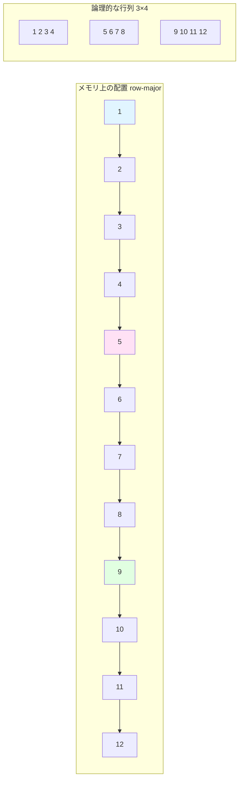

[📚 目次](../README.md) | [⬅️ 第1章](01-01-GPUネイティブ機械学習とは何か.md) | [➡️ 第3章](01-03-自動微分の仕組み.md)

---

# 第 2 章　線形代数と数値計算の基礎

本章では、機械学習で頻出する線形代数の基本概念と、数値計算における実装上の注意点を取り上げます。特に、行列積（GEMM）と畳み込み（CONV）について、数式・コード・活用事例を交えて詳述します。

## 2.1 ベクトル・行列・テンソル

### 基本的な定義

| 名称             | 次元   | 形状表記     | 具体例        | 用途                  |
| ---------------- | ------ | ------------ | ------------- | --------------------- |
| **スカラー**     | 0 次元 | ()           | 3.14          | 損失値、学習率        |
| **ベクトル**     | 1 次元 | (n,)         | [1, 2, 3]     | 埋め込みベクトル      |
| **行列**         | 2 次元 | (m, n)       | [[1,2],[3,4]] | 重み行列              |
| **3 階テンソル** | 3 次元 | (d, m, n)    | RGB 画像      | 画像（C×H×W）         |
| **4 階テンソル** | 4 次元 | (b, d, m, n) | バッチ画像    | ミニバッチ（N×C×H×W） |

**テンソル**は多次元配列の一般化であり、機械学習では以下の形状が頻出します：

**画像データ**: \((N, C, H, W)\)

- N: バッチサイズ
- C: チャネル数（RGB なら 3）
- H: 高さ（Height）
- W: 幅（Width）

**系列データ**: \((N, T, D)\)

- N: バッチサイズ
- T: 時系列長（Time steps）
- D: 特徴次元

### 形状とストライドの重要性

テンソルの**形状**（shape）は各次元のサイズ、**ストライド**（stride）は隣接要素間のメモリオフセットです。

**具体例**: 3×4 行列（row-major 配置）

```rust
// Rust での例
use ndarray::Array2;

let matrix = Array2::from_shape_vec((3, 4), vec![
    1.0, 2.0, 3.0, 4.0,   // 1行目
    5.0, 6.0, 7.0, 8.0,   // 2行目
    9.0, 10.0, 11.0, 12.0 // 3行目
]).unwrap();

println!("形状: {:?}", matrix.shape());      // [3, 4]
println!("ストライド: {:?}", matrix.strides()); // [4, 1]
// ストライド [4, 1] の意味：
// - 次の行に移動するには 4 要素分進む
// - 次の列に移動するには 1 要素分進む
```

**メモリレイアウトの可視化**:



**ストライド [4, 1] の意味**:
- 次の行: 4要素分進む（1→5, 5→9）
- 次の列: 1要素分進む（1→2, 2→3）

**ストライドの計算**:
\[
\text{offset}(i, j) = i \times \text{stride}[0] + j \times \text{stride}[1] = 4i + j
\]

### Python と Rust でのテンソル操作

**Python (NumPy)**:

```python
import numpy as np

# 3次元テンソルの作成
tensor = np.random.randn(2, 3, 4)  # 形状: (2, 3, 4)
print(f"形状: {tensor.shape}")
print(f"ストライド: {tensor.strides}")  # バイト単位
print(f"要素数: {tensor.size}")
print(f"次元数: {tensor.ndim}")

# スライス操作（ビュー：コピーなし）
sub_tensor = tensor[:, 1:, :]  # 形状: (2, 2, 4)
print(f"スライス後のストライド: {sub_tensor.strides}")
```

**Rust (ndarray)**:

```rust
use ndarray::{Array3, s};
use ndarray_rand::RandomExt;
use ndarray_rand::rand_distr::StandardNormal;

// 3次元テンソルの作成
let tensor: Array3<f64> = Array3::random((2, 3, 4), StandardNormal);
println!("形状: {:?}", tensor.shape());        // [2, 3, 4]
println!("ストライド: {:?}", tensor.strides()); // [12, 4, 1]（要素数単位）
println!("要素数: {}", tensor.len());
println!("次元数: {}", tensor.ndim());

// スライス操作（ビュー：コピーなし）
let sub_tensor = tensor.slice(s![.., 1.., ..]);  // 形状: [2, 2, 4]
println!("スライス後のストライド: {:?}", sub_tensor.strides());
```

**ストライドの違い**:

- NumPy: バイト単位（f64 なら 8 の倍数）
- ndarray: 要素数単位（型に依らず整数）

## 2.2 行列積と畳み込みの計算量

### 畳み込み演算（Convolution）の詳細

**畳み込み**は CNN（Convolutional Neural Network、畳み込みニューラルネットワーク）の中核演算で、画像の局所的な特徴を抽出します。

#### 2 次元畳み込みの数学的定義

入力 \(X\) とカーネル（フィルタ）\(W\) の畳み込み：

\[
Y*{ij} = \sum*{m=0}^{K*h-1} \sum*{n=0}^{K*w-1} X*{i+m, j+n} \times W\_{mn}
\]

**パラメータ**:

- 入力サイズ: \(H \times W\)
- カーネルサイズ: \(K_h \times K_w\)
- 出力サイズ: \((H - K_h + 1) \times (W - K_w + 1)\)（パディング・ストライドなしの場合）

#### 具体的な計算例

**入力画像** \(X\) (5×5):

```
1  2  3  4  5
6  7  8  9  10
11 12 13 14 15
16 17 18 19 20
21 22 23 24 25
```

**カーネル（エッジ検出フィルタ）** \(W\) (3×3):

```
-1  0  1
-2  0  2
-1  0  1
```

**出力の計算**（左上の要素）:
\[
Y*{0,0} = \sum*{m=0}^{2} \sum*{n=0}^{2} X*{m,n} \times W\_{m,n}
\]

\[
= (1 \times -1) + (2 \times 0) + (3 \times 1) + (6 \times -2) + (7 \times 0) + (8 \times 2) + (11 \times -1) + (12 \times 0) + (13 \times 1)
\]

\[
= -1 + 0 + 3 - 12 + 0 + 16 - 11 + 0 + 13 = 8
\]

#### Rust での実装

```rust
// 2D 畳み込みの素朴な実装
fn conv2d_naive(
    input: &[f32],   // 入力画像（H×W）
    kernel: &[f32],  // カーネル（Kh×Kw）
    output: &mut [f32], // 出力（Oh×Ow）
    h: usize, w: usize,        // 入力サイズ
    kh: usize, kw: usize       // カーネルサイズ
) {
    let oh = h - kh + 1;  // 出力の高さ
    let ow = w - kw + 1;  // 出力の幅

    for i in 0..oh {
        for j in 0..ow {
            let mut sum = 0.0;
            for m in 0..kh {
                for n in 0..kw {
                    sum += input[(i + m) * w + (j + n)] * kernel[m * kw + n];
                }
            }
            output[i * ow + j] = sum;
        }
    }
}

// 使用例
fn main() {
    let input = vec![
        1.0, 2.0, 3.0, 4.0, 5.0,
        6.0, 7.0, 8.0, 9.0, 10.0,
        11.0, 12.0, 13.0, 14.0, 15.0,
        16.0, 17.0, 18.0, 19.0, 20.0,
        21.0, 22.0, 23.0, 24.0, 25.0,
    ];

    let kernel = vec![
        -1.0, 0.0, 1.0,
        -2.0, 0.0, 2.0,
        -1.0, 0.0, 1.0,
    ];

    let mut output = vec![0.0; 3 * 3];  // 3×3 の出力

    conv2d_naive(&input, &kernel, &mut output, 5, 5, 3, 3);

    println!("出力: {:?}", output);
}
```

#### 計算量の分析

**素朴な実装の計算量**:

入力: \(C*{in} \times H \times W\)  
カーネル: \(C*{out} \times C*{in} \times K_h \times K_w\)  
出力: \(C*{out} \times H*{out} \times W*{out}\)

\[
\text{計算量} = C*{out} \times H*{out} \times W*{out} \times C*{in} \times K_h \times K_w \times 2
\]

**具体例**: ResNet-50 の最初の畳み込み層

- 入力: \(3 \times 224 \times 224\)
- カーネル: \(64 \times 3 \times 7 \times 7\)
- ストライド: 2
- 出力: \(64 \times 112 \times 112\)

計算量: \(64 \times 112 \times 112 \times 3 \times 7 \times 7 \times 2 \approx 118\) MFLOPS

### 畳み込みの最適化手法

畳み込みには複数の実装方法があり、サイズや用途によって最適な手法が異なります。

| 手法              | 計算量                           | メモリ使用量 | 適した場面     |
| ----------------- | -------------------------------- | ------------ | -------------- |
| **素朴な実装**    | \(O(C*{out}H_oW_oC*{in}K_hK_w)\) | 小           | 小規模カーネル |
| **im2col + GEMM** | \(O(C*{out}H_oW_oC*{in}K_hK_w)\) | 大           | 大規模バッチ   |
| **FFT 畳み込み**  | \(O(C*{out}C*{in}HW\log(HW))\)   | 大           | 大規模カーネル |
| **Winograd**      | \(O(C*{out}H_oW_oC*{in})\)       | 中           | 3×3 カーネル   |

#### im2col（Image to Column）による GEMM への変換

im2col は畳み込みを行列積に変換する手法で、最適化された BLAS ライブラリを活用できます [^8]。

**アイデア**: 畳み込みの各位置で使う入力パッチを列として展開する。

**例**: 5×5 入力、3×3 カーネル

**im2col 変換後の行列**（各列が 1 つの出力位置に対応）:

```
位置(0,0) 位置(0,1) 位置(0,2) ...
1         2         3         ...
2         3         4         ...
3         4         5         ...
6         7         8         ...
7         8         9         ...
8         9         10        ...
11        12        13        ...
12        13        14        ...
13        14        15        ...
```

**行列積として計算**:
\[
\text{Output} = \text{Kernel} \times \text{im2col}(X)
\]

カーネルは \((C*{out} \times (C*{in} \times K*h \times K_w))\) 行列、im2col 後は \(((C*{in} \times K_h \times K_w) \times (H_o \times W_o))\) 行列。

**Rust での実装例**:

```rust
use ndarray::{Array2, Array4, s};

// im2col 変換（簡略版）
fn im2col(
    input: &Array4<f32>,  // (N, C, H, W)
    kernel_h: usize,
    kernel_w: usize,
) -> Array2<f32> {
    let (n, c, h, w) = input.dim();
    let out_h = h - kernel_h + 1;
    let out_w = w - kernel_w + 1;

    let col_size = c * kernel_h * kernel_w;
    let num_patches = n * out_h * out_w;

    let mut col = Array2::<f32>::zeros((col_size, num_patches));

    let mut patch_idx = 0;
    for batch in 0..n {
        for i in 0..out_h {
            for j in 0..out_w {
                let mut row_idx = 0;
                for ch in 0..c {
                    for kh in 0..kernel_h {
                        for kw in 0..kernel_w {
                            col[[row_idx, patch_idx]] = input[[batch, ch, i + kh, j + kw]];
                            row_idx += 1;
                        }
                    }
                }
                patch_idx += 1;
            }
        }
    }

    col
}

// 畳み込みを GEMM で計算
fn conv2d_gemm(
    input: &Array4<f32>,     // (N, C_in, H, W)
    weight: &Array4<f32>,    // (C_out, C_in, Kh, Kw)
) -> Array4<f32> {
    let (n, c_in, h, w) = input.dim();
    let (c_out, _, kh, kw) = weight.dim();
    let out_h = h - kh + 1;
    let out_w = w - kw + 1;

    // im2col 変換
    let col = im2col(input, kh, kw);

    // カーネルを行列に変形: (C_out, C_in*Kh*Kw)
    let weight_mat = weight.view().into_shape((c_out, c_in * kh * kw)).unwrap();

    // 行列積: (C_out, C_in*Kh*Kw) × (C_in*Kh*Kw, N*H_out*W_out)
    let output_mat = weight_mat.dot(&col);

    // 出力を4次元テンソルに変形
    output_mat.into_shape((c_out, n, out_h, out_w))
        .unwrap()
        .permuted_axes([1, 0, 2, 3])  // (N, C_out, H_out, W_out)
}
```

**メモリ使用量の代償**:

- im2col はメモリを大量に消費する（\(C\_{in} \times K_h \times K_w \times H_o \times W_o\)）
- 例: バッチ 128、入力 64×56×56、カーネル 3×3 の場合、約 1.8 GB 必要

#### Winograd 畳み込み

Winograd アルゴリズムは、小さなカーネル（特に 3×3）の畳み込みを高速化する手法です [^9]。乗算回数を削減できます。

**効果**: 3×3 カーネルの場合、乗算回数を約 2.25 倍削減（9 回 → 4 回）

**トレードオフ**: 加算回数は増加し、数値誤差が大きくなる場合がある。

### 活用事例: CNN での畳み込み

#### LeNet-5（手書き数字認識）

```rust
// LeNet-5 の第1畳み込み層の例
// 入力: 1×32×32（グレースケール画像）
// 出力: 6×28×28（6つの特徴マップ）

use ndarray::{Array4, Axis};

fn lenet_conv1(input: &Array4<f32>) -> Array4<f32> {
    // input shape: (batch, 1, 32, 32)
    // kernel shape: (6, 1, 5, 5)

    let batch_size = input.shape()[0];
    let mut output = Array4::<f32>::zeros((batch_size, 6, 28, 28));

    // 6つのカーネルで畳み込み
    for b in 0..batch_size {
        for out_ch in 0..6 {
            // 畳み込み演算（実際には最適化ライブラリを使用）
            // conv2d_naive() を呼び出す
        }
    }

    output
}
```

**計算量**: \(6 \times 28 \times 28 \times 1 \times 5 \times 5 \times 2 \approx 118\) KFLOPS/サンプル

#### ResNet（画像分類）

ResNet は深い CNN で、畳み込みを多段に積み重ねます [^10]。

**特徴**:

- 残差接続（Residual Connection）により深いネットワークを学習可能に
- ボトルネック構造（1×1 → 3×3 → 1×1）で計算量削減

**ResNet-50 の計算量**: 約 4 GFLOPS/画像

### 計算量の実測例

| ネットワーク    | 入力サイズ | パラメータ数 | 計算量      | GPU 推論時間（RTX 4090） |
| --------------- | ---------- | ------------ | ----------- | ------------------------ |
| LeNet-5         | 32×32×1    | 60K          | 0.4 MFLOPS  | 0.05 ms                  |
| AlexNet         | 224×224×3  | 61M          | 720 MFLOPS  | 1.2 ms                   |
| VGG-16          | 224×224×3  | 138M         | 15.5 GFLOPS | 5.8 ms                   |
| ResNet-50       | 224×224×3  | 25.6M        | 4.1 GFLOPS  | 2.1 ms                   |
| EfficientNet-B0 | 224×224×3  | 5.3M         | 390 MFLOPS  | 1.5 ms                   |

[^8]: Chellapilla, K., Puri, S., & Simard, P. (2006). "High performance convolutional neural networks for document processing." International Workshop on Frontiers in Handwriting Recognition.
[^9]: Lavin, A., & Gray, S. (2016). "Fast Algorithms for Convolutional Neural Networks." CVPR 2016. arXiv:1509.09308
[^10]: He, K., Zhang, X., Ren, S., & Sun, J. (2016). "Deep Residual Learning for Image Recognition." CVPR 2016. arXiv:1512.03385

## 2.3 メモリレイアウトとキャッシュ効率

### Row-Major vs Column-Major

行列のメモリ配置には 2 つの方式があります：

| 配置方式                         | 配列順序 | 使用言語/ライブラリ          | ストライド（3×4 行列） |
| -------------------------------- | -------- | ---------------------------- | ---------------------- |
| **Row-Major** (C order)          | 行優先   | C, C++, Python (NumPy), Rust | [4, 1]                 |
| **Column-Major** (Fortran order) | 列優先   | Fortran, MATLAB, R           | [1, 3]                 |

**具体例**: 3×4 行列

```
A = | 1  2  3  4  |
    | 5  6  7  8  |
    | 9  10 11 12 |
```

**Row-Major (C order)**: メモリ上は `[1, 2, 3, 4, 5, 6, 7, 8, 9, 10, 11, 12]`  
**Column-Major (Fortran order)**: メモリ上は `[1, 5, 9, 2, 6, 10, 3, 7, 11, 4, 8, 12]`

### キャッシュ効率への影響

**CPU キャッシュの階層**:

| レベル           | サイズ       | レイテンシ          | 用途             |
| ---------------- | ------------ | ------------------- | ---------------- |
| **L1**           | 32 ～ 64 KB  | 4 サイクル          | 最も頻繁なデータ |
| **L2**           | 256KB ～ 1MB | 10 ～ 20 サイクル   | やや頻繁なデータ |
| **L3**           | 8 ～ 32 MB   | 40 ～ 75 サイクル   | 共有キャッシュ   |
| **メインメモリ** | 8 ～ 128 GB  | 100 ～ 300 サイクル | すべてのデータ   |

**キャッシュラインサイズ**: 通常 64 バイト（f32 なら 16 要素、f64 なら 8 要素）

### キャッシュミスの例

**非効率な列アクセス（Row-Major 行列）**:

```rust
// 列ごとにアクセス（キャッシュミス多発）
fn sum_columns_slow(matrix: &Array2<f32>) -> Vec<f32> {
    let (rows, cols) = matrix.dim();
    let mut sums = vec![0.0; cols];

    for j in 0..cols {
        for i in 0..rows {
            sums[j] += matrix[[i, j]];  // 非連続アクセス
        }
    }
    sums
}
```

**効率的な行アクセス**:

```rust
// 行ごとにアクセス（キャッシュヒット率高）
fn sum_columns_fast(matrix: &Array2<f32>) -> Vec<f32> {
    let (rows, cols) = matrix.dim();
    let mut sums = vec![0.0; cols];

    for i in 0..rows {
        for j in 0..cols {
            sums[j] += matrix[[i, j]];  // 連続アクセス
        }
    }
    sums
}
```

**性能差**: 大きな行列（10000×10000）では、**10 ～ 50 倍**の性能差が出ることがあります。

### ブロッキング（タイリング）による最適化

**ブロッキング**は、行列を小さなブロックに分割してキャッシュに収める手法です [^11]。

**素朴な行列積**:

```rust
fn matmul_naive(a: &[f32], b: &[f32], c: &mut [f32], n: usize) {
    for i in 0..n {
        for j in 0..n {
            for k in 0..n {
                c[i * n + j] += a[i * n + k] * b[k * n + j];
            }
        }
    }
}
```

**ブロッキング版**:

```rust
fn matmul_blocked(a: &[f32], b: &[f32], c: &mut [f32], n: usize, block_size: usize) {
    // ブロックごとに処理
    for i0 in (0..n).step_by(block_size) {
        for j0 in (0..n).step_by(block_size) {
            for k0 in (0..n).step_by(block_size) {
                // ブロック内の計算
                for i in i0..std::cmp::min(i0 + block_size, n) {
                    for j in j0..std::cmp::min(j0 + block_size, n) {
                        let mut sum = c[i * n + j];
                        for k in k0..std::cmp::min(k0 + block_size, n) {
                            sum += a[i * n + k] * b[k * n + j];
                        }
                        c[i * n + j] = sum;
                    }
                }
            }
        }
    }
}
```

**ブロックサイズの選択**:

- L1 キャッシュに収まるサイズ: 通常 32 ～ 64
- 実測で最適値を決定（CPU 依存）

**性能改善**: 1024×1024 行列で、素朴な実装と比べて **5 ～ 10 倍** 高速化

### メモリアライメント

**アライメント**（alignment）は、データが特定のアドレス境界に配置されることを指します。

```rust
use std::alloc::{alloc, Layout};

// 64 バイトアライメントのメモリ確保（SIMD 最適化用）
unsafe {
    let layout = Layout::from_size_align(1024 * 4, 64).unwrap();
    let ptr = alloc(layout) as *mut f32;

    // ptr は 64 バイト境界に配置される
}
```

**効果**:

- SIMD 命令の効率が向上
- キャッシュラインの境界をまたがない

## 2.4 BLAS/LAPACK の仕組みと役割

### BLAS の階層構造

**BLAS** (Basic Linear Algebra Subprograms、基本線形代数サブプログラム) は、線形代数演算の標準インターフェースです [^12]。

| レベル      | 演算内容         | 計算量 | 代表的な関数    |
| ----------- | ---------------- | ------ | --------------- |
| **Level 1** | ベクトル演算     | O(n)   | axpy, dot, norm |
| **Level 2** | 行列・ベクトル積 | O(n²)  | gemv, ger       |
| **Level 3** | 行列・行列積     | O(n³)  | gemm, trmm      |

**GEMM** (GEneral Matrix Multiply) は Level 3 の中核関数：

\[
C := \alpha \cdot op(A) \cdot op(B) + \beta \cdot C
\]

ここで、\(op(X)\) は \(X\) または \(X^T\)

### 主要な BLAS 実装

| 実装                 | 特徴                            | 性能     | ライセンス           |
| -------------------- | ------------------------------- | -------- | -------------------- |
| **OpenBLAS**         | オープンソース、幅広い CPU 対応 | 高       | BSD                  |
| **Intel MKL**        | Intel CPU に最適化              | 極めて高 | 商用（条件付き無料） |
| **BLIS**             | モダンな設計、拡張性            | 高       | BSD                  |
| **Apple Accelerate** | macOS 標準                      | 高       | 無料                 |

### GPU 向け BLAS

| 実装        | 対応 GPU    | 性能     | ライセンス           |
| ----------- | ----------- | -------- | -------------------- |
| **cuBLAS**  | NVIDIA      | 極めて高 | CUDA Toolkit（無料） |
| **rocBLAS** | AMD         | 高       | MIT                  |
| **clBLAS**  | OpenCL 対応 | 中       | Apache 2.0           |

**性能比較**（4096×4096 行列積、単精度）:

| 実装                 | 実行時間 | GFLOPS |
| -------------------- | -------- | ------ |
| 素朴な実装（CPU）    | 35000 ms | 4      |
| OpenBLAS（16 コア）  | 450 ms   | 300    |
| Intel MKL（16 コア） | 320 ms   | 425    |
| cuBLAS（RTX 4090）   | 2.5 ms   | 54000  |

### Rust から BLAS を使う

**ndarray-linalg を使った例**:

```rust
use ndarray::{Array2, arr2};
use ndarray_linalg::*;

fn main() {
    // 行列の作成
    let a = arr2(&[[1.0, 2.0], [3.0, 4.0]]);
    let b = arr2(&[[5.0, 6.0], [7.0, 8.0]]);

    // 行列積（内部で BLAS を呼び出す）
    let c = a.dot(&b);
    println!("{:?}", c);

    // LU分解（LAPACK を呼び出す）
    let (lu, pivot) = a.factorize_into().unwrap();

    // 固有値計算（LAPACK を呼び出す）
    let eigenvalues = a.eigenvalues().unwrap();
    println!("固有値: {:?}", eigenvalues);
}
```

**Cargo.toml の設定**:

```toml
[dependencies]
ndarray = "0.15"
ndarray-linalg = { version = "0.16", features = ["openblas-static"] }

[features]
default = []
intel-mkl = ["ndarray-linalg/intel-mkl-static"]
```

### LAPACK の役割

**LAPACK** (Linear Algebra PACKage) は、BLAS の上に構築された高度な線形代数ライブラリです。

**主な機能**:

- 連立一次方程式の求解
- 固有値・固有ベクトル計算
- 特異値分解（SVD）
- QR 分解、Cholesky 分解

**機械学習での用途**:

- 主成分分析（PCA）: SVD を使用
- 線形回帰: QR 分解や正規方程式
- カーネル法: 固有値分解

### Python と Rust の BLAS 利用比較

**Python (NumPy)**:

```python
import numpy as np

# NumPy は自動的に BLAS を使用
a = np.random.randn(1000, 1000)
b = np.random.randn(1000, 1000)
c = a @ b  # 内部で BLAS の gemm を呼び出し

# どの BLAS が使われているか確認
np.show_config()
```

**Rust (ndarray)**:

```rust
use ndarray::Array2;
use ndarray_rand::RandomExt;
use ndarray_rand::rand_distr::StandardNormal;

// BLAS feature を有効にする必要がある
let a: Array2<f64> = Array2::random((1000, 1000), StandardNormal);
let b: Array2<f64> = Array2::random((1000, 1000), StandardNormal);
let c = a.dot(&b);  // BLAS 有効なら gemm を呼び出し
```

**注意点**:

- Rust では BLAS のリンクを明示的に設定する必要がある
- ビルド時の依存関係が複雑になる場合がある
- 一度設定すれば、Python と同等以上の性能が得られる

[^11]: Lam, M. S., Rothberg, E. E., & Wolf, M. E. (1991). "The cache performance and optimizations of blocked algorithms." ACM SIGPLAN Notices, 26(4), 63-74.
[^12]: Lawson, C. L., Hanson, R. J., Kincaid, D. R., & Krogh, F. T. (1979). "Basic linear algebra subprograms for Fortran usage." ACM Transactions on Mathematical Software, 5(3), 308-323.

### 数値安定性と精度

#### 浮動小数点数の限界

**IEEE 754 浮動小数点数**の表現範囲：

| 型      | 仮数部 | 指数部 | 精度（10 進） | 範囲       |
| ------- | ------ | ------ | ------------- | ---------- |
| **f32** | 23 bit | 8 bit  | 約 7 桁       | ±3.4×10³⁸  |
| **f64** | 52 bit | 11 bit | 約 16 桁      | ±1.8×10³⁰⁸ |

**丸め誤差の例**:

```rust
fn main() {
    let a: f32 = 0.1 + 0.2;
    let b: f32 = 0.3;
    println!("{} == {}: {}", a, b, a == b);  // false!
    println!("差: {}", (a - b).abs());        // 1.490116e-8
}
```

#### Kahan 加算アルゴリズム

大量の値を加算する際、**Kahan 加算**（補償加算）で誤差を減らせます [^13]。

```rust
// 素朴な加算（誤差が蓄積）
fn sum_naive(values: &[f32]) -> f32 {
    values.iter().sum()
}

// Kahan 加算（誤差補償）
fn sum_kahan(values: &[f32]) -> f32 {
    let mut sum = 0.0;
    let mut compensation = 0.0;  // 誤差の補償項

    for &value in values {
        let y = value - compensation;
        let t = sum + y;
        compensation = (t - sum) - y;
        sum = t;
    }
    sum
}

// ベンチマーク
fn main() {
    let values: Vec<f32> = (0..1_000_000).map(|i| 1.0 / (i as f32 + 1.0)).collect();

    let naive = sum_naive(&values);
    let kahan = sum_kahan(&values);
    let reference = values.iter().map(|&x| x as f64).sum::<f64>() as f32;

    println!("素朴な加算: {}, 誤差: {:.2e}", naive, (naive - reference).abs());
    println!("Kahan加算: {}, 誤差: {:.2e}", kahan, (kahan - reference).abs());
}
```

**結果例**:

- 素朴な加算の誤差: 約 1.2×10⁻³
- Kahan 加算の誤差: 約 3.5×10⁻⁵（約 30 倍改善）

#### 数値安定性の例：ソフトマックス関数

**ソフトマックス**は深層学習の出力層でよく使われます：

\[
\text{softmax}(x_i) = \frac{e^{x_i}}{\sum_j e^{x_j}}
\]

**問題**: \(x_i\) が大きいとオーバーフロー、小さいとアンダーフロー

**安定化手法**: 最大値を引く

\[
\text{softmax}(x_i) = \frac{e^{x_i - \max(x)}}{\sum_j e^{x_j - \max(x)}}
\]

```rust
use ndarray::{Array1, Axis};

// 不安定な実装
fn softmax_unstable(x: &Array1<f32>) -> Array1<f32> {
    let exp_x = x.mapv(|v| v.exp());
    let sum = exp_x.sum();
    exp_x / sum
}

// 安定な実装
fn softmax_stable(x: &Array1<f32>) -> Array1<f32> {
    let max_x = x.fold(f32::NEG_INFINITY, |a, &b| a.max(b));
    let exp_x = x.mapv(|v| (v - max_x).exp());
    let sum = exp_x.sum();
    exp_x / sum
}

fn main() {
    let x = Array1::from(vec![1000.0, 1001.0, 1002.0]);

    // 不安定版は inf になる
    println!("不安定: {:?}", softmax_unstable(&x));  // [NaN, NaN, NaN]

    // 安定版は正しく計算される
    println!("安定: {:?}", softmax_stable(&x));      // [0.09, 0.24, 0.67]
}
```

### 実務的な最適化戦略

| 段階                    | 手法                       | 効果          | 実装コスト |
| ----------------------- | -------------------------- | ------------- | ---------- |
| **1. アルゴリズム選択** | 最適な計算量のアルゴリズム | 10 ～ 1000 倍 | 低～中     |
| **2. BLAS/LAPACK 利用** | 最適化ライブラリの活用     | 5 ～ 50 倍    | 低         |
| **3. メモリレイアウト** | キャッシュ効率化           | 2 ～ 10 倍    | 中         |
| **4. 並列化**           | マルチコア活用             | コア数倍      | 中～高     |
| **5. SIMD**             | ベクトル命令               | 2 ～ 8 倍     | 高         |
| **6. GPU 移植**         | 大規模並列化               | 10 ～ 100 倍  | 高         |

**推奨アプローチ**:

1. **まず BLAS を使う**（最も効果が高く、コストが低い）
2. プロファイリングでボトルネックを特定
3. ボトルネックに対して上記の手法を適用
4. 大規模データなら GPU を検討

### まとめ

本章では、機械学習で頻出する線形代数演算について、以下の内容を学びました：

**主要なポイント**:

- **テンソル**: 多次元配列の形状とストライドがメモリ効率に直結
- **GEMM**: 行列積は機械学習の中核演算で、BLAS による最適化が不可欠
- **CONV**: 畳み込みは複数の実装手法があり、用途に応じて選択
- **メモリレイアウト**: キャッシュ効率がパフォーマンスを大きく左右
- **BLAS/LAPACK**: 最適化された線形代数ライブラリの活用が重要
- **数値安定性**: 浮動小数点誤差に注意し、安定化手法を適用

## 2.5 数値安定性と精度

機械学習の実装では、**数値安定性**が予測精度やモデルの収束性に直接影響します。このセクションでは、浮動小数点演算の特性を理解し、実践的な安定化手法を学びます。

### 浮動小数点数の限界

#### IEEE 754 標準

現代のコンピュータは、**IEEE 754**標準に従った浮動小数点演算を行います [^14]。

| 型 | ビット数 | 指数部 | 仮数部 | 精度（10進） | 範囲 |
|-----|---------|--------|--------|-------------|------|
| `f32` | 32 | 8 | 23 | 約7桁 | ±10<sup>±38</sup> |
| `f64` | 64 | 11 | 52 | 約16桁 | ±10<sup>±308</sup> |
| `f16` | 16 | 5 | 10 | 約3桁 | ±10<sup>±4</sup> |
| `bf16` | 16 | 8 | 7 | 約2桁 | ±10<sup>±38</sup> |

[^14]: IEEE Standard for Floating-Point Arithmetic (IEEE 754-2008)

#### 機械イプシロン

**機械イプシロン**（ε）は、「1.0 + ε > 1.0」となる最小の正の数です：

```rust
fn main() {
    let eps_f32 = f32::EPSILON;  // 約 1.19e-7
    let eps_f64 = f64::EPSILON;  // 約 2.22e-16
    
    println!("f32 epsilon: {:.3e}", eps_f32);
    println!("f64 epsilon: {:.3e}", eps_f64);
    
    // 誤差の蓄積
    let mut sum = 0.0f32;
    for _ in 0..10_000_000 {
        sum += 0.1;
    }
    println!("Expected: {}, Actual: {}", 1_000_000.0, sum);
    // Expected: 1000000, Actual: 1000000.06...（誤差が蓄積）
}
```

#### 桁落ち（Cancellation）

近い値の減算で有効桁数が失われる現象：

```rust
fn main() {
    let a = 1.23456789f64;
    let b = 1.23456788f64;
    let diff = a - b;  // 1e-8
    
    // 相対誤差が大きくなる
    let relative_error = (diff - 1e-8).abs() / 1e-8;
    println!("Relative error: {:.3e}", relative_error);
}
```

### 数値不安定の典型例

#### 1. Softmax 関数のオーバーフロー

**数式**:
\[
\text{softmax}(x_i) = \frac{e^{x_i}}{\sum_{j} e^{x_j}}
\]

**問題**: \(x_i\) が大きいと \(e^{x_i}\) がオーバーフロー

```rust
// ❌ 不安定な実装
fn softmax_naive(x: &[f64]) -> Vec<f64> {
    let exp_x: Vec<f64> = x.iter().map(|&xi| xi.exp()).collect();
    let sum: f64 = exp_x.iter().sum();
    exp_x.iter().map(|&e| e / sum).collect()
}

// ✅ 安定な実装（Log-Sum-Exp トリック）
fn softmax_stable(x: &[f64]) -> Vec<f64> {
    let x_max = x.iter().cloned().fold(f64::NEG_INFINITY, f64::max);
    let exp_x: Vec<f64> = x.iter().map(|&xi| (xi - x_max).exp()).collect();
    let sum: f64 = exp_x.iter().sum();
    exp_x.iter().map(|&e| e / sum).collect()
}

fn main() {
    let x = vec![1000.0, 1001.0, 999.0];
    
    // softmax_naive(&x);  // オーバーフロー！
    let result = softmax_stable(&x);
    println!("{:?}", result);  // [0.244, 0.665, 0.090]
}
```

**数学的解説**:
\[
\text{softmax}(x_i) = \frac{e^{x_i - c}}{\sum_{j} e^{x_j - c}}
\]
ここで \(c = \max(x)\) とすれば、\(x_i - c \leq 0\) となり、オーバーフローを防げます。

#### 2. ログ和指数（Log-Sum-Exp）

```rust
// ❌ 不安定
fn logsumexp_naive(x: &[f64]) -> f64 {
    x.iter().map(|&xi| xi.exp()).sum::<f64>().ln()
}

// ✅ 安定
fn logsumexp_stable(x: &[f64]) -> f64 {
    let x_max = x.iter().cloned().fold(f64::NEG_INFINITY, f64::max);
    let sum = x.iter().map(|&xi| (xi - x_max).exp()).sum::<f64>();
    x_max + sum.ln()
}
```

**数式**:
\[
\log \sum_i e^{x_i} = c + \log \sum_i e^{x_i - c}
\]

#### 3. 標準偏差の計算

**不安定な2パス法**:
\[
\sigma = \sqrt{\frac{1}{n}\sum_i (x_i - \mu)^2}
\]

```rust
// ❌ 2パス（平均→分散）で桁落ちの可能性
fn std_twopass(x: &[f64]) -> f64 {
    let mean = x.iter().sum::<f64>() / x.len() as f64;
    let variance = x.iter()
        .map(|&xi| (xi - mean).powi(2))
        .sum::<f64>() / x.len() as f64;
    variance.sqrt()
}

// ✅ Welford のオンラインアルゴリズム
fn std_welford(x: &[f64]) -> f64 {
    let mut mean = 0.0;
    let mut m2 = 0.0;
    
    for (i, &xi) in x.iter().enumerate() {
        let delta = xi - mean;
        mean += delta / (i + 1) as f64;
        let delta2 = xi - mean;
        m2 += delta * delta2;
    }
    
    (m2 / x.len() as f64).sqrt()
}
```

**Welfordアルゴリズムの利点**:
- 1パスで計算可能
- 数値的に安定
- オンライン（ストリーミング）計算が可能

### 混合精度学習

**Mixed Precision Training** [^15] は、FP16（半精度）とFP32（単精度）を組み合わせて、速度とメモリを節約しながら精度を保つ手法です。

[^15]: Micikevicius, P., et al. (2017). "Mixed Precision Training." https://arxiv.org/abs/1710.03740

#### 精度比較

| 型 | メモリ | 計算速度 | 精度 | 主な用途 |
|----|--------|---------|------|----------|
| FP64 | 8 bytes | 1x | 最高 | 科学計算 |
| FP32 | 4 bytes | 2x | 高 | デフォルト |
| FP16 | 2 bytes | 4-8x | 中 | 順伝播 |
| BF16 | 2 bytes | 4-8x | 中高 | 学習全体 |

**BFloat16（Brain Float16）** は、GoogleがTPU向けに開発した形式で、FP32と同じ指数部範囲を持つため、オーバーフローしにくい特性があります。

#### 実装例（概念）

```rust
struct MixedPrecisionTrainer {
    model_fp32: Model,      // マスター重み（FP32）
    model_fp16: Model,      // 計算用重み（FP16）
    loss_scale: f32,        // 損失スケーリング
}

impl MixedPrecisionTrainer {
    fn train_step(&mut self, x: Tensor, y: Tensor) {
        // 1. FP16で順伝播
        let pred_fp16 = self.model_fp16.forward(x.to_fp16());
        
        // 2. 損失をスケーリング（アンダーフロー防止）
        let loss = (pred_fp16 - y.to_fp16()).pow(2).mean() * self.loss_scale;
        
        // 3. FP16で逆伝播
        let grads_fp16 = loss.backward();
        
        // 4. 勾配をアンスケール＆FP32に変換
        let grads_fp32 = (grads_fp16 / self.loss_scale).to_fp32();
        
        // 5. FP32で重み更新
        self.model_fp32.update(grads_fp32);
        
        // 6. FP32 → FP16 にコピー
        self.model_fp16.copy_from(&self.model_fp32);
    }
}
```

**損失スケーリング**の理由：
FP16は指数範囲が狭いため、小さな勾配がアンダーフロー（0になる）します。損失を1024倍などにスケーリングすることで、勾配も大きくなり、精度が保たれます。

### 数値的に安定な行列演算

#### LU分解の部分ピボット選択

```rust
use nalgebra as na;

fn solve_linear_system(a: &na::DMatrix<f64>, b: &na::DVector<f64>) -> na::DVector<f64> {
    // ✅ LU分解（部分ピボット選択付き）
    let lu = a.clone().lu();
    lu.solve(b).expect("System is singular")
}
```

**ピボット選択**により、小さな数での除算を避け、数値安定性が向上します。

#### QR分解による最小二乗法

```rust
use nalgebra as na;

fn least_squares(a: &na::DMatrix<f64>, b: &na::DVector<f64>) -> na::DVector<f64> {
    // ✅ QR分解（正規方程式より安定）
    let qr = a.clone().qr();
    qr.solve(b).expect("No solution")
}

// ❌ 正規方程式（A^T A を計算するため条件数が悪化）
fn least_squares_unstable(a: &na::DMatrix<f64>, b: &na::DVector<f64>) -> na::DVector<f64> {
    let ata = a.transpose() * a;
    let atb = a.transpose() * b;
    ata.lu().solve(&atb).expect("Singular")
}
```

**条件数の悪化**:
\[
\kappa(A^T A) = \kappa(A)^2
\]
正規方程式では条件数が2乗になるため、数値誤差が増幅されます。

### 実践的なチェックリスト

| 項目 | チェック内容 | 推奨手法 |
|------|------------|---------|
| **Softmax** | 大きな値でオーバーフローしない？ | Max減算 |
| **Log-Sum-Exp** | 正しく計算される？ | Max減算 + log |
| **分散計算** | 1パスで安定計算できる？ | Welfordアルゴリズム |
| **行列分解** | 小さな数で除算していない？ | ピボット選択 |
| **最小二乗** | 正規方程式を避けている？ | QR分解 |
| **混合精度** | 勾配がアンダーフローしない？ | 損失スケーリング |
| **誤差蓄積** | 長いループで加算している？ | Kahan加算 |

### Pythonとの比較

| 観点 | Python/NumPy | Rust |
|------|-------------|------|
| デフォルト精度 | f64 | 明示的に指定 |
| 精度変換 | 暗黙的 | 明示的（`.as_()`, `into()`） |
| オーバーフロー | 例外（`FloatingPointError`） | 無限大（`inf`） |
| NaN処理 | 伝播するが警告あり | サイレントに伝播 |
| 数値安定性 | NumPy内部で対応済み | 自前で実装必要 |

```python
# Python: NumPyは自動的に安定な実装
import numpy as np
x = np.array([1000, 1001, 999])
result = np.exp(x) / np.exp(x).sum()  # NumPyが内部で安定化
```

```rust
// Rust: 明示的に安定化が必要
let x = vec![1000.0, 1001.0, 999.0];
let result = softmax_stable(&x);  // 自分で実装
```

### まとめ

**数値安定性の重要原則**:
1. **大きな数と小さな数の演算を避ける**（桁落ち防止）
2. **ログ空間で計算**（オーバーフロー防止）
3. **安定なアルゴリズムを選択**（QR分解 > 正規方程式）
4. **混合精度では損失スケーリング**（アンダーフロー防止）
5. **テストケースで検証**（極端な値でテスト）

**次章への橋渡し**:  
第 3 章では、深層学習の心臓部である**自動微分**（Automatic Differentiation）の仕組みを、計算グラフ、テープ設計、メモリ管理の観点から詳述します。Rust の所有権システムがどのように自動微分の実装に役立つかも見ていきます。

[^13]: Kahan, W. (1965). "Further remarks on reducing truncation errors." Communications of the ACM, 8(1), 40.
---

[📚 目次に戻る](../README.md) | [⬅️ 第1章: GPUネイティブ機械学習とは何か](01-01-GPUネイティブ機械学習とは何か.md) | [➡️ 第3章: 自動微分の仕組み](01-03-自動微分の仕組み.md)