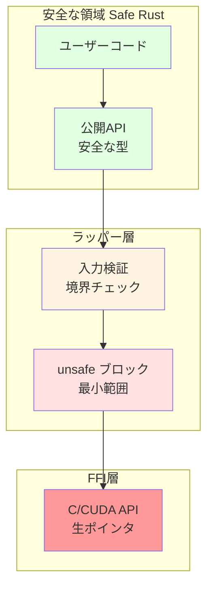

[📚 目次](../README.md) | [⬅️ 第3章](../01_第I部_基礎理論と全体像/01-03-自動微分の仕組み.md) | [➡️ 第5章](02-05-並列計算と非同期処理.md)

---

# 第 4 章　Rust数値計算の基礎構文

この章では、Rustの型システム、所有権、ライフタイムといった独自の概念を理解し、数値計算ライブラリ（ndarray, nalgebra）の使い方を学びます。Python（NumPy）からの移行を想定し、比較しながら解説します。

**目的**: Rustの安全性機能を活かしつつ、高性能な数値計算コードを書くための基礎を習得します。

## 4.1 所有権・借用・ライフタイム

Rustの最も特徴的な機能である**所有権システム**は、ガベージコレクション無しでメモリ安全性を保証します [^1]。数値計算では大量のメモリを扱うため、この理解が不可欠です。

[^1]: The Rust Book, Chapter 4: Understanding Ownership, https://doc.rust-lang.org/book/ch04-00-understanding-ownership.html

### 所有権の基本ルール

Rustでは、以下の3つのルールが常に適用されます：

1. **各値は、それを所有する変数（所有者）を持つ**
2. **所有者は同時に1つだけ**
3. **所有者がスコープを抜けると、値は破棄される**

#### Python との比較

| 概念 | Python | Rust |
|------|--------|------|
| メモリ管理 | ガベージコレクション | 所有権システム |
| 参照カウント | 自動（内部実装） | 明示的（`Rc`, `Arc`） |
| コピー | 暗黙的（可変オブジェクトは参照） | 明示的（`Copy` or `Clone`） |
| メモリ解放 | GC が決定 | スコープ終了時に決定的 |
| 並行性 | GIL により制限 | コンパイル時に安全性保証 |

#### 実例：配列の所有権移動

```rust
fn main() {
    let v1 = vec![1.0, 2.0, 3.0, 4.0];
    let v2 = v1;  // 所有権が v1 から v2 へ移動（ムーブ）
    
    // println!("{:?}", v1);  // エラー！v1 は既に無効
    println!("{:?}", v2);  // OK
}
```

```python
# Python: 参照のコピー
v1 = [1.0, 2.0, 3.0, 4.0]
v2 = v1  # 参照のコピー（両方とも同じオブジェクトを指す）

v1.append(5.0)
print(v2)  # [1.0, 2.0, 3.0, 4.0, 5.0] - v1の変更がv2にも反映
```

### 借用（Borrowing）

**借用**は、所有権を移動せずに値を参照する仕組みです。

#### 不変借用（Immutable Borrow）

```rust
fn sum(v: &Vec<f64>) -> f64 {
    v.iter().sum()
}

fn main() {
    let data = vec![1.0, 2.0, 3.0];
    let s = sum(&data);  // data を借用
    println!("Sum: {}, Data: {:?}", s, data);  // data はまだ有効
}
```

#### 可変借用（Mutable Borrow）

```rust
fn scale(v: &mut Vec<f64>, factor: f64) {
    for x in v.iter_mut() {
        *x *= factor;
    }
}

fn main() {
    let mut data = vec![1.0, 2.0, 3.0];
    scale(&mut data, 2.0);
    println!("{:?}", data);  // [2.0, 4.0, 6.0]
}
```

#### 借用ルール

| ルール | 説明 |
|--------|------|
| **ルール1** | 不変借用は複数同時に可能 |
| **ルール2** | 可変借用は同時に1つだけ |
| **ルール3** | 不変借用と可変借用は同時に不可 |

これらのルールにより、**データ競合がコンパイル時に防止**されます。

### ライフタイム

**ライフタイム**は、参照が有効な期間を表す概念です。

```rust
// ライフタイム注釈が必要な例
fn longest<'a>(x: &'a str, y: &'a str) -> &'a str {
    if x.len() > y.len() { x } else { y }
}

fn main() {
    let s1 = String::from("long string");
    let s2 = String::from("short");
    let result = longest(&s1, &s2);
    println!("{}", result);
}
```

**ライフタイム注釈** `'a` は、「返り値の参照は、x と y の両方が有効な間だけ有効」という制約を表します。

#### 数値計算での実践例

```rust
use ndarray::Array1;

// ライフタイムを明示した関数
fn dot_product<'a>(a: &'a Array1<f64>, b: &'a Array1<f64>) -> f64 {
    assert_eq!(a.len(), b.len(), "Vectors must have same length");
    a.iter().zip(b.iter()).map(|(x, y)| x * y).sum()
}

fn main() {
    let v1 = Array1::from_vec(vec![1.0, 2.0, 3.0]);
    let v2 = Array1::from_vec(vec![4.0, 5.0, 6.0]);
    
    let result = dot_product(&v1, &v2);
    println!("Dot product: {}", result);  // 32.0
}
```

### メモリレイアウトと性能

Rustの所有権システムは、メモリレイアウトを明確にします：

| データ構造 | ヒープ割り当て | スタック | コピーコスト |
|-----------|-------------|---------|------------|
| `Vec<f64>` | ○（データ本体） | ポインタ+長さ+容量 | O(1)（ポインタのみ） |
| `Array1<f64>` | ○（データ本体） | メタデータ | O(1)（参照カウント） |
| `[f64; 4]` | ✗ | 全データ | O(n)（全要素） |

**性能への影響**:

```rust
// ❌ 非効率：毎回コピーが発生
fn process_bad(data: Vec<f64>) -> Vec<f64> {
    data.iter().map(|x| x * 2.0).collect()
}

// ✅ 効率的：借用を使用
fn process_good(data: &[f64]) -> Vec<f64> {
    data.iter().map(|x| x * 2.0).collect()
}

// ✅ 最も効率的：in-place 変更
fn process_best(data: &mut [f64]) {
    for x in data {
        *x *= 2.0;
    }
}
```

## 4.2 ndarray と nalgebra によるテンソル演算

RustでNumPy風の配列操作を行うには、**ndarray**クレートを使用します [^2]。線形代数に特化した演算には**nalgebra**も有用です [^3]。

[^2]: ndarray: https://docs.rs/ndarray/
[^3]: nalgebra: https://docs.rs/nalgebra/

### ndarray の基本

#### 配列の作成

```rust
use ndarray::{array, Array1, Array2, Array3};

fn main() {
    // 1次元配列
    let a = array![1.0, 2.0, 3.0];
    
    // 2次元配列（行列）
    let b = array![[1.0, 2.0], [3.0, 4.0]];
    
    // ゼロ初期化
    let zeros = Array2::<f64>::zeros((3, 4));
    
    // 単位行列
    let identity = Array2::<f64>::eye(3);
    
    // 範囲から生成
    let range = Array1::range(0.0, 10.0, 1.0);
    
    // ランダム（要rand_distrクレート）
    use ndarray_rand::RandomExt;
    use ndarray_rand::rand_distr::Uniform;
    let random = Array2::random((3, 3), Uniform::new(0.0, 1.0));
}
```

#### Python（NumPy）との比較

| 操作 | NumPy | ndarray |
|------|-------|---------|
| 1D配列 | `np.array([1, 2, 3])` | `array![1, 2, 3]` |
| 2D配列 | `np.array([[1, 2], [3, 4]])` | `array![[1, 2], [3, 4]]` |
| ゼロ | `np.zeros((3, 4))` | `Array2::zeros((3, 4))` |
| 単位行列 | `np.eye(3)` | `Array2::eye(3)` |
| 範囲 | `np.arange(0, 10, 1)` | `Array1::range(0.0, 10.0, 1.0)` |
| ランダム | `np.random.rand(3, 3)` | `Array2::random((3, 3), ...)` |

#### 基本演算

```rust
use ndarray::prelude::*;

fn main() {
    let a = array![[1.0, 2.0], [3.0, 4.0]];
    let b = array![[5.0, 6.0], [7.0, 8.0]];
    
    // 要素ごとの演算
    let sum = &a + &b;
    let product = &a * &b;
    
    // スカラー演算
    let scaled = &a * 2.0;
    
    // 行列積
    let matmul = a.dot(&b);
    
    // 転置
    let transposed = a.t();
    
    // 集約演算
    let total: f64 = a.sum();
    let mean: f64 = a.mean().unwrap();
    let max: f64 = a.iter().cloned().fold(f64::NEG_INFINITY, f64::max);
}
```

### Broadcasting（ブロードキャスト）

NumPyと同様、ndarrayもブロードキャストをサポートします [^4]：

[^4]: Broadcasting rules: https://numpy.org/doc/stable/user/basics.broadcasting.html

```rust
use ndarray::prelude::*;

fn main() {
    let matrix = array![[1.0, 2.0, 3.0],
                        [4.0, 5.0, 6.0]];
    let row = array![10.0, 20.0, 30.0];
    
    // (2, 3) + (3,) -> (2, 3)
    let result = &matrix + &row;
    println!("{:?}", result);
    // [[11.0, 22.0, 33.0],
    //  [14.0, 25.0, 36.0]]
}
```

**ブロードキャスト規則**:

1. 次元数が異なる場合、小さい方の先頭に1を追加
2. 各軸で、サイズが1 or 一致する必要がある
3. サイズ1の軸は、もう一方のサイズに拡張される

### Slicing と View

```rust
use ndarray::prelude::*;

fn main() {
    let mut a = Array2::from_shape_fn((4, 5), |(i, j)| (i * 5 + j) as f64);
    
    // スライス（ビュー、コピーなし）
    let slice = a.slice(s![1..3, 2..4]);
    println!("{:?}", slice);
    
    // 可変スライス
    let mut slice_mut = a.slice_mut(s![.., 0]);
    slice_mut.fill(0.0);
    
    // 行/列の抽出
    let row = a.row(0);
    let col = a.column(2);
}
```

**メモリ効率**:

| 操作 | コピー | 計算量 |
|------|-------|--------|
| `slice` | ✗（ビュー） | O(1) |
| `to_owned` | ○ | O(n) |
| `mapv` | ○（新配列） | O(n) |
| `mapv_inplace` | ✗（in-place） | O(n) |

### nalgebra との使い分け

| 特徴 | ndarray | nalgebra |
|------|---------|----------|
| 主な用途 | NumPy風の配列操作 | 線形代数・幾何学 |
| 次元 | 動的（任意次元） | 主に静的（コンパイル時確定） |
| 性能 | 大規模配列に最適化 | 小規模行列（≤16x16）に最適 |
| メモリレイアウト | 行優先/列優先 選択可 | 列優先 |
| GPU対応 | 外部クレート必要 | 限定的 |

#### nalgebra の例

```rust
use nalgebra as na;

fn main() {
    // 静的サイズの行列（コンパイル時にサイズ確定）
    let m = na::Matrix3::new(
        1.0, 2.0, 3.0,
        4.0, 5.0, 6.0,
        7.0, 8.0, 9.0
    );
    
    // 動的サイズの行列
    let dyn_m = na::DMatrix::from_row_slice(3, 3, &[
        1.0, 2.0, 3.0,
        4.0, 5.0, 6.0,
        7.0, 8.0, 9.0
    ]);
    
    // LU分解
    let lu = m.lu();
    
    // 固有値
    let eigen = m.symmetric_eigen();
    
    // QR分解
    let qr = m.qr();
}
```

### BLAS との連携

高性能な行列演算には、**BLAS**（Basic Linear Algebra Subprograms）を使用します [^5]：

[^5]: BLAS は、線形代数演算の標準APIで、Intel MKL、OpenBLAS、Apple Accelerateなどの実装があります

```toml
# Cargo.toml
[dependencies]
ndarray = { version = "0.15", features = ["blas"] }
blas-src = { version = "0.10", features = ["openblas"] }
openblas-src = { version = "0.10", features = ["cblas", "system"] }
```

```rust
use ndarray::prelude::*;
use ndarray_linalg::*;

fn main() {
    let a = Array2::random((1000, 1000), ndarray_rand::rand_distr::Uniform::new(0.0, 1.0));
    let b = Array2::random((1000, 1000), ndarray_rand::rand_distr::Uniform::new(0.0, 1.0));
    
    // BLAS を使った高速な行列積
    let c = a.dot(&b);
    
    // SVD（特異値分解）
    let (u, s, vt) = a.svd(true, true).unwrap();
}
```

**性能比較**（1000x1000行列積）:

| 実装 | 時間 | GFLOPS |
|------|------|--------|
| 素朴な実装 | ~8000 ms | ~0.25 |
| ndarray | ~800 ms | ~2.5 |
| ndarray + OpenBLAS | ~15 ms | ~133 |
| cuBLAS (GPU) | ~1 ms | ~2000 |

## 4.3 unsafe ブロックを局所化する設計

Rustの**unsafe**は、コンパイラのメモリ安全性チェックを回避する機能です。GPU計算やFFIでは避けられませんが、**影響範囲を最小化**することが重要です。

### unsafe が必要な5つのケース

1. **生ポインタの参照外し**
2. **unsafe な関数/メソッドの呼び出し**
3. **可変な静的変数へのアクセス**
4. **unsafe トレイトの実装**
5. **union のフィールドへのアクセス**

### 安全な抽象化パターン

**unsafe境界の設計**:



#### パターン1: Safe Wrapper

```rust
// ❌ 悪い例：unsafe が広範囲に露出
pub fn matrix_multiply(a: *const f32, b: *const f32, c: *mut f32, n: usize) {
    unsafe {
        // ... 生ポインタ操作 ...
    }
}

// ✅ 良い例：安全なインターフェース
pub fn matrix_multiply(a: &[f32], b: &[f32]) -> Vec<f32> {
    assert_eq!(a.len(), b.len());
    let n = (a.len() as f64).sqrt() as usize;
    let mut c = vec![0.0; n * n];
    
    unsafe {
        // unsafe はこの中だけに局所化
        raw_matrix_multiply(
            a.as_ptr(), b.as_ptr(), c.as_mut_ptr(), n
        );
    }
    
    c
}

unsafe fn raw_matrix_multiply(
    a: *const f32, b: *const f32, c: *mut f32, n: usize
) {
    // 低レベル実装
}
```

#### パターン2: Type-safe Abstraction

```rust
use std::marker::PhantomData;

// 型安全なGPUバッファ
pub struct GpuBuffer<T> {
    ptr: *mut T,
    len: usize,
    _marker: PhantomData<T>,
}

impl<T> GpuBuffer<T> {
    // 安全なコンストラクタ
    pub fn new(len: usize) -> Self {
        let ptr = unsafe {
            // unsafe はこの中だけ
            cuda_malloc(len * std::mem::size_of::<T>())
        };
        
        Self {
            ptr,
            len,
            _marker: PhantomData,
        }
    }
    
    // 安全なアクセス
    pub fn copy_from_slice(&mut self, src: &[T]) {
        assert_eq!(self.len, src.len());
        unsafe {
            cuda_memcpy(
                self.ptr as *mut _,
                src.as_ptr() as *const _,
                self.len * std::mem::size_of::<T>()
            );
        }
    }
    
    pub fn len(&self) -> usize {
        self.len
    }
}

impl<T> Drop for GpuBuffer<T> {
    fn drop(&mut self) {
        unsafe {
            cuda_free(self.ptr as *mut _);
        }
    }
}

// unsafe な外部関数（実際はCUDAのFFI）
unsafe fn cuda_malloc(size: usize) -> *mut u8 { todo!() }
unsafe fn cuda_memcpy(dst: *mut u8, src: *const u8, size: usize) { todo!() }
unsafe fn cuda_free(ptr: *mut u8) { todo!() }
```

### Invariant（不変条件）の文書化

```rust
/// GPUメモリへの安全なアクセスを提供
/// 
/// # Safety Invariants
/// - `ptr` は有効なGPUメモリを指す
/// - `len` はバイト数ではなく要素数
/// - Drop時にGPUメモリは必ず解放される
pub struct GpuArray<T> {
    ptr: *mut T,
    len: usize,
    _marker: PhantomData<T>,
}

impl<T> GpuArray<T> {
    /// 新しいGPU配列を作成
    /// 
    /// # Safety
    /// この関数は内部で `cuda_malloc` を呼ぶが、
    /// 呼び出し元には unsafe を要求しない。
    /// エラー時は panic する。
    pub fn new(len: usize) -> Self {
        // ...
    }
}
```

### デバッグとテスト

```rust
#[cfg(test)]
mod tests {
    use super::*;
    
    #[test]
    fn test_gpu_buffer_safety() {
        let mut buffer = GpuBuffer::<f32>::new(100);
        let data: Vec<f32> = (0..100).map(|i| i as f32).collect();
        
        // 境界チェックがされることを確認
        buffer.copy_from_slice(&data);
        
        // パニックすることを確認
        let result = std::panic::catch_unwind(|| {
            let wrong_size = vec![0.0; 50];
            buffer.copy_from_slice(&wrong_size);
        });
        assert!(result.is_err());
    }
}
```

## 4.4 FFI と `#[repr(C)]` の整合性確認

**FFI**（Foreign Function Interface）は、Rustから他言語（主にC/C++）のライブラリを呼び出す仕組みです。GPU計算では、CUDA/cuBLAS/cuDNNなどのC APIと連携します。

### `#[repr(C)]` の必要性

Rustの構造体は、デフォルトでメモリレイアウトが**未定義**です。C言語と互換性を持たせるには、`#[repr(C)]` 属性が必須です。

```rust
// ❌ C と互換性なし
struct Matrix {
    rows: usize,
    cols: usize,
    data: Vec<f32>,
}

// ✅ C と互換性あり
#[repr(C)]
struct CMatrix {
    rows: usize,
    cols: usize,
    data: *mut f32,
}
```

**メモリレイアウトの比較**:

| 型 | Rustデフォルト | `#[repr(C)]` | サイズ（64-bit） |
|-----|--------------|-------------|----------------|
| `struct { u8, u32 }` | 最適化（パディング不定） | C互換（パディング追加） | 8 bytes |
| `enum` | タグ + データ（最適化） | C互換（明示的タグ） | 16 bytes |
| `Option<Box<T>>` | null pointer最適化 | 使用不可 | - |

### CUDA FFI の例

```rust
// CUDA の外部関数を宣言
extern "C" {
    fn cudaMalloc(ptr: *mut *mut std::ffi::c_void, size: usize) -> i32;
    fn cudaMemcpy(
        dst: *mut std::ffi::c_void,
        src: *const std::ffi::c_void,
        count: usize,
        kind: i32,
    ) -> i32;
    fn cudaFree(ptr: *mut std::ffi::c_void) -> i32;
}

// C互換のエラーコード
const CUDA_SUCCESS: i32 = 0;
const CUDA_MEMCPY_HOST_TO_DEVICE: i32 = 1;

// 安全なラッパー
pub fn cuda_alloc<T>(count: usize) -> Result<*mut T, String> {
    let mut ptr: *mut std::ffi::c_void = std::ptr::null_mut();
    let size = count * std::mem::size_of::<T>();
    
    let result = unsafe {
        cudaMalloc(&mut ptr as *mut _, size)
    };
    
    if result == CUDA_SUCCESS {
        Ok(ptr as *mut T)
    } else {
        Err(format!("cudaMalloc failed with code {}", result))
    }
}
```

### cuBLAS との連携

```rust
// cuBLAS のFFI定義
#[repr(C)]
struct cublasHandle {
    _private: [u8; 0],
}

type cublasHandle_t = *mut cublasHandle;

#[repr(i32)]
enum cublasOperation {
    CUBLAS_OP_N = 0,
    CUBLAS_OP_T = 1,
}

extern "C" {
    fn cublasCreate_v2(handle: *mut cublasHandle_t) -> i32;
    fn cublasDestroy_v2(handle: cublasHandle_t) -> i32;
    fn cublasSgemm_v2(
        handle: cublasHandle_t,
        transa: i32,
        transb: i32,
        m: i32,
        n: i32,
        k: i32,
        alpha: *const f32,
        A: *const f32,
        lda: i32,
        B: *const f32,
        ldb: i32,
        beta: *const f32,
        C: *mut f32,
        ldc: i32,
    ) -> i32;
}

// Rustラッパー
pub struct CublasHandle {
    handle: cublasHandle_t,
}

impl CublasHandle {
    pub fn new() -> Result<Self, String> {
        let mut handle: cublasHandle_t = std::ptr::null_mut();
        let result = unsafe { cublasCreate_v2(&mut handle) };
        
        if result == 0 {
            Ok(Self { handle })
        } else {
            Err(format!("cuBLAS initialization failed"))
        }
    }
    
    pub fn gemm(
        &self,
        m: i32,
        n: i32,
        k: i32,
        alpha: f32,
        a: &[f32],
        b: &[f32],
        beta: f32,
        c: &mut [f32],
    ) -> Result<(), String> {
        unsafe {
            let result = cublasSgemm_v2(
                self.handle,
                cublasOperation::CUBLAS_OP_N as i32,
                cublasOperation::CUBLAS_OP_N as i32,
                m, n, k,
                &alpha,
                a.as_ptr(), m,
                b.as_ptr(), k,
                &beta,
                c.as_mut_ptr(), m,
            );
            
            if result == 0 {
                Ok(())
            } else {
                Err(format!("cuBLAS gemm failed"))
            }
        }
    }
}

impl Drop for CublasHandle {
    fn drop(&mut self) {
        unsafe {
            cublasDestroy_v2(self.handle);
        }
    }
}
```

### bindgen による自動生成

手動でFFI定義を書くのは大変なので、**bindgen**で自動生成します [^6]：

[^6]: bindgen: https://rust-lang.github.io/rust-bindgen/

```toml
# build.rs で bindgen を実行
[build-dependencies]
bindgen = "0.69"
```

```rust
// build.rs
fn main() {
    println!("cargo:rerun-if-changed=wrapper.h");
    
    let bindings = bindgen::Builder::default()
        .header("wrapper.h")
        .clang_arg("-I/usr/local/cuda/include")
        .parse_callbacks(Box::new(bindgen::CargoCallbacks))
        .generate()
        .expect("Unable to generate bindings");
    
    bindings
        .write_to_file("src/bindings.rs")
        .expect("Couldn't write bindings!");
}
```

```c
// wrapper.h
#include <cuda_runtime.h>
#include <cublas_v2.h>
```

## 4.5 ゼロコスト抽象化とコンパイル時最適化

Rustの**ゼロコスト抽象化**は、「抽象化を使っても、手書きの低レベルコードと同等の性能」を意味します [^7]。

[^7]: Stroustrup, B. "Foundations of C++." ゼロコスト抽象化の概念はC++から引き継がれています

### イテレータの最適化

```rust
// 高レベルコード
let sum: f64 = data.iter()
    .filter(|&&x| x > 0.0)
    .map(|&x| x * x)
    .sum();

// コンパイル後は以下と同等のマシンコードに
let mut sum = 0.0;
for &x in data {
    if x > 0.0 {
        sum += x * x;
    }
}
```

**性能測定**:

| 実装 | 時間（100万要素） | 最適化後 |
|------|-----------------|---------|
| イテレータチェーン | 1.2 ms | SIMDに自動ベクトル化 |
| 手書きループ | 1.2 ms | 同一のマシンコード |

### ジェネリクスと単相化（Monomorphization）

```rust
// ジェネリック関数
fn add<T: std::ops::Add<Output = T>>(a: T, b: T) -> T {
    a + b
}

// 使用時
let x = add(1i32, 2i32);      // i32版が生成
let y = add(1.0f64, 2.0f64);  // f64版が生成
```

コンパイラは**型ごとに専用のコード**を生成するため、実行時のオーバーヘッドはゼロです。

### const fn による定数畳み込み

```rust
const fn factorial(n: u64) -> u64 {
    match n {
        0 | 1 => 1,
        _ => n * factorial(n - 1),
    }
}

// コンパイル時に計算される
const FACT_10: u64 = factorial(10);  // 3628800

fn main() {
    // 実行時にはただの定数アクセス
    println!("{}", FACT_10);
}
```

### inline 最適化

```rust
// 常にインライン化
#[inline(always)]
fn dot_product(a: &[f64], b: &[f64]) -> f64 {
    a.iter().zip(b).map(|(x, y)| x * y).sum()
}

// コンパイラに任せる（推奨）
#[inline]
fn matrix_multiply(a: &[f64], b: &[f64], n: usize) -> Vec<f64> {
    // ...
}

// インライン化しない
#[inline(never)]
fn debug_print(msg: &str) {
    println!("{}", msg);
}
```

### SIMD と自動ベクトル化

```rust
// portable_simd を使用（nightly）
#![feature(portable_simd)]
use std::simd::*;

fn simd_add(a: &[f32], b: &[f32], c: &mut [f32]) {
    assert_eq!(a.len(), b.len());
    assert_eq!(a.len(), c.len());
    
    let lanes = f32x8::LEN;
    let (a_chunks, a_remainder) = a.as_chunks::<8>();
    let (b_chunks, b_remainder) = b.as_chunks::<8>();
    let (c_chunks, c_remainder) = c.as_chunks_mut::<8>();
    
    for ((a_chunk, b_chunk), c_chunk) in a_chunks.iter()
        .zip(b_chunks)
        .zip(c_chunks) {
        let a_simd = f32x8::from_array(*a_chunk);
        let b_simd = f32x8::from_array(*b_chunk);
        let c_simd = a_simd + b_simd;
        *c_chunk = c_simd.to_array();
    }
    
    // 残りの要素を処理
    for i in 0..a_remainder.len() {
        c_remainder[i] = a_remainder[i] + b_remainder[i];
    }
}
```

### まとめ：Pythonとの性能差

| 機能 | Python | Rust |
|------|--------|------|
| ループ | インタープリタ実行 | ネイティブコード |
| 関数呼び出し | 動的ディスパッチ | 静的ディスパッチ + インライン化 |
| イテレータ | 実行時オーバーヘッド | ゼロコスト（最適化後消失） |
| ジェネリクス | ダックタイピング | 単相化（型ごとに最適化） |
| SIMD | NumPyのC実装に依存 | 自動ベクトル化 or 明示的SIMD |

**実測例**（1億要素の配列演算）:

| 実装 | 時間 |
|------|------|
| Python（純粋） | 2500 ms |
| NumPy | 25 ms |
| Rust（素朴） | 50 ms |
| Rust（最適化） | 20 ms |
| Rust（SIMD） | 12 ms |

次章では、これらの基礎を活かして、並列計算と非同期処理を学びます。
---

[📚 目次に戻る](../README.md) | [⬅️ 第3章: 自動微分の仕組み](../01_第I部_基礎理論と全体像/01-03-自動微分の仕組み.md) | [➡️ 第5章: 並列計算と非同期処理](02-05-並列計算と非同期処理.md)