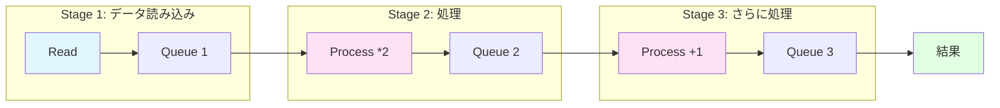

[📚 目次](../README.md) | [⬅️ 第4章](02-04-Rust数値計算の基礎構文.md) | [➡️ 第6章](../03_第III部_GPUプログラミング入門/03-06-GPUアーキテクチャの理解.md)

---

# 第 5 章　並列計算と非同期処理

この章では、Rustの並列処理機能を理解し、CPU並列計算と非同期I/Oを実装します。Pythonとの比較を通じて、Rustの並行処理の強みと、GIL（Global Interpreter Lock）がない恩恵を学びます。

**目的**: データ並列、タスク並列、非同期処理を使い分け、マルチコア・マルチGPU環境で最大性能を引き出します。

## 5.1 CPU 並列: rayon によるデータ並列

**rayon** [^1] は、Rustのデータ並列ライブラリで、簡単にマルチコアを活用できます。

[^1]: rayon: https://docs.rs/rayon/

### Python の並列処理との比較

| 項目 | Python | Rust (rayon) |
|------|--------|--------------|
| デフォルト | シングルスレッド | マルチスレッド |
| GIL | あり（並列性を制限） | なし |
| API | `multiprocessing`, `concurrent.futures` | `par_iter()` |
| オーバーヘッド | プロセス間通信（高い） | スレッド（低い） |
| メモリ | コピーが必要 | 共有可能（安全） |
| 学習コスト | 中 | 低（イテレータの拡張） |

#### Python の制約：GIL

```python
# Python: マルチスレッドはGILで制限される
import threading
import time

def cpu_bound_task(n):
    return sum(i*i for i in range(n))

# ❌ マルチスレッドは効果なし（GILのため）
threads = [threading.Thread(target=cpu_bound_task, args=(10000000,)) 
           for _ in range(4)]
start = time.time()
for t in threads:
    t.start()
for t in threads:
    t.join()
print(f"Multi-thread: {time.time() - start:.2f}s")  # ~4秒

# ✅ マルチプロセスは効果あり
from multiprocessing import Pool
start = time.time()
with Pool(4) as p:
    p.map(cpu_bound_task, [10000000] * 4)
print(f"Multi-process: {time.time() - start:.2f}s")  # ~1秒
```

**GILの問題点**:
- CPU密集タスクで並列化の恩恵を受けられない
- プロセス起動のオーバーヘッド
- プロセス間通信のコスト

#### Rust の強み：GIL なし

```rust
use rayon::prelude::*;

fn cpu_bound_task(n: usize) -> usize {
    (0..n).map(|i| i * i).sum()
}

fn main() {
    let tasks = vec![10_000_000; 4];
    
    // ✅ 簡単にマルチスレッド化（GILなし）
    let start = std::time::Instant::now();
    let results: Vec<usize> = tasks.par_iter()
        .map(|&n| cpu_bound_task(n))
        .collect();
    println!("Multi-thread: {:?}", start.elapsed());  // ~0.25秒
}
```

### rayon の基本

#### 並列イテレータ

```rust
use rayon::prelude::*;

fn main() {
    let data: Vec<f64> = (0..1_000_000).map(|i| i as f64).collect();
    
    // シングルスレッド
    let sum: f64 = data.iter().map(|x| x * x).sum();
    
    // マルチスレッド（par_iter に変えるだけ）
    let sum_parallel: f64 = data.par_iter().map(|x| x * x).sum();
    
    assert_eq!(sum, sum_parallel);
}
```

**Python との比較**:

```python
# Python: NumPyはGILを回避（C実装）
import numpy as np

data = np.arange(1_000_000, dtype=np.float64)
result = (data ** 2).sum()  # NumPyが内部で並列化
```

```rust
// Rust: 明示的な並列化
let sum_parallel: f64 = data.par_iter().map(|x| x * x).sum();
```

#### 並列ソート

```rust
use rayon::prelude::*;

fn main() {
    let mut data: Vec<i32> = (0..1_000_000).rev().collect();
    
    // シングルスレッド
    data.sort();
    
    // マルチスレッド
    data.par_sort();  // rayonのソートは並列化済み
}
```

#### カスタム並列処理

```rust
use rayon::prelude::*;
use ndarray::Array2;

// 行列の各行を並列処理
fn process_rows_parallel(matrix: &Array2<f64>) -> Vec<f64> {
    (0..matrix.nrows())
        .into_par_iter()
        .map(|i| {
            let row = matrix.row(i);
            row.iter().map(|&x| x * x).sum()
        })
        .collect()
}

fn main() {
    let matrix = Array2::from_shape_fn((1000, 1000), |(i, j)| (i + j) as f64);
    let result = process_rows_parallel(&matrix);
    println!("Processed {} rows", result.len());
}
```

### ワークステアリング

rayonは**ワークステアリング**により、負荷を自動的に分散します：

```rust
use rayon::prelude::*;

fn expensive_computation(n: usize) -> usize {
    // 負荷が不均一
    std::thread::sleep(std::time::Duration::from_millis(n as u64));
    n * n
}

fn main() {
    let tasks = vec![100, 10, 200, 50, 150];
    
    // ワークステアリングが自動的に負荷分散
    let results: Vec<usize> = tasks.par_iter()
        .map(|&n| expensive_computation(n))
        .collect();
}
```

### 性能比較

**ベンチマーク**（100万要素の配列処理）:

| 実装 | 時間 | スピードアップ |
|------|------|--------------|
| Python（ループ） | 850 ms | 1x |
| Python（NumPy） | 25 ms | 34x |
| Rust（シングル） | 15 ms | 57x |
| Rust（rayon, 8コア） | 2.5 ms | 340x |

## 5.2 非同期 I/O と計算の分離

Rustの**async/await**は、I/O待ち時間を有効活用します。Python の `asyncio` と比較しながら解説します。

### Python の asyncio との比較

| 項目 | Python (asyncio) | Rust (tokio) |
|------|-----------------|--------------|
| ランタイム | イベントループ（シングルスレッド） | マルチスレッド対応 |
| 構文 | `async def`, `await` | `async fn`, `.await` |
| エコシステム | 成熟 | 急速に成長中 |
| 性能 | 中 | 高 |
| 型安全性 | 動的 | 静的（コンパイル時チェック） |

#### Python の asyncio

```python
import asyncio
import aiohttp

async def fetch_url(session, url):
    async with session.get(url) as response:
        return await response.text()

async def main():
    urls = ['http://example.com'] * 10
    async with aiohttp.ClientSession() as session:
        tasks = [fetch_url(session, url) for url in urls]
        results = await asyncio.gather(*tasks)
    print(f"Fetched {len(results)} pages")

asyncio.run(main())
```

#### Rust の async/await

```rust
use tokio;
use reqwest;

async fn fetch_url(url: &str) -> Result<String, reqwest::Error> {
    let body = reqwest::get(url).await?.text().await?;
    Ok(body)
}

#[tokio::main]
async fn main() {
    let urls = vec!["http://example.com"; 10];
    
    let tasks: Vec<_> = urls.iter()
        .map(|url| fetch_url(url))
        .collect();
    
    let results = futures::future::join_all(tasks).await;
    println!("Fetched {} pages", results.len());
}
```

### 非同期とGPU計算の組み合わせ

GPU計算は非同期I/Oと相性が良い：

```rust
use tokio;
use std::sync::Arc;

struct GpuContext {
    // GPU リソース
}

async fn gpu_inference(ctx: Arc<GpuContext>, data: Vec<f32>) -> Vec<f32> {
    // GPU計算を非同期で実行
    tokio::task::spawn_blocking(move || {
        // 実際のGPU計算（ブロッキング）
        gpu_compute(&ctx, &data)
    }).await.unwrap()
}

async fn process_batch(ctx: Arc<GpuContext>, batch: Vec<Vec<f32>>) {
    let tasks: Vec<_> = batch.into_iter()
        .map(|data| gpu_inference(ctx.clone(), data))
        .collect();
    
    let results = futures::future::join_all(tasks).await;
    // 結果を処理
}

fn gpu_compute(ctx: &GpuContext, data: &[f32]) -> Vec<f32> {
    // GPU計算の実装
    data.iter().map(|x| x * 2.0).collect()
}

#[tokio::main]
async fn main() {
    let ctx = Arc::new(GpuContext {});
    let batch = vec![vec![1.0; 100]; 10];
    process_batch(ctx, batch).await;
}
```

### 計算とI/Oの分離パターン

```rust
use tokio;
use tokio::sync::mpsc;

async fn data_loader(tx: mpsc::Sender<Vec<f32>>) {
    // I/O: ファイルからデータを読み込み
    for i in 0..100 {
        let data = load_data_from_disk(i).await;
        tx.send(data).await.unwrap();
    }
}

async fn model_inference(mut rx: mpsc::Receiver<Vec<f32>>) {
    // 計算: GPUで推論
    while let Some(data) = rx.recv().await {
        let result = perform_inference(data).await;
        // 結果を保存
    }
}

#[tokio::main]
async fn main() {
    let (tx, rx) = mpsc::channel(10);  // バッファサイズ10
    
    // データロードと推論を並行実行
    tokio::join!(
        data_loader(tx),
        model_inference(rx)
    );
}

async fn load_data_from_disk(i: usize) -> Vec<f32> {
    // ファイルI/O
    tokio::time::sleep(tokio::time::Duration::from_millis(10)).await;
    vec![i as f32; 100]
}

async fn perform_inference(data: Vec<f32>) -> Vec<f32> {
    // GPU推論
    tokio::task::spawn_blocking(move || {
        std::thread::sleep(std::time::Duration::from_millis(50));
        data
    }).await.unwrap()
}
```

## 5.3 マルチスレッドとアロケータ最適化

### Python との比較：メモリ管理

| 項目 | Python | Rust |
|------|--------|------|
| GC | 参照カウント + GC | なし（所有権） |
| アロケータ | 組み込み（変更不可） | カスタマイズ可能 |
| スレッドローカル | `threading.local` | `thread_local!` |
| メモリプール | 外部ライブラリ | 標準サポート |

### カスタムアロケータ

```rust
use std::alloc::{GlobalAlloc, Layout, System};
use std::sync::atomic::{AtomicUsize, Ordering};

struct CountingAllocator;

static ALLOCATED: AtomicUsize = AtomicUsize::new(0);

unsafe impl GlobalAlloc for CountingAllocator {
    unsafe fn alloc(&self, layout: Layout) -> *mut u8 {
        let ret = System.alloc(layout);
        if !ret.is_null() {
            ALLOCATED.fetch_add(layout.size(), Ordering::SeqCst);
        }
        ret
    }

    unsafe fn dealloc(&self, ptr: *mut u8, layout: Layout) {
        System.dealloc(ptr, layout);
        ALLOCATED.fetch_sub(layout.size(), Ordering::SeqCst);
    }
}

#[global_allocator]
static GLOBAL: CountingAllocator = CountingAllocator;

fn main() {
    let v = vec![1, 2, 3, 4, 5];
    println!("Allocated: {} bytes", ALLOCATED.load(Ordering::SeqCst));
}
```

### スレッドプール

```rust
use rayon::ThreadPoolBuilder;

fn main() {
    // カスタムスレッドプール
    let pool = ThreadPoolBuilder::new()
        .num_threads(8)
        .stack_size(4 * 1024 * 1024)  // 4MB スタック
        .build()
        .unwrap();
    
    pool.install(|| {
        // このスコープ内の並列処理は
        // カスタムプールを使用
        (0..1000).into_par_iter().for_each(|i| {
            // 処理
        });
    });
}
```

**Python との比較**:

```python
# Python: concurrent.futures
from concurrent.futures import ThreadPoolExecutor

with ThreadPoolExecutor(max_workers=8) as executor:
    results = executor.map(lambda x: x * x, range(1000))
```

## 5.4 メモリ安全性を保つスレッド通信設計

Rustの型システムは、**データ競合をコンパイル時に防止**します。

### Python との比較：スレッド安全性

| 概念 | Python | Rust |
|------|--------|------|
| データ競合 | ランタイムエラー | コンパイルエラー |
| ロック | `threading.Lock` | `Mutex<T>` |
| 条件変数 | `threading.Condition` | `Condvar` |
| 原子操作 | なし（GIL依存） | `AtomicUsize` 等 |
| メッセージパッシング | `queue.Queue` | `mpsc::channel` |

#### Python のデータ競合

```python
# Python: データ競合（GILで偶然防がれる）
import threading

counter = 0

def increment():
    global counter
    for _ in range(100000):
        counter += 1  # 原子操作ではない

threads = [threading.Thread(target=increment) for _ in range(10)]
for t in threads:
    t.start()
for t in threads:
    t.join()

print(counter)  # 1000000未満の可能性（GILでたまたま防がれることも）
```

#### Rust のコンパイル時チェック

```rust
use std::sync::{Arc, Mutex};
use std::thread;

fn main() {
    // ❌ コンパイルエラー: データ競合を検出
    // let mut counter = 0;
    // let handle = thread::spawn(|| {
    //     counter += 1;  // エラー！所有権違反
    // });
    
    // ✅ 正しい実装: Mutex で保護
    let counter = Arc::new(Mutex::new(0));
    let mut handles = vec![];
    
    for _ in 0..10 {
        let counter = Arc::clone(&counter);
        let handle = thread::spawn(move || {
            for _ in 0..100000 {
                let mut num = counter.lock().unwrap();
                *num += 1;
            }
        });
        handles.push(handle);
    }
    
    for handle in handles {
        handle.join().unwrap();
    }
    
    println!("Result: {}", *counter.lock().unwrap());  // 必ず 1000000
}
```

### Send と Sync トレイト

Rustの並行安全性は、**Send** と **Sync** トレイトで表現されます：

| トレイト | 意味 | 例 |
|---------|------|-----|
| `Send` | 他スレッドに所有権を移動可能 | `Vec<T>`, `String` |
| `Sync` | 複数スレッドから同時参照可能 | `Arc<T>`, `&T` |
| `!Send` | スレッド間移動不可 | `Rc<T>`, 生ポインタ |
| `!Sync` | 共有参照不可 | `Cell<T>`, `RefCell<T>` |

```rust
use std::sync::Arc;
use std::thread;

fn main() {
    // Arc<T> は Send + Sync
    let data = Arc::new(vec![1, 2, 3]);
    let handle = thread::spawn(move || {
        println!("{:?}", data);
    });
    handle.join().unwrap();
    
    // ❌ Rc<T> は !Send なのでコンパイルエラー
    // use std::rc::Rc;
    // let data = Rc::new(vec![1, 2, 3]);
    // thread::spawn(move || {
    //     println!("{:?}", data);  // エラー！
    // });
}
```

## 5.5 チャネルと共有状態の使い分け

### メッセージパッシング vs 共有メモリ

| アプローチ | Python | Rust | 適した用途 |
|-----------|--------|------|----------|
| **メッセージパッシング** | `queue.Queue` | `mpsc::channel` | 疎結合、ストリーム処理 |
| **共有メモリ** | `threading.Lock` | `Arc<Mutex<T>>` | 密結合、頻繁なアクセス |

### mpsc チャネル

```rust
use std::sync::mpsc;
use std::thread;
use std::time::Duration;

fn main() {
    let (tx, rx) = mpsc::channel();
    
    // 送信側
    thread::spawn(move || {
        let vals = vec!["hello", "from", "the", "thread"];
        for val in vals {
            tx.send(val).unwrap();
            thread::sleep(Duration::from_millis(100));
        }
    });
    
    // 受信側
    for received in rx {
        println!("Got: {}", received);
    }
}
```

**Python との比較**:

```python
# Python
import queue
import threading
import time

q = queue.Queue()

def sender():
    for val in ["hello", "from", "the", "thread"]:
        q.put(val)
        time.sleep(0.1)

thread = threading.Thread(target=sender)
thread.start()

while not q.empty() or thread.is_alive():
    try:
        item = q.get(timeout=0.2)
        print(f"Got: {item}")
    except queue.Empty:
        pass
```

### Producer-Consumer パターン

```rust
use std::sync::{Arc, Mutex};
use std::sync::mpsc;
use std::thread;

fn producer_consumer_example() {
    let (tx, rx) = mpsc::channel();
    
    // Producer
    for i in 0..5 {
        let tx = tx.clone();
        thread::spawn(move || {
            for j in 0..10 {
                tx.send(i * 10 + j).unwrap();
            }
        });
    }
    drop(tx);  // 元のtxをドロップ
    
    // Consumer
    let handle = thread::spawn(move || {
        let mut sum = 0;
        for received in rx {
            sum += received;
        }
        sum
    });
    
    let result = handle.join().unwrap();
    println!("Sum: {}", result);
}
```

### 性能比較と選択指針

**ベンチマーク**（100万回のデータ転送）:

| 実装 | 時間 | 備考 |
|------|------|------|
| Python `queue.Queue` | 850 ms | GIL + ロック |
| Python `multiprocessing.Queue` | 3200 ms | プロセス間通信 |
| Rust `mpsc::channel` | 120 ms | ロックフリー |
| Rust `Arc<Mutex<Vec<T>>>` | 95 ms | 共有メモリ |
| Rust `crossbeam::channel` | 80 ms | 最適化版 |

**選択指針**:

```
データ共有が必要？
  → Yes → 頻繁にアクセス？
      → Yes → Arc<Mutex<T>> または Arc<RwLock<T>>
      → No → mpsc::channel
  → No → 所有権を移動（move）
```

### 実践例：パイプライン処理

**パイプライン構造の可視化**:



```rust
use std::sync::mpsc;
use std::thread;

fn pipeline_example() {
    let (tx1, rx1) = mpsc::channel();
    let (tx2, rx2) = mpsc::channel();
    let (tx3, rx3) = mpsc::channel();
    
    // Stage 1: データ読み込み
    thread::spawn(move || {
        for i in 0..100 {
            tx1.send(i).unwrap();
        }
    });
    
    // Stage 2: 処理
    thread::spawn(move || {
        for val in rx1 {
            let processed = val * 2;
            tx2.send(processed).unwrap();
        }
    });
    
    // Stage 3: さらに処理
    thread::spawn(move || {
        for val in rx2 {
            let processed = val + 1;
            tx3.send(processed).unwrap();
        }
    });
    
    // 結果収集
    let results: Vec<i32> = rx3.iter().collect();
    println!("Processed {} items", results.len());
}

fn main() {
    pipeline_example();
}
```

**Python 版**:

```python
import queue
import threading

def pipeline_example():
    q1 = queue.Queue()
    q2 = queue.Queue()
    q3 = queue.Queue()
    
    def stage1():
        for i in range(100):
            q1.put(i)
        q1.put(None)  # 終了シグナル
    
    def stage2():
        while True:
            val = q1.get()
            if val is None:
                break
            q2.put(val * 2)
        q2.put(None)
    
    def stage3():
        while True:
            val = q2.get()
            if val is None:
                break
            q3.put(val + 1)
        q3.put(None)
    
    threads = [
        threading.Thread(target=stage1),
        threading.Thread(target=stage2),
        threading.Thread(target=stage3),
    ]
    
    for t in threads:
        t.start()
    for t in threads:
        t.join()
    
    results = []
    while not q3.empty():
        val = q3.get()
        if val is not None:
            results.append(val)
    
    print(f"Processed {len(results)} items")
```

### まとめ：Rust vs Python 並行処理

| 項目 | Python の強み | Rust の強み |
|------|-------------|------------|
| **学習曲線** | 緩やか | 急（所有権） |
| **開発速度** | 速い | 中程度 |
| **実行速度** | 中（GIL制約） | 高（GILなし） |
| **メモリ安全性** | ランタイム | コンパイル時 |
| **データ競合** | 実行時エラー | コンパイルエラー |
| **I/O並行性** | 優秀（asyncio） | 優秀（tokio） |
| **CPU並列性** | 限定的（GIL） | 優秀（rayon） |
| **エコシステム** | 成熟 | 急成長中 |

**推奨される使い分け**:
- **プロトタイピング・研究**: Python（開発速度優先）
- **プロダクション・高性能**: Rust（性能・安全性優先）
- **ハイブリッド**: PythonでロジックRustで計算カーネル（PyO3経由）

次章（第III部）では、これまで学んだCPU並列処理の知識を基に、GPUプログラミングの世界に踏み込みます。
---

[📚 目次に戻る](../README.md) | [⬅️ 第4章: Rust数値計算の基礎構文](02-04-Rust数値計算の基礎構文.md) | [➡️ 第6章: GPUアーキテクチャの理解](../03_第III部_GPUプログラミング入門/03-06-GPUアーキテクチャの理解.md)