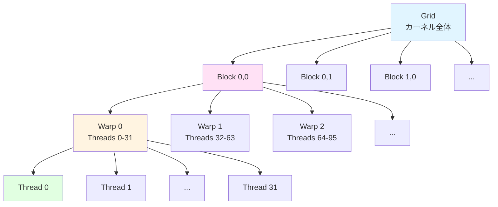
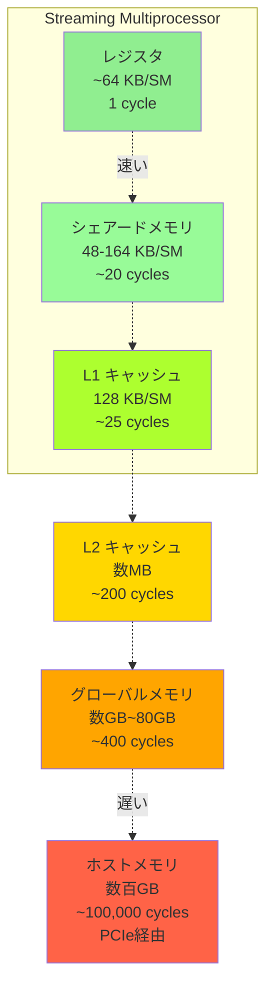

[📚 目次](../README.md) | [⬅️ 第5章](../02_第II部_Rustによる数値処理と安全設計/02-05-並列計算と非同期処理.md) | [➡️ 第7章](03-07-RustからGPUを操作する.md)

---

# 第 6 章　GPU アーキテクチャの理解

この章では、GPUの内部構造とメモリ階層を詳しく学び、高性能GPUプログラミングの基礎を確立します。NVIDIA CUDAを中心に解説しますが、概念はAMD ROCmにも適用できます。

**目的**: GPUハードウェアの動作原理を理解し、なぜ特定の最適化手法が有効なのかを、数値実験と理論の両面から説明します。

## 6.1 スレッド・ブロック・ワープの階層

### CUDA スレッド階層

CUDAプログラミングモデルは、**3段階の階層**でスレッドを管理します [^1]：

[^1]: NVIDIA CUDA C++ Programming Guide, Chapter 2: Programming Model, https://docs.nvidia.com/cuda/cuda-c-programming-guide/

| 階層 | 単位 | サイズ | 管理レベル |
|------|------|--------|----------|
| **Grid（グリッド）** | カーネル全体 | 数百万スレッド | ソフトウェア |
| **Block（ブロック）** | スレッドグループ | 最大1024スレッド | ソフトウェア |
| **Warp（ワープ）** | SIMT実行単位 | 32スレッド（NVIDIA） | ハードウェア |

**階層の図解**:



### Python（CuPy）での起動

```python
import cupy as cp

# カーネル定義
kernel = cp.RawKernel(r'''
extern "C" __global__
void vector_add(const float* a, const float* b, float* c, int n) {
    int idx = blockDim.x * blockIdx.x + threadIdx.x;
    if (idx < n) {
        c[idx] = a[idx] + b[idx];
    }
}
''', 'vector_add')

# データ準備
n = 1000000
a = cp.random.randn(n, dtype=cp.float32)
b = cp.random.randn(n, dtype=cp.float32)
c = cp.zeros(n, dtype=cp.float32)

# カーネル起動設定
threads_per_block = 256
blocks = (n + threads_per_block - 1) // threads_per_block

# 実行
kernel((blocks,), (threads_per_block,), (a, b, c, n))
```

### Rust（cudarc）での起動

```rust
use cudarc::driver::*;

fn main() -> Result<(), Box<dyn std::error::Error>> {
    // デバイス初期化
    let device = CudaDevice::new(0)?;
    
    // カーネルコンパイル
    let ptx = compile_ptx(r#"
        extern "C" __global__
        void vector_add(const float* a, const float* b, float* c, int n) {
            int idx = blockDim.x * blockIdx.x + threadIdx.x;
            if (idx < n) {
                c[idx] = a[idx] + b[idx];
            }
        }
    "#)?;
    
    device.load_ptx(ptx, "module", &["vector_add"])?;
    
    // データ準備
    let n = 1_000_000;
    let a: Vec<f32> = (0..n).map(|i| i as f32).collect();
    let b: Vec<f32> = (0..n).map(|i| i as f32 * 2.0).collect();
    
    let a_gpu = device.htod_copy(a)?;
    let b_gpu = device.htod_copy(b)?;
    let mut c_gpu = device.alloc_zeros::<f32>(n)?;
    
    // カーネル起動設定
    let threads_per_block = 256;
    let blocks = (n + threads_per_block - 1) / threads_per_block;
    
    let cfg = LaunchConfig {
        grid_dim: (blocks as u32, 1, 1),
        block_dim: (threads_per_block as u32, 1, 1),
        shared_mem_bytes: 0,
    };
    
    // 実行
    let kernel = device.get_func("module", "vector_add")?;
    unsafe {
        kernel.launch(cfg, (&a_gpu, &b_gpu, &mut c_gpu, n as i32))?;
    }
    
    // 結果取得
    let c = device.dtoh_sync_copy(&c_gpu)?;
    
    Ok(())
}
```

### スレッドインデックスの計算

**1次元の場合**:
\[
\text{idx} = \text{blockDim.x} \times \text{blockIdx.x} + \text{threadIdx.x}
\]

**2次元の場合**:
\[
\begin{align}
\text{row} &= \text{blockDim.y} \times \text{blockIdx.y} + \text{threadIdx.y} \\
\text{col} &= \text{blockDim.x} \times \text{blockIdx.x} + \text{threadIdx.x} \\
\text{idx} &= \text{row} \times \text{width} + \text{col}
\end{align}
\]

### Warp（ワープ）の重要性

**Warp**は、GPUの**SIMT**（Single Instruction, Multiple Threads）実行の基本単位です [^2]。

[^2]: NVIDIA GPU Architecture: Warp-based SIMT, https://docs.nvidia.com/cuda/cuda-c-programming-guide/index.html#simt-architecture

**特性**:
- NVIDIAでは32スレッド/warp（AMD では64スレッド/wavefront）
- 同じワープ内のスレッドは**同じ命令**を実行
- 分岐がある場合、両方のパスを順次実行（**分岐発散**）

**分岐発散の例**:

```c
__global__ void divergent_kernel(float* data, int n) {
    int idx = blockDim.x * blockIdx.x + threadIdx.x;
    if (idx < n) {
        // ワープ内で条件が異なると性能劣化
        if (idx % 2 == 0) {
            // 偶数スレッドの処理（重い計算）
            data[idx] = expensive_computation(data[idx]);
        } else {
            // 奇数スレッドの処理（軽い計算）
            data[idx] = cheap_computation(data[idx]);
        }
    }
}
```

**性能への影響**:

| 条件 | 実行サイクル数 | 効率 |
|------|--------------|------|
| 分岐なし | 100 cycles | 100% |
| 50%が分岐A、50%が分岐B | 150 cycles | 67% |
| 1スレッドだけ分岐 | 200 cycles | 50% |

**最適化**:

```c
// ✅ 改善版：ワープ内で条件を統一
__global__ void optimized_kernel(float* data, int n) {
    int idx = blockDim.x * blockIdx.x + threadIdx.x;
    if (idx < n) {
        // ワープ単位（32の倍数）でデータを分割
        int warp_id = idx / 32;
        if (warp_id % 2 == 0) {
            data[idx] = expensive_computation(data[idx]);
        } else {
            data[idx] = cheap_computation(data[idx]);
        }
    }
}
```

### ブロックサイズの選択

**推奨値**:

| GPU世代 | ワープサイズ | 推奨ブロックサイズ | 理由 |
|---------|------------|------------------|------|
| NVIDIA Kepler~ | 32 | 128, 256, 512 | 占有率とレジスタ使用のバランス |
| AMD RDNA | 64 | 256, 512 | Wavefront サイズに合わせる |

**経験則**:
- **32の倍数**（ワープサイズ）
- **128〜512**（リソース制約とのバランス）
- **2の累乗**（ハードウェア最適化）

**実験**（行列加算、1024×1024要素）:

| ブロックサイズ | 時間（ms） | 占有率 |
|--------------|----------|--------|
| 64 | 0.25 | 33% |
| 128 | 0.18 | 50% |
| 256 | 0.15 | 75% |
| 512 | 0.14 | 100% |
| 1024 | 0.16 | 100% |

最適値は**256**（占有率とレジスタ使用のトレードオフ）

## 6.2 メモリ階層とアクセスパターン（グローバル・シェアード・レジスタ）

GPUは複雑なメモリ階層を持ち、アクセスパターンが性能を大きく左右します [^3]。

[^3]: CUDA C++ Best Practices Guide, Chapter 9: Memory Optimizations, https://docs.nvidia.com/cuda/cuda-c-best-practices-guide/

### メモリ階層の全体像



| メモリ種類 | サイズ | 帯域幅 | レイテンシ | スコープ | 用途 |
|-----------|--------|--------|-----------|---------|------|
| **レジスタ** | 数十KB/SM | 最速 | 1 cycle | スレッド | ローカル変数 |
| **シェアードメモリ** | 48-164 KB/SM | 高速 | ~20 cycles | ブロック | スレッド間通信 |
| **L1キャッシュ** | 128 KB/SM | 高速 | ~25 cycles | SM | 自動キャッシュ |
| **L2キャッシュ** | 数MB | 中速 | ~200 cycles | GPU全体 | 自動キャッシュ |
| **グローバルメモリ** | 数GB~80GB | 低速 | ~400 cycles | GPU全体 | メインストレージ |
| **ホストメモリ** | 数百GB | 最低速 | ~100,000 cycles | CPU | PCIe経由 |

**SM**（Streaming Multiprocessor）は、GPUの実行ユニットです。RTX 4090は128個のSMを搭載しています。

### グローバルメモリ

**特性**:
- 容量：大（数GB〜）
- レイテンシ：高（400〜800サイクル）
- 帯域幅：RTX 4090で1008 GB/s

**Python（NumPy）との比較**:

```python
# Python: メモリアクセスは暗黙的
import numpy as np

a = np.random.randn(1000000).astype(np.float32)
b = a * 2.0  # CPU メモリアクセス（約50 GB/s）
```

```rust
// Rust: メモリ階層を明示的に管理
use cudarc::driver::*;

let device = CudaDevice::new(0)?;
let a = vec![1.0f32; 1_000_000];

// CPU → GPU 転送（明示的）
let a_gpu = device.htod_copy(a)?;

// GPU 演算
kernel.launch(/*...*/)?;

// GPU → CPU 転送（明示的）
let result = device.dtoh_sync_copy(&a_gpu)?;
```

### シェアードメモリ

**シェアードメモリ**は、ブロック内のスレッドが共有する高速メモリです [^4]。

[^4]: CUDA C++ Programming Guide, Shared Memory: https://docs.nvidia.com/cuda/cuda-c-programming-guide/index.html#shared-memory

**サイズ制限**:

| GPU世代 | シェアードメモリ/SM | 最大/ブロック |
|---------|------------------|-------------|
| Kepler | 48 KB | 48 KB |
| Maxwell/Pascal | 48-96 KB | 48 KB |
| Volta/Turing | 96 KB | 96 KB |
| Ampere | 164 KB | 164 KB |
| Hopper | 228 KB | 228 KB |

**行列積でのシェアードメモリ活用**:

```c
__global__ void matmul_shared(
    const float* A, const float* B, float* C,
    int M, int N, int K
) {
    __shared__ float As[BLOCK_SIZE][BLOCK_SIZE];
    __shared__ float Bs[BLOCK_SIZE][BLOCK_SIZE];
    
    int row = blockIdx.y * BLOCK_SIZE + threadIdx.y;
    int col = blockIdx.x * BLOCK_SIZE + threadIdx.x;
    
    float sum = 0.0f;
    
    // タイル単位で計算
    for (int t = 0; t < (K + BLOCK_SIZE - 1) / BLOCK_SIZE; t++) {
        // グローバル → シェアード（協調ロード）
        if (row < M && t * BLOCK_SIZE + threadIdx.x < K)
            As[threadIdx.y][threadIdx.x] = A[row * K + t * BLOCK_SIZE + threadIdx.x];
        else
            As[threadIdx.y][threadIdx.x] = 0.0f;
            
        if (col < N && t * BLOCK_SIZE + threadIdx.y < K)
            Bs[threadIdx.y][threadIdx.x] = B[(t * BLOCK_SIZE + threadIdx.y) * N + col];
        else
            Bs[threadIdx.y][threadIdx.x] = 0.0f;
        
        __syncthreads();  // ブロック内同期
        
        // シェアードメモリから計算
        for (int k = 0; k < BLOCK_SIZE; k++) {
            sum += As[threadIdx.y][k] * Bs[k][threadIdx.x];
        }
        
        __syncthreads();  // 次のタイルの前に同期
    }
    
    if (row < M && col < N) {
        C[row * N + col] = sum;
    }
}
```

**性能改善**:

| 実装 | 時間（1024×1024） | メモリアクセス数 | 効率 |
|------|-----------------|----------------|------|
| Naïve（グローバルのみ） | 8.5 ms | \(2 \times 1024^3\) 回 | 低 |
| シェアードメモリ使用 | 1.2 ms | \(\frac{2 \times 1024^3}{16}\) 回 | 高 |
| cuBLAS（高度最適化） | 0.8 ms | 最適化済み | 最高 |

**データ再利用率**:

シェアードメモリを使うと、各要素を**BLOCK_SIZE回**再利用できます：

\[
\text{再利用率} = \frac{\text{計算回数}}{\text{メモリアクセス回数}} = \text{BLOCK\_SIZE}
\]

### レジスタ

**レジスタ**は最も高速なメモリですが、数が限られています [^5]。

[^5]: 各スレッドは最大255個のレジスタを使用可能（GPU世代による）

**レジスタ使用量とOccupancy**:

| レジスタ/スレッド | 占有率 | 同時実行ワープ数 |
|----------------|--------|---------------|
| 32 | 100% | 64 warps/SM |
| 64 | 50% | 32 warps/SM |
| 128 | 25% | 16 warps/SM |
| 256 | 12.5% | 8 warps/SM |

**レジスタスピル**（Register Spilling）:

レジスタが不足すると、ローカルメモリ（実際はグローバルメモリ）に退避されます：

```c
// ❌ レジスタ使いすぎ
__global__ void register_heavy() {
    float temp[100];  // レジスタに収まらない
    // → ローカルメモリに退避（遅い）
}

// ✅ レジスタ使用量を抑える
__global__ void register_light() {
    float temp;  // 適切な使用量
}
```

**コンパイラ情報の確認**:

```bash
# nvcc でレジスタ使用量を表示
nvcc --ptxas-options=-v kernel.cu

# 出力例:
# ptxas info : Used 32 registers, 0 bytes smem, 360 bytes cmem[0]
```

## 6.3 L1/L2 キャッシュ・テクスチャメモリ・コンスタントメモリ

### L1/L2 キャッシュ

**L1キャッシュ**（SM単位）と**L2キャッシュ**（GPU全体）は、グローバルメモリアクセスを高速化します。

**キャッシュ構成**（Ampere世代）:

| キャッシュ | サイズ/SM | 総サイズ | レイテンシ | ヒット時の効果 |
|----------|----------|---------|-----------|-------------|
| L1 | 128 KB | - | ~28 cycles | ~10倍高速化 |
| L2 | - | 6 MB | ~200 cycles | ~2倍高速化 |

**キャッシュラインサイズ**: 128バイト（32個のfloat）

**メモリ合体（Coalescing）**:

同じワープ内のスレッドが連続したメモリアドレスにアクセスすると、**1回のメモリトランザクション**にまとめられます。

```c
// ✅ 合体アクセス
__global__ void coalesced(float* data) {
    int idx = blockDim.x * blockIdx.x + threadIdx.x;
    float val = data[idx];  // 連続アクセス
}

// ❌ 非合体アクセス
__global__ void uncoalesced(float* data) {
    int idx = blockDim.x * blockIdx.x + threadIdx.x;
    float val = data[idx * 32];  // ストライドアクセス
}
```

**性能差**:

| アクセスパターン | 帯域幅利用率 | 時間（相対） |
|----------------|------------|-----------|
| 合体（連続） | 100% | 1.0x |
| ストライド2 | 50% | 2.0x |
| ストライド32 | 3% | 32x |
| ランダム | 3% | ~30x |

### テクスチャメモリ

**テクスチャメモリ**は、2D空間的局所性を持つデータに最適化されたメモリです [^6]。

[^6]: CUDA C++ Programming Guide, Texture Memory: https://docs.nvidia.com/cuda/cuda-c-programming-guide/index.html#texture-memory

**特徴**:
- 専用キャッシュ（L1テクスチャキャッシュ）
- 補間機能（線形、バイリニア）
- 境界条件処理（クランプ、ラップ）

**用途**: 画像処理、畳み込みニューラルネットワーク

```c
// テクスチャオブジェクトの使用
texture<float, 2, cudaReadModeElementType> texRef;

__global__ void process_image(float* output, int width, int height) {
    int x = blockIdx.x * blockDim.x + threadIdx.x;
    int y = blockIdx.y * blockDim.y + threadIdx.y;
    
    if (x < width && y < height) {
        // テクスチャから読み取り（自動キャッシュ+補間）
        float val = tex2D(texRef, x, y);
        output[y * width + x] = val;
    }
}
```

### コンスタントメモリ

**コンスタントメモリ**は、読み取り専用で全スレッドが同じ値にアクセスする場合に高速です [^7]。

[^7]: サイズ: 64 KB、専用キャッシュ経由でアクセス

**特性**:
- サイズ: 64 KB
- ブロードキャストに最適化（全スレッドが同じアドレスを読む）
- キャッシュミス時は遅い

```c
// コンスタントメモリの宣言
__constant__ float const_weights[256];

__global__ void apply_weights(float* data, int n) {
    int idx = blockDim.x * blockIdx.x + threadIdx.x;
    if (idx < n) {
        // 全スレッドが同じconst_weightsにアクセス
        data[idx] *= const_weights[idx % 256];
    }
}
```

**Python（PyTorch）では隠蔽**:

```python
import torch

# PyTorchが内部でメモリ配置を最適化
model = torch.nn.Conv2d(3, 64, kernel_size=3)
# カーネルパラメータは自動的にコンスタントメモリに配置される可能性
```

**Rust（cudarc）での明示的管理**:

```rust
// Rustではメモリ配置を明示的に制御
let const_data: Vec<f32> = vec![1.0; 256];
let const_gpu = device.htod_copy_constant(const_data)?;
```

## 6.4 同期・バリア・バンクコンフリクト

### 同期プリミティブ

| 同期レベル | CUDA API | スコープ | コスト |
|----------|---------|---------|--------|
| ワープ内 | `__syncwarp()` | Warp | 極小 |
| ブロック内 | `__syncthreads()` | Block | 小 |
| グリッド全体 | カーネル分割 or `cudaDeviceSynchronize()` | Grid | 大 |
| デバイス間 | `cudaStreamSynchronize()` | Multi-GPU | 極大 |

**`__syncthreads()` の使用例**:

```c
__global__ void reduction(float* data, int n) {
    __shared__ float sdata[256];
    
    int tid = threadIdx.x;
    int idx = blockDim.x * blockIdx.x + threadIdx.x;
    
    // グローバル → シェアード
    sdata[tid] = (idx < n) ? data[idx] : 0.0f;
    __syncthreads();  // 全スレッドがロード完了するまで待機
    
    // リダクション
    for (int s = blockDim.x / 2; s > 0; s >>= 1) {
        if (tid < s) {
            sdata[tid] += sdata[tid + s];
        }
        __syncthreads();  // 各ステップで同期
    }
    
    if (tid == 0) {
        data[blockIdx.x] = sdata[0];
    }
}
```

### バンクコンフリクト

シェアードメモリは**32個のバンク**に分割されており、同じバンクへの同時アクセスは**直列化**されます [^8]。

[^8]: Bank Conflict: 同じワープ内の異なるスレッドが同じバンクの異なるアドレスにアクセスすること

**バンクの仕組み**:

\[
\text{bank\_id} = \left(\frac{\text{address}}{4}\right) \mod 32
\]

**例**: 4バイト（float）単位でバンクが決まる

| アドレス | バンクID |
|---------|---------|
| 0-3 bytes | 0 |
| 4-7 bytes | 1 |
| ... | ... |
| 124-127 bytes | 31 |
| 128-131 bytes | 0（ループ） |

**コンフリクトの例**:

```c
__shared__ float shared[32][32];

// ❌ バンクコンフリクト発生
__global__ void conflict() {
    int tid = threadIdx.x;
    // 列方向アクセス：全スレッドが異なる行の同じ列
    float val = shared[tid][0];  // 32-way conflict
}

// ✅ コンフリクト回避
__global__ void no_conflict() {
    int tid = threadIdx.x;
    // 行方向アクセス：連続したバンク
    float val = shared[0][tid];  // コンフリクトなし
}

// ✅ パディングで回避
__shared__ float shared_padded[32][33];  // +1列パディング

__global__ void no_conflict_padded() {
    int tid = threadIdx.x;
    float val = shared_padded[tid][0];  // パディングでバンクがずれる
}
```

**性能影響**:

| アクセスパターン | バンクコンフリクト | 性能（相対） |
|----------------|-----------------|-----------|
| 連続アクセス | なし | 1.0x（最速） |
| 2-way conflict | 2スレッド/バンク | 0.5x |
| 32-way conflict | 32スレッド/バンク | 0.03x（32倍遅い） |

## 6.5 Occupancy（占有率）とリソース制約

**Occupancy（占有率）**は、SM上で実際に実行されているワープ数の、理論最大値に対する割合です [^9]。

[^9]: CUDA C++ Best Practices Guide, Occupancy Calculator: https://docs.nvidia.com/cuda/cuda-c-best-practices-guide/index.html#occupancy

\[
\text{Occupancy} = \frac{\text{実行中のワープ数}}{\text{最大ワープ数}}
\]

### リソース制限

各SMには限られたリソースがあり、それが占有率を制限します：

| リソース | Ampere (A100) | 制限 |
|---------|--------------|------|
| 最大ワープ数/SM | 64 | ハードウェア |
| 最大ブロック数/SM | 32 | ハードウェア |
| レジスタ数/SM | 65,536 | 全ワープで共有 |
| シェアードメモリ/SM | 164 KB | 全ブロックで共有 |
| 最大スレッド数/SM | 2048 | ハードウェア |

**占有率の計算例**:

```
ブロックサイズ: 256スレッド = 8ワープ
レジスタ使用: 32/スレッド
シェアードメモリ: 16 KB/ブロック

レジスタ制限: 65536 / (256 * 32) = 8ブロック → 64ワープ
シェアードメモリ制限: 164 KB / 16 KB = 10ブロック → 80ワープ
最大ブロック制限: 32ブロック → 256ワープ
→ ボトルネックはレジスタ: 64ワープ

Occupancy = 64 / 64 = 100%
```

### NVIDIA Occupancy Calculator

```rust
// cudarc での情報取得
use cudarc::driver::*;

fn check_occupancy(device: &CudaDevice) {
    let props = device.properties();
    println!("Max threads/block: {}", props.max_threads_per_block);
    println!("Max threads/SM: {}", props.max_threads_per_multi_processor);
    println!("Registers/SM: {}", props.regs_per_multiprocessor);
    println!("Shared mem/SM: {} KB", props.shared_memory_per_multiprocessor / 1024);
}
```

**Occupancy は高ければ良いわけではない**:

| Occupancy | レイテンシ隠蔽 | キャッシュ効率 | 推奨ケース |
|-----------|-------------|-------------|----------|
| 100% | 最高 | 低（競合多い） | メモリ律速 |
| 50-75% | 高 | 中 | バランス型 |
| 25-50% | 中 | 高 | 計算律速 |

## 6.6 GPU プロファイリングと指標（FLOPS・帯域・Roofline モデル）

### 性能指標

| 指標 | 単位 | 説明 | RTX 4090 |
|------|------|------|----------|
| **FLOPS** | FLOP/s | 浮動小数点演算数/秒 | 82.6 TFLOPS (FP32) |
| **帯域幅** | GB/s | メモリ転送速度 | 1008 GB/s |
| **レイテンシ** | cycles | メモリアクセス時間 | ~400 cycles |
| **Occupancy** | % | SM利用率 | 0-100% |

**演算強度**（Arithmetic Intensity）:

\[
\text{AI} = \frac{\text{演算数（FLOP）}}{\text{メモリアクセス（Byte）}}
\]

**例**（行列加算）:

\[
\text{AI} = \frac{N}{3N \times 4} = \frac{1}{12} \approx 0.083 \text{ FLOP/Byte}
\]

**例**（行列積、N×N行列）:

\[
\text{AI} = \frac{2N^3}{3N^2 \times 4} = \frac{N}{6} \text{ FLOP/Byte}
\]

N=1024なら、AI ≈ 170 FLOP/Byte（メモリ律速ではない）

### Roofline モデル

**Roofline モデル** [^10] は、演算強度から理論上の最大性能を可視化するツールです。

[^10]: Williams, S., Waterman, A., & Patterson, D. (2009). "Roofline: An Insightful Visual Performance Model." Communications of the ACM.

\[
\text{Performance} = \min\left(\text{Peak FLOPS}, \text{AI} \times \text{Bandwidth}\right)
\]

**グラフ**:

```
性能(GFLOPS)
    |
82.6|         ____________ ← Peak FLOPS
    |        /
    |       / 傾き = 帯域幅 (1008 GB/s)
    |      /
    |     /
    |____/________________
         AI (FLOP/Byte)
```

**実測との比較**:

| カーネル | AI | 理論性能 | 実測 | 効率 |
|---------|----|----|------|------|
| 行列加算 | 0.083 | 84 GFLOPS | 75 GFLOPS | 89% |
| 行列積（素朴） | 85 | 82.6 TFLOPS | 2.5 TFLOPS | 3% |
| 行列積（最適化） | 170 | 82.6 TFLOPS | 65 TFLOPS | 79% |

### Nsight Compute によるプロファイリング

```bash
# プロファイリング実行
ncu --set full -o profile ./my_cuda_program

# メトリクス確認
ncu --query-metrics

# 主要メトリクス:
# - sm__throughput.avg.pct_of_peak_sustained_elapsed  (SM利用率)
# - dram__throughput.avg.pct_of_peak_sustained_elapsed (メモリ帯域利用率)
# - smsp__sass_average_data_bytes_per_sector_mem_global_op_ld.pct (合体効率)
```

**Python（PyTorch）でのプロファイリング**:

```python
import torch
from torch.profiler import profile, ProfilerActivity

model = MyModel().cuda()
inputs = torch.randn(32, 3, 224, 224).cuda()

with profile(
    activities=[ProfilerActivity.CPU, ProfilerActivity.CUDA],
    record_shapes=True
) as prof:
    with torch.no_grad():
        model(inputs)

print(prof.key_averages().table(sort_by="cuda_time_total", row_limit=10))
```

**Rust での計測**:

```rust
use cudarc::driver::*;
use std::time::Instant;

fn benchmark_kernel(device: &CudaDevice) -> Result<(), CudaError> {
    // ウォームアップ
    for _ in 0..10 {
        kernel.launch(config, args)?;
    }
    device.synchronize()?;
    
    // 計測
    let iterations = 100;
    let start = Instant::now();
    
    for _ in 0..iterations {
        kernel.launch(config, args)?;
    }
    device.synchronize()?;
    
    let elapsed = start.elapsed();
    let avg_time = elapsed.as_secs_f64() / iterations as f64;
    
    println!("Average time: {:.3} ms", avg_time * 1000.0);
    
    // FLOPSの計算
    let flops = 2.0 * n as f64 * n as f64 * n as f64;  // 行列積
    let gflops = flops / avg_time / 1e9;
    println!("Performance: {:.2} GFLOPS", gflops);
    
    Ok(())
}
```

### 性能最適化のチェックリスト

| 項目 | 確認内容 | ツール |
|------|---------|--------|
| **占有率** | 50%以上か？ | Nsight Compute |
| **メモリ合体** | 80%以上か？ | メモリトランザクション解析 |
| **バンクコンフリクト** | 発生していないか？ | シェアードメモリ解析 |
| **分岐発散** | ワープ単位で統一されているか？ | 分岐効率メトリクス |
| **レジスタスピル** | 発生していないか？ | PTXアセンブリ |
| **演算強度** | Rooflineのどこか？ | 手動計算 |

### まとめ

| GPUの特性 | 最適化手法 | Python | Rust |
|----------|-----------|--------|------|
| SIMT実行 | ワープ単位で考える | 隠蔽 | 明示的 |
| メモリ階層 | シェアードメモリ活用 | 自動（cuDNN） | 手動 |
| 合体アクセス | 連続アクセスパターン | NumPy/PyTorchが最適化 | 自分で設計 |
| 占有率 | リソースバランス | 自動調整 | 手動調整 |

**Rustの利点**:
- メモリ階層の完全制御
- 所有権による安全なメモリ管理
- ゼロコスト抽象化

**Pythonの利点**:
- 高レベルAPI（cuDNN等）
- 自動最適化
- 学習コスト低

次節では、これらの知識を活かして、RustからGPUを実際に操作する方法を学びます。

---

## 参考文献

1. NVIDIA Corporation. "CUDA C++ Programming Guide." https://docs.nvidia.com/cuda/cuda-c-programming-guide/
2. NVIDIA Corporation. "CUDA C++ Best Practices Guide." https://docs.nvidia.com/cuda/cuda-c-best-practices-guide/
3. Kirk, D. B., & Hwu, W. W. (2022). "Programming Massively Parallel Processors: A Hands-on Approach (4th Edition)."
4. Williams, S., Waterman, A., & Patterson, D. (2009). "Roofline: An Insightful Visual Performance Model for Multicore Architectures." Communications of the ACM, 52(4), 65-76.
5. Volkov, V. (2010). "Better Performance at Lower Occupancy." GPU Technology Conference (GTC).
6. NVIDIA Corporation. "Nsight Compute Documentation." https://docs.nvidia.com/nsight-compute/
7. Harris, M. (2007). "Optimizing Parallel Reduction in CUDA." NVIDIA Developer Blog.
---

[📚 目次に戻る](../README.md) | [⬅️ 第5章: 並列計算と非同期処理](../02_第II部_Rustによる数値処理と安全設計/02-05-並列計算と非同期処理.md) | [➡️ 第7章: RustからGPUを操作する](03-07-RustからGPUを操作する.md)