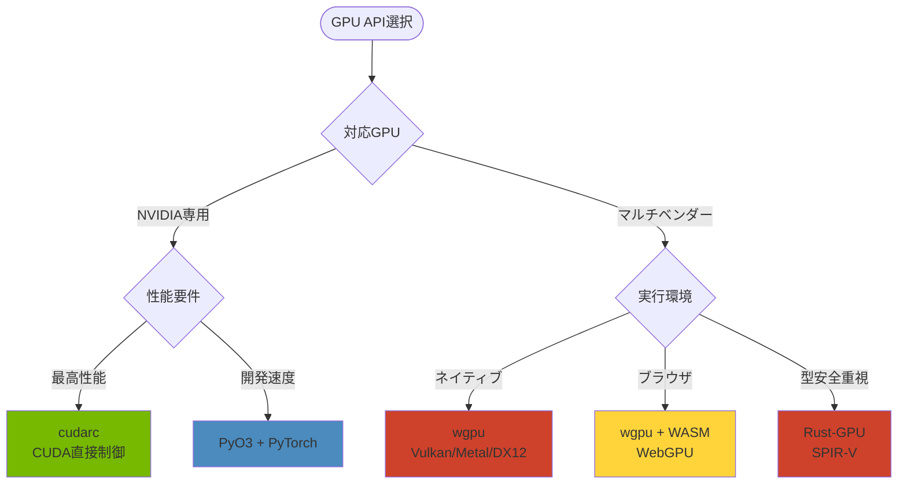

[📚 目次](../README.md) | [⬅️ 第6章](03-06-GPUアーキテクチャの理解.md) | [➡️ 第8章](03-08-GPUメモリ管理と最適化.md)

---

# 第 7 章　Rust から GPU を操作する

この章では、RustからGPUを制御する各種ライブラリとAPIを学びます。CUDA、ROCm、wgpuの3つのバックエンドを比較し、用途に応じた選択方法を示します。

**目的**: Rustで実用的なGPUプログラムを書けるようになり、Python（CuPy/PyTorch）との違いを理解します。

## 7.1 CUDA と ROCm の基本 API

### CUDA vs ROCm の比較

| 項目 | NVIDIA CUDA | AMD ROCm |
|------|------------|----------|
| 対応GPU | NVIDIA GPU | AMD GPU (一部Intel) |
| 言語 | CUDA C/C++ | HIP C/C++ |
| ランタイム | cudarc, cust, cuda-rs | なし（CUDA互換） |
| 成熟度 | 高 | 中 |
| エコシステム | 豊富（cuBLAS, cuDNN等） | 成長中（rocBLAS, MIOpen等） |
| Rustサポート | cudarc（推奨） | 限定的 |

### Python（CuPy）との比較

| 操作 | Python (CuPy) | Rust (cudarc) |
|------|--------------|--------------|
| 初期化 | 自動 | 明示的 |
| メモリ確保 | `cp.array()` | `device.alloc()` |
| データ転送 | 暗黙的 | `htod_copy()`, `dtoh_copy()` |
| カーネル | 文字列 or ファイル | PTX文字列 or ファイル |
| エラー処理 | 例外 | `Result<T, E>` |

### cudarc の基本

**cudarc** [^1] は、Rust-nativeなCUDAバインディングで、安全性と性能を両立します。

[^1]: cudarc: https://github.com/coreylowman/cudarc

#### デバイスの初期化

```rust
use cudarc::driver::*;

fn main() -> Result<(), CudaError> {
    // デバイス数の取得
    let device_count = CudaDevice::count()?;
    println!("Found {} CUDA devices", device_count);
    
    // デバイス0を使用
    let device = CudaDevice::new(0)?;
    
    // デバイス情報
    println!("Device: {}", device.name());
    println!("Compute Capability: {}.{}", 
             device.compute_cap().0, device.compute_cap().1);
    
    Ok(())
}
```

**Python（CuPy）版**:

```python
import cupy as cp

# デバイス数
device_count = cp.cuda.runtime.getDeviceCount()
print(f"Found {device_count} CUDA devices")

# デバイス0を使用（デフォルト）
cp.cuda.Device(0).use()

# デバイス情報
props = cp.cuda.Device().attributes
print(f"Device: {props['Name'].decode()}")
print(f"Compute Capability: {props['ComputeCapabilityMajor']}.{props['ComputeCapabilityMinor']}")
```

#### メモリ操作

```rust
use cudarc::driver::*;

fn memory_operations() -> Result<(), CudaError> {
    let device = CudaDevice::new(0)?;
    
    // CPU側データ
    let host_data: Vec<f32> = (0..1000).map(|i| i as f32).collect();
    
    // CPU → GPU（ホスト・トゥ・デバイス）
    let device_data = device.htod_copy(host_data.clone())?;
    
    // GPU上でメモリ確保
    let mut output = device.alloc_zeros::<f32>(1000)?;
    
    // カーネル実行（省略）
    
    // GPU → CPU（デバイス・トゥ・ホスト）
    let result: Vec<f32> = device.dtoh_sync_copy(&output)?;
    
    Ok(())
}
```

**メモリ転送のコスト**:

| 転送 | PCIe 3.0 x16 | PCIe 4.0 x16 | PCIe 5.0 x16 |
|------|-------------|-------------|-------------|
| 理論帯域 | 16 GB/s | 32 GB/s | 64 GB/s |
| 実効帯域 | ~12 GB/s | ~25 GB/s | ~50 GB/s |

**100MBのデータ転送時間**:
- PCIe 3.0: ~8.3 ms
- PCIe 4.0: ~4.0 ms
- GPU計算（1 TFLOPS）: ~0.1 ms

→ **データ転送がボトルネックになりやすい**

#### カーネル定義と起動

```rust
use cudarc::driver::*;
use cudarc::nvrtc::compile_ptx;

fn launch_kernel() -> Result<(), Box<dyn std::error::Error>> {
    let device = CudaDevice::new(0)?;
    
    // PTXコンパイル
    let ptx = compile_ptx(r#"
        extern "C" __global__ void saxpy(
            int n, float a, const float* x, float* y
        ) {
            int i = blockIdx.x * blockDim.x + threadIdx.x;
            if (i < n) {
                y[i] = a * x[i] + y[i];  // y = ax + y
            }
        }
    "#)?;
    
    device.load_ptx(ptx, "saxpy_module", &["saxpy"])?;
    
    // データ準備
    let n = 1_000_000;
    let a = 2.0f32;
    let x = vec![1.0f32; n];
    let y = vec![3.0f32; n];
    
    let x_gpu = device.htod_copy(x)?;
    let mut y_gpu = device.htod_copy(y)?;
    
    // カーネル起動
    let f = device.get_func("saxpy_module", "saxpy").unwrap();
    let cfg = LaunchConfig {
        grid_dim: ((n + 255) / 256, 1, 1),
        block_dim: (256, 1, 1),
        shared_mem_bytes: 0,
    };
    
    unsafe {
        f.launch(cfg, (n as i32, a, &x_gpu, &mut y_gpu))?;
    }
    
    // 結果取得
    let result = device.dtoh_sync_copy(&y_gpu)?;
    println!("result[0] = {}", result[0]);  // 5.0 = 2*1 + 3
    
    Ok(())
}
```

**Python（CuPy）版**:

```python
import cupy as cp

# カーネル定義
saxpy_kernel = cp.RawKernel(r'''
extern "C" __global__
void saxpy(int n, float a, const float* x, float* y) {
    int i = blockIdx.x * blockDim.x + threadIdx.x;
    if (i < n) {
        y[i] = a * x[i] + y[i];
    }
}
''', 'saxpy')

n = 1000000
a = 2.0
x = cp.ones(n, dtype=cp.float32)
y = cp.ones(n, dtype=cp.float32) * 3

# カーネル起動
grid = ((n + 255) // 256,)
block = (256,)
saxpy_kernel(grid, block, (n, a, x, y))

print(f"result[0] = {y[0]}")  # 5.0
```

## 7.2 cust/cudarc を使ったカーネル呼び出し

### cudarc vs cust

| 特徴 | cudarc | cust |
|------|--------|------|
| 設計思想 | ミニマル、Rustらしい | 高レベルAPI |
| API | Driver API | Runtime API |
| 型安全性 | 高 | 中 |
| 使いやすさ | 中 | 高 |
| 性能 | 最高（直接制御） | 高 |
| メンテナンス | 活発 | 停滞気味 |

### cudarc の高度な使用例

#### ストリームによる並行実行

```rust
use cudarc::driver::*;

fn concurrent_streams() -> Result<(), CudaError> {
    let device = CudaDevice::new(0)?;
    
    // 複数ストリーム作成
    let stream1 = device.fork_default_stream()?;
    let stream2 = device.fork_default_stream()?;
    
    // データ準備
    let data1 = vec![1.0f32; 100000];
    let data2 = vec![2.0f32; 100000];
    
    let d1 = device.htod_copy(data1)?;
    let d2 = device.htod_copy(data2)?;
    
    // 並行実行
    unsafe {
        kernel.launch_on_stream(&stream1, cfg1, (&d1,))?;
        kernel.launch_on_stream(&stream2, cfg2, (&d2,))?;
    }
    
    // 両方の完了を待機
    stream1.synchronize()?;
    stream2.synchronize()?;
    
    Ok(())
}
```

**Python（PyTorch）でのストリーム**:

```python
import torch

stream1 = torch.cuda.Stream()
stream2 = torch.cuda.Stream()

with torch.cuda.stream(stream1):
    result1 = model1(input1)

with torch.cuda.stream(stream2):
    result2 = model2(input2)

torch.cuda.synchronize()  # 全ストリーム待機
```

#### イベントによる計測

```rust
use cudarc::driver::*;

fn timing_with_events() -> Result<(), CudaError> {
    let device = CudaDevice::new(0)?;
    
    // イベント作成
    let start = device.create_event()?;
    let end = device.create_event()?;
    
    // 計測開始
    device.record_event(&start)?;
    
    // カーネル実行
    unsafe {
        kernel.launch(cfg, args)?;
    }
    
    // 計測終了
    device.record_event(&end)?;
    device.synchronize()?;
    
    // 経過時間（ミリ秒）
    let elapsed_ms = device.elapsed_millis(&start, &end)?;
    println!("Kernel time: {:.3} ms", elapsed_ms);
    
    Ok(())
}
```

## 7.3 wgpu によるプラットフォーム非依存 GPU 実装

**wgpu** [^2] は、WebGPU標準に基づくクロスプラットフォームGPU APIです。

[^2]: wgpu: https://wgpu.rs/

### wgpu の特徴

| 項目 | CUDA (cudarc) | wgpu |
|------|--------------|------|
| 対応GPU | NVIDIA のみ | NVIDIA, AMD, Intel, Apple |
| バックエンド | CUDA | Vulkan, Metal, DX12, WebGL |
| API | Driver API | WebGPU標準 |
| Python対応 | CuPy | wgpu-py |
| ブラウザ実行 | 不可 | 可能（WebAssembly） |
| 成熟度 | 高 | 中（急成長） |

### wgpu の基本コード

```rust
use wgpu;

async fn run_wgpu() {
    // インスタンス作成
    let instance = wgpu::Instance::new(wgpu::InstanceDescriptor::default());
    
    // アダプタ選択（GPU選択）
    let adapter = instance.request_adapter(&wgpu::RequestAdapterOptions {
        power_preference: wgpu::PowerPreference::HighPerformance,
        ..Default::default()
    }).await.unwrap();
    
    println!("Using GPU: {}", adapter.get_info().name);
    
    // デバイスとキュー取得
    let (device, queue) = adapter.request_device(
        &wgpu::DeviceDescriptor {
            label: None,
            required_features: wgpu::Features::empty(),
            required_limits: wgpu::Limits::default(),
        },
        None,
    ).await.unwrap();
    
    // コンピュートシェーダーの作成
    let shader = device.create_shader_module(wgpu::ShaderModuleDescriptor {
        label: Some("Compute shader"),
        source: wgpu::ShaderSource::Wgsl(r#"
            @group(0) @binding(0) var<storage, read> input: array<f32>;
            @group(0) @binding(1) var<storage, read_write> output: array<f32>;
            
            @compute @workgroup_size(256)
            fn main(@builtin(global_invocation_id) global_id: vec3<u32>) {
                let idx = global_id.x;
                output[idx] = input[idx] * 2.0;
            }
        "#.into()),
    });
    
    // バッファ作成
    let input_data: Vec<f32> = (0..1000).map(|i| i as f32).collect();
    let input_buffer = device.create_buffer_init(&wgpu::util::BufferInitDescriptor {
        label: Some("Input"),
        contents: bytemuck::cast_slice(&input_data),
        usage: wgpu::BufferUsages::STORAGE,
    });
    
    let output_buffer = device.create_buffer(&wgpu::BufferDescriptor {
        label: Some("Output"),
        size: (input_data.len() * 4) as u64,
        usage: wgpu::BufferUsages::STORAGE | wgpu::BufferUsages::COPY_SRC,
        mapped_at_creation: false,
    });
    
    // バインドグループ（リソースのバインディング）
    let bind_group_layout = device.create_bind_group_layout(&wgpu::BindGroupLayoutDescriptor {
        label: None,
        entries: &[
            wgpu::BindGroupLayoutEntry {
                binding: 0,
                visibility: wgpu::ShaderStages::COMPUTE,
                ty: wgpu::BindingType::Buffer {
                    ty: wgpu::BufferBindingType::Storage { read_only: true },
                    has_dynamic_offset: false,
                    min_binding_size: None,
                },
                count: None,
            },
            wgpu::BindGroupLayoutEntry {
                binding: 1,
                visibility: wgpu::ShaderStages::COMPUTE,
                ty: wgpu::BindingType::Buffer {
                    ty: wgpu::BufferBindingType::Storage { read_only: false },
                    has_dynamic_offset: false,
                    min_binding_size: None,
                },
                count: None,
            },
        ],
    });
    
    // パイプライン作成
    let compute_pipeline = device.create_compute_pipeline(&wgpu::ComputePipelineDescriptor {
        label: None,
        layout: Some(&device.create_pipeline_layout(&wgpu::PipelineLayoutDescriptor {
            label: None,
            bind_group_layouts: &[&bind_group_layout],
            push_constant_ranges: &[],
        })),
        module: &shader,
        entry_point: "main",
    });
    
    // 実行
    let mut encoder = device.create_command_encoder(&Default::default());
    {
        let mut cpass = encoder.begin_compute_pass(&Default::default());
        cpass.set_pipeline(&compute_pipeline);
        cpass.set_bind_group(0, &bind_group, &[]);
        cpass.dispatch_workgroups((input_data.len() as u32 + 255) / 256, 1, 1);
    }
    
    queue.submit(Some(encoder.finish()));
    device.poll(wgpu::Maintain::Wait);
}
```

### WGSL vs CUDA の比較

| 特徴 | CUDA C | WGSL (WebGPU Shading Language) |
|------|---------|-------------------------------|
| 構文 | C/C++ | Rust風 |
| 型システム | C型 | 強力な型システム |
| ポインタ | あり | なし（参照のみ） |
| 安全性 | 低 | 高 |
| 表現力 | 高 | 中 |

**WGSL の例**:

```wgsl
// WGSL: Rust風の構文
@group(0) @binding(0) var<storage, read> a: array<f32>;
@group(0) @binding(1) var<storage, read> b: array<f32>;
@group(0) @binding(2) var<storage, read_write> c: array<f32>;

@compute @workgroup_size(256)
fn matmul(@builtin(global_invocation_id) global_id: vec3<u32>) {
    let idx = global_id.x;
    c[idx] = a[idx] + b[idx];
}
```

**CUDA の例**:

```c
// CUDA: C風の構文
extern "C" __global__ void matmul(
    const float* a, const float* b, float* c, int n
) {
    int idx = blockIdx.x * blockDim.x + threadIdx.x;
    if (idx < n) {
        c[idx] = a[idx] + b[idx];
    }
}
```

## 7.4 Rust-GPU / SPIR-V でシェーダを書く

**Rust-GPU** [^3] は、RustコードをGPUシェーダー（SPIR-V）にコンパイルするプロジェクトです。

[^3]: Rust-GPU: https://github.com/EmbarkStudios/rust-gpu

### Rust-GPU の利点

| 項目 | CUDA/WGSL | Rust-GPU |
|------|-----------|----------|
| 言語 | C/WGSL | Rust |
| 型安全性 | 低〜中 | 高 |
| エラー検出 | 実行時 | コンパイル時 |
| マクロ | なし | Rustマクロ |
| エコシステム | 独自 | Rustクレート |

### Rust-GPU コード例

```rust
#![cfg_attr(target_arch = "spirv", no_std)]

use spirv_std::glam::{Vec3, vec3};
use spirv_std::spirv;

#[spirv(compute(threads(256)))]
pub fn main_cs(
    #[spirv(global_invocation_id)] id: Vec3,
    #[spirv(storage_buffer, descriptor_set = 0, binding = 0)] input: &[f32],
    #[spirv(storage_buffer, descriptor_set = 0, binding = 1)] output: &mut [f32],
) {
    let idx = id.x as usize;
    if idx < input.len() {
        output[idx] = input[idx] * 2.0 + 1.0;
    }
}
```

**ビルド設定**（Cargo.toml）:

```toml
[dependencies]
spirv-std = { version = "0.9", features = ["glam"] }

[profile.dev]
opt-level = 3

[profile.release]
lto = "fat"
```

**ビルドコマンド**:

```bash
cargo build --target spirv-unknown-vulkan1.2
```

### Python にはない Rust-GPU の強み

```rust
// ✅ Rustの型安全性をGPUでも享受
#[spirv(compute(threads(256)))]
pub fn type_safe_kernel(
    #[spirv(storage_buffer)] data: &mut [Vec3],  // 型チェック済み
) {
    // Rustのイテレータも使用可能
    for vec in data.iter_mut() {
        *vec = vec.normalize();  // ベクトル正規化
    }
}
```

## 7.5 PTX アセンブリと低レベル最適化

**PTX**（Parallel Thread Execution）は、CUDAの中間言語です [^4]。

[^4]: PTX ISA: https://docs.nvidia.com/cuda/parallel-thread-execution/

### PTX の基本

```ptx
.version 8.0
.target sm_80
.address_size 64

.visible .entry saxpy (
    .param .u64 .ptr .global .align 4 n,
    .param .f32 a,
    .param .u64 .ptr .global .const .align 4 x,
    .param .u64 .ptr .global .align 4 y
) {
    .reg .f32 %f<10>;
    .reg .u64 %r<10>;
    .reg .pred %p<5>;
    
    // スレッドID計算
    mov.u32 %r1, %tid.x;
    mov.u32 %r2, %ctaid.x;
    mov.u32 %r3, %ntid.x;
    mad.lo.u32 %r4, %r2, %r3, %r1;  // idx = blockIdx * blockDim + threadIdx
    
    // ... 計算 ...
}
```

### インライン PTX

Rustから直接PTXを使用できます：

```rust
use core::arch::asm;

#[no_mangle]
pub unsafe extern "ptx-kernel" fn optimized_kernel(
    data: *mut f32,
    n: i32,
) {
    let idx: u32;
    
    // インラインPTX
    asm!(
        "mov.u32 {idx}, %tid.x;",
        idx = out(reg32) idx,
    );
    
    if (idx as i32) < n {
        *data.add(idx as usize) *= 2.0;
    }
}
```

### SASS 最適化

**SASS**（Shader Assembly）は、PTXからコンパイルされた実際のマシンコードです。

```bash
# PTX → SASS 逆アセンブル
cuobjdump -sass my_kernel.cubin

# 出力例:
# IMAD R2, R0, R1, R3;  // 整数積和
# FFMA R4, R5, R6, R7;  // 浮動小数点融合積和
```

**最適化のポイント**:
- **融合積和（FMA）**: \(a \times b + c\) を1命令で
- **ループ展開**: 分岐を減らす
- **命令レベル並列性（ILP）**: 独立した演算を並べる

### まとめ：GPU API の選択指針



| 用途 | 推奨 | 理由 |
|------|------|------|
| 研究・プロトタイプ | PyTorch | エコシステム |
| NVIDIA専用・最高性能 | cudarc | 直接制御 |
| クロスプラットフォーム | wgpu | 移植性 |
| ブラウザ実行 | wgpu (WASM) | WebGPU |
| 型安全性 | Rust-GPU | コンパイル時検証 |

次章では、GPUメモリの効率的な管理と、データ転送の最適化手法を学びます。

---

## 参考文献

1. NVIDIA Corporation. "CUDA C++ Programming Guide." https://docs.nvidia.com/cuda/cuda-c-programming-guide/
2. NVIDIA Corporation. "CUDA Runtime API." https://docs.nvidia.com/cuda/cuda-runtime-api/
3. NVIDIA Corporation. "PTX ISA." https://docs.nvidia.com/cuda/parallel-thread-execution/
4. coreylowman. "cudarc." https://github.com/coreylowman/cudarc
5. wgpu project. "wgpu Documentation." https://wgpu.rs/
6. Embark Studios. "Rust-GPU." https://github.com/EmbarkStudios/rust-gpu
7. Khronos Group. "WebGPU Specification." https://www.w3.org/TR/webgpu/
8. Nickolls, J., & Dally, W. J. (2010). "The GPU Computing Era." IEEE Micro, 30(2), 56-69.
---

[📚 目次に戻る](../README.md) | [⬅️ 第6章: GPUアーキテクチャの理解](03-06-GPUアーキテクチャの理解.md) | [➡️ 第8章: GPUメモリ管理と最適化](03-08-GPUメモリ管理と最適化.md)