[📚 目次](../README.md) | [⬅️ 第7章](03-07-RustからGPUを操作する.md) | [➡️ 第9章](../04_第IV部_機械学習エンジンの構築/04-09-テンソル・オペレーター設計.md)

---

# 第 8 章　GPU メモリ管理と最適化

この章では、GPUメモリの効率的な管理と、データ転送の最適化手法を学びます。メモリ帯域幅がGPU性能のボトルネックになることが多いため、この章の知識は極めて重要です。

**目的**: メモリアクセスパターンを最適化し、データ転送のオーバーヘッドを最小化する実践的な手法を習得します。

## 8.1 ホスト ⇔ デバイス転送コストと最小化戦略

### 転送コストの実測

**PCIe帯域幅の理論値と実効値**:

| PCIe世代 | 理論帯域幅 | 実効帯域幅（Read） | 実効帯域幅（Write） | レイテンシ |
|---------|-----------|------------------|-------------------|----------|
| PCIe 3.0 x16 | 16 GB/s | ~12 GB/s | ~12 GB/s | ~10 μs |
| PCIe 4.0 x16 | 32 GB/s | ~25 GB/s | ~25 GB/s | ~8 μs |
| PCIe 5.0 x16 | 64 GB/s | ~50 GB/s | ~50 GB/s | ~6 μs |
| NVLink (V100) | 300 GB/s | ~280 GB/s | ~280 GB/s | ~2 μs |

**計算例**（1GBのデータ転送）:

| 接続 | 転送時間 | GPU計算時間（10 TFLOPS） | 転送オーバーヘッド |
|------|---------|----------------------|----------------|
| PCIe 3.0 | 83 ms | 0.1 ms | **転送が830倍遅い** |
| PCIe 4.0 | 40 ms | 0.1 ms | 転送が400倍遅い |
| NVLink | 3.6 ms | 0.1 ms | 転送が36倍遅い |

**教訓**: データ転送を最小化することが最重要

### Python（PyTorch）での暗黙的転送

```python
import torch

# CPUテンソル
x_cpu = torch.randn(1000, 1000)

# GPU転送（暗黙的）
x_gpu = x_cpu.cuda()  # 内部でcudaMemcpy

# 計算
y_gpu = x_gpu @ x_gpu

# CPU転送（暗黙的）
y_cpu = y_gpu.cpu()  # 内部でcudaMemcpy
```

### Rust（cudarc）での明示的転送

```rust
use cudarc::driver::*;
use std::time::Instant;

fn measure_transfer() -> Result<(), CudaError> {
    let device = CudaDevice::new(0)?;
    let size = 1000 * 1000;
    let data: Vec<f32> = vec![1.0; size];
    
    // H2D（ホスト → デバイス）計測
    let start = Instant::now();
    let d_data = device.htod_copy(data.clone())?;
    device.synchronize()?;
    let h2d_time = start.elapsed();
    
    println!("H2D: {:.3} ms ({:.2} GB/s)", 
             h2d_time.as_secs_f64() * 1000.0,
             (size * 4) as f64 / h2d_time.as_secs_f64() / 1e9);
    
    // D2H（デバイス → ホスト）計測
    let start = Instant::now();
    let result: Vec<f32> = device.dtoh_sync_copy(&d_data)?;
    let d2h_time = start.elapsed();
    
    println!("D2H: {:.3} ms ({:.2} GB/s)", 
             d2h_time.as_secs_f64() * 1000.0,
             (size * 4) as f64 / d2h_time.as_secs_f64() / 1e9);
    
    Ok(())
}
```

### 転送最小化の戦略

| 戦略 | 説明 | 削減率 | 実装コスト |
|------|------|--------|----------|
| **データのGPU常駐化** | 可能な限りGPUに置く | 90%+ | 低 |
| **バッチ処理** | 小さい転送をまとめる | 50-80% | 低 |
| **非同期転送** | 計算と転送を重複 | 実質0% | 中 |
| **ピン留めメモリ** | DMA転送を高速化 | 30-50% | 低 |
| **Unified Memory** | 自動転送 | 変動 | 低 |

## 8.2 ピン留めメモリ・Unified Memory・ゼロコピー

### ピン留めメモリ（Pinned Memory）

**ページング可能メモリ**（Pageable Memory）は、OSがスワップアウトできるため、GPU転送時にコピーが発生します。

**ピン留めメモリ**（Pinned/Page-locked Memory）[^1] は、物理メモリに固定され、DMA転送が可能です。

[^1]: CUDA C++ Programming Guide, Pinned Memory: https://docs.nvidia.com/cuda/cuda-c-programming-guide/index.html#page-locked-host-memory

**性能比較**:

| メモリタイプ | 転送帯域幅（PCIe 3.0） | 使用例 |
|------------|---------------------|--------|
| Pageable | ~3 GB/s | デフォルト |
| Pinned | ~12 GB/s | **4倍高速** |

**Python（CuPy）での使用**:

```python
import cupy as cp

# ピン留めメモリ確保
pinned_mem = cp.cuda.alloc_pinned_memory(1000 * 1000 * 4)  # 4MB
array = cp.ndarray((1000, 1000), dtype=cp.float32, memptr=pinned_mem)

# 通常のメモリとの比較
import time

# Pageable メモリ
normal_array = cp.asnumpy(cp.random.randn(1000, 1000, dtype=cp.float32))
start = time.time()
cp.asarray(normal_array)
print(f"Pageable: {(time.time() - start) * 1000:.3f} ms")

# Pinned メモリ
pinned_array = cp.cuda.to_cpu(cp.random.randn(1000, 1000, dtype=cp.float32), 
                               stream=cp.cuda.Stream.null)
```

**Rust（cudarc）での使用**:

```rust
use cudarc::driver::*;

fn pinned_memory_example() -> Result<(), CudaError> {
    let device = CudaDevice::new(0)?;
    let size = 1_000_000;
    
    // 通常のメモリ
    let normal_data = vec![1.0f32; size];
    
    let start = std::time::Instant::now();
    let gpu1 = device.htod_copy(normal_data.clone())?;
    device.synchronize()?;
    println!("Pageable: {:.3} ms", start.elapsed().as_secs_f64() * 1000.0);
    
    // ピン留めメモリ（cudarc は内部で自動的に最適化）
    // 手動でピン留めする場合:
    let pinned = device.alloc_host_pinned(size)?;
    // ... 使用 ...
    
    Ok(())
}
```

### Unified Memory

**Unified Memory** [^2] は、CPUとGPU間でメモリ空間を統一し、自動的にデータ移行を行います。

[^2]: CUDA Unified Memory: https://docs.nvidia.com/cuda/cuda-c-programming-guide/index.html#unified-memory-programming

**特徴**:

| 項目 | 明示的転送 | Unified Memory |
|------|-----------|---------------|
| コード複雑度 | 高 | 低 |
| 性能 | 最高（手動最適化） | 中〜高（自動最適化） |
| ページフォルト | なし | あり（初回アクセス） |
| オーバーサブスクリプション | 手動管理 | 自動 |

**Python（PyTorch）は内部でUnified Memoryを使用しません**（明示的転送のみ）

**C++（CUDA）での使用**:

```cpp
// Unified Memory 確保
float *data;
cudaMallocManaged(&data, size * sizeof(float));

// CPUから書き込み
for (int i = 0; i < size; i++) {
    data[i] = i;
}

// GPUから読み込み（自動転送）
kernel<<<blocks, threads>>>(data);
cudaDeviceSynchronize();

// CPUから読み込み（自動転送）
printf("%f\n", data[0]);

cudaFree(data);
```

**Rustでは現状、Unified Memoryのサポートは限定的**。

### ゼロコピー（Zero-Copy）

**ゼロコピー**は、ピン留めメモリを直接GPUからアクセスする技術です [^3]。

[^3]: データのコピーなしで、PCIe経由でアクセス

**使用条件**:
- 小さいデータ（数KB〜数MB）
- 読み取り回数が少ない
- 転送コストが計算コストより大きい

**適用例**:

| データサイズ | コピー方式 | ゼロコピー | 推奨 |
|------------|-----------|-----------|------|
| 1 KB | 0.01 ms | 0.001 ms | ゼロコピー |
| 1 MB | 0.1 ms | 0.1 ms | どちらでも |
| 100 MB | 10 ms | 50 ms | コピー |

**計算**: 大きいデータは一度コピーした方が、後のアクセスが高速

## 8.3 メモリ合体（Coalescing）アクセスパターン

**メモリ合体**（Memory Coalescing）は、連続したメモリアクセスを1回のトランザクションにまとめる最適化です [^4]。

[^4]: CUDA C++ Best Practices Guide, Coalesced Access: https://docs.nvidia.com/cuda/cuda-c-best-practices-guide/index.html#coalesced-access-to-global-memory

### 合体の条件

ワープ内の32スレッドが連続した128バイト領域（32個のfloat）にアクセスすると、**1回のメモリトランザクション**で済みます。

**合体アクセスの例**:

```c
// ✅ 完全合体
__global__ void coalesced_read(float* in, float* out, int n) {
    int idx = blockIdx.x * blockDim.x + threadIdx.x;
    if (idx < n) {
        out[idx] = in[idx];  // 連続アクセス
    }
}
```

**スレッドIDとアドレスの対応**:

| スレッドID | アクセスアドレス | バイト |
|-----------|---------------|--------|
| 0 | `&in[0]` | 0-3 |
| 1 | `&in[1]` | 4-7 |
| ... | ... | ... |
| 31 | `&in[31]` | 124-127 |

→ 128バイトが1トランザクション

**非合体アクセスの例**:

```c
// ❌ 非合体（32回のトランザクション）
__global__ void uncoalesced_read(float* in, float* out, int n) {
    int idx = blockIdx.x * blockDim.x + threadIdx.x;
    if (idx < n) {
        out[idx] = in[idx * 32];  // ストライド32
    }
}
```

**性能差**（1億要素の読み取り）:

| パターン | 帯域幅 | 時間 | 効率 |
|---------|--------|------|------|
| 合体 | 850 GB/s | 0.47 ms | 84% |
| ストライド2 | 425 GB/s | 0.94 ms | 42% |
| ストライド32 | 27 GB/s | 14.8 ms | 2.7% |

### 行列転置の最適化

**問題**: 行列転置は本質的に非合体アクセスを含みます。

```c
// ❌ 素朴な転置（書き込みが非合体）
__global__ void transpose_naive(float* in, float* out, int n) {
    int x = blockIdx.x * blockDim.x + threadIdx.x;
    int y = blockIdx.y * blockDim.y + threadIdx.y;
    
    if (x < n && y < n) {
        out[x * n + y] = in[y * n + x];  // 書き込みが非合体
    }
}

// ✅ シェアードメモリを使った最適化
__global__ void transpose_optimized(float* in, float* out, int n) {
    __shared__ float tile[32][33];  // +1でバンクコンフリクト回避
    
    int x = blockIdx.x * 32 + threadIdx.x;
    int y = blockIdx.y * 32 + threadIdx.y;
    
    // 読み取り（合体）
    if (x < n && y < n) {
        tile[threadIdx.y][threadIdx.x] = in[y * n + x];
    }
    
    __syncthreads();
    
    // 転置して書き込み（合体）
    x = blockIdx.y * 32 + threadIdx.x;
    y = blockIdx.x * 32 + threadIdx.y;
    
    if (x < n && y < n) {
        out[y * n + x] = tile[threadIdx.x][threadIdx.y];
    }
}
```

**性能比較**（4096×4096行列）:

| 実装 | 帯域幅 | 時間 |
|------|--------|------|
| 素朴な転置 | 45 GB/s | 1.5 ms |
| 最適化転置 | 780 GB/s | 0.09 ms |
| cuBLAS | 850 GB/s | 0.08 ms |

**高速化率**: 17倍

### Rust での実装

```rust
use cudarc::driver::*;

const TILE_DIM: usize = 32;

let ptx = compile_ptx(r#"
    extern "C" __global__ void transpose_optimized(
        const float* in, float* out, int n
    ) {
        __shared__ float tile[32][33];
        
        int x = blockIdx.x * 32 + threadIdx.x;
        int y = blockIdx.y * 32 + threadIdx.y;
        
        if (x < n && y < n) {
            tile[threadIdx.y][threadIdx.x] = in[y * n + x];
        }
        
        __syncthreads();
        
        x = blockIdx.y * 32 + threadIdx.x;
        y = blockIdx.x * 32 + threadIdx.y;
        
        if (x < n && y < n) {
            out[y * n + x] = tile[threadIdx.x][threadIdx.y];
        }
    }
"#)?;
```

## 8.4 ストリーム・イベント・非同期実行

### CUDAストリーム

**ストリーム**は、順序付けられたGPU操作のキューです [^5]。異なるストリームの操作は並行実行できます。

[^5]: CUDA C++ Programming Guide, Streams: https://docs.nvidia.com/cuda/cuda-c-programming-guide/index.html#streams

**ストリームの種類**:

| ストリーム | 説明 | 用途 |
|----------|------|------|
| デフォルト | 暗黙的、同期的 | 単純なプログラム |
| 非デフォルト | 明示的、非同期 | パイプライン化 |

**Python（CuPy）でのストリーム**:

```python
import cupy as cp

# ストリーム作成
stream1 = cp.cuda.Stream()
stream2 = cp.cuda.Stream()

with stream1:
    a1 = cp.random.randn(1000, 1000)
    b1 = a1 @ a1

with stream2:
    a2 = cp.random.randn(1000, 1000)
    b2 = a2 @ a2

# 両方完了を待つ
stream1.synchronize()
stream2.synchronize()
```

**Rust（cudarc）でのストリーム**:

```rust
use cudarc::driver::*;

fn stream_example() -> Result<(), CudaError> {
    let device = CudaDevice::new(0)?;
    
    // ストリーム作成
    let stream1 = device.fork_default_stream()?;
    let stream2 = device.fork_default_stream()?;
    
    // データ準備
    let data1 = vec![1.0f32; 100000];
    let data2 = vec![2.0f32; 100000];
    
    // 非同期転送
    let d1 = device.htod_copy_async(data1, &stream1)?;
    let d2 = device.htod_copy_async(data2, &stream2)?;
    
    // 並行実行
    unsafe {
        kernel.launch_on_stream(&stream1, cfg, (&d1,))?;
        kernel.launch_on_stream(&stream2, cfg, (&d2,))?;
    }
    
    // 同期
    stream1.synchronize()?;
    stream2.synchronize()?;
    
    Ok(())
}
```

### 計算と転送のパイプライン化

**3段階パイプライン**:

```mermaid
gantt
    title ストリームによる並行実行
    dateFormat X
    axisFormat %L
    
    section Stream 0
    H2D_0    :s0h0, 0, 1
    Kernel_0 :s0k0, after s0h0, 1
    D2H_0    :s0d0, after s0k0, 1
    H2D_3    :s0h3, after s0d0, 1
    Kernel_3 :s0k3, after s0h3, 1
    
    section Stream 1
    H2D_1    :s1h1, 1, 1
    Kernel_1 :s1k1, after s1h1, 1
    D2H_1    :s1d1, after s1k1, 1
    H2D_4    :s1h4, after s1d1, 1
    
    section Stream 2
    H2D_2    :s2h2, 2, 1
    Kernel_2 :s2k2, after s2h2, 1
    D2H_2    :s2d2, after s2k2, 1
```



**凡例**:
- H2D: Host to Device 転送
- Kernel: GPU計算
- D2H: Device to Host 転送

**実装例**:

```rust
fn pipelined_processing() -> Result<(), CudaError> {
    let device = CudaDevice::new(0)?;
    let num_streams = 3;
    let batch_size = 10000;
    let num_batches = 30;
    
    // ストリーム作成
    let streams: Vec<_> = (0..num_streams)
        .map(|_| device.fork_default_stream())
        .collect::<Result<_, _>>()?;
    
    for i in 0..num_batches {
        let stream_idx = i % num_streams;
        let stream = &streams[stream_idx];
        
        // データ準備
        let data = vec![i as f32; batch_size];
        
        // H2D
        let d_in = device.htod_copy_async(data, stream)?;
        
        // カーネル実行
        unsafe {
            kernel.launch_on_stream(stream, cfg, (&d_in,))?;
        }
        
        // D2H
        let result = device.dtoh_async_copy(&d_in, stream)?;
    }
    
    // 全ストリーム同期
    for stream in streams {
        stream.synchronize()?;
    }
    
    Ok(())
}
```

**性能改善**:

| 実装 | 時間 | スピードアップ |
|------|------|--------------|
| 順次実行 | 300 ms | 1x |
| 2ストリームパイプライン | 160 ms | 1.9x |
| 3ストリームパイプライン | 110 ms | 2.7x |

## 8.5 複数 GPU・デバイス選択とスケジューリング

### マルチGPU プログラミング

**PyTorchでのマルチGPU**:

```python
import torch
import torch.nn as nn

# DataParallel（簡単だが非効率）
model = nn.DataParallel(MyModel())
model = model.cuda()

# DistributedDataParallel（推奨）
model = MyModel().cuda()
model = nn.parallel.DistributedDataParallel(model)
```

**Rust（cudarc）でのマルチGPU**:

```rust
use cudarc::driver::*;
use rayon::prelude::*;

fn multi_gpu_processing() -> Result<(), Box<dyn std::error::Error>> {
    let device_count = CudaDevice::count()?;
    println!("Found {} GPUs", device_count);
    
    // 各GPUでデバイス作成
    let devices: Vec<_> = (0..device_count)
        .map(|i| CudaDevice::new(i))
        .collect::<Result<_, _>>()?;
    
    // データを分割
    let total_size = 1_000_000;
    let chunk_size = total_size / device_count;
    let data: Vec<f32> = (0..total_size).map(|i| i as f32).collect();
    
    // 並列実行（rayon）
    let results: Vec<Vec<f32>> = devices.par_iter()
        .enumerate()
        .map(|(i, device)| {
            let start = i * chunk_size;
            let end = (i + 1) * chunk_size;
            let chunk = &data[start..end];
            
            // GPU処理
            let d_chunk = device.htod_copy(chunk.to_vec()).unwrap();
            // ... カーネル実行 ...
            device.dtoh_sync_copy(&d_chunk).unwrap()
        })
        .collect();
    
    // 結果をマージ
    let final_result: Vec<f32> = results.into_iter().flatten().collect();
    
    Ok(())
}
```

### P2P（Peer-to-Peer）転送

**GPU間直接転送**（NVLink経由）:

```rust
fn p2p_transfer() -> Result<(), CudaError> {
    let device0 = CudaDevice::new(0)?;
    let device1 = CudaDevice::new(1)?;
    
    // P2Pアクセス有効化
    device0.enable_peer_access(&device1)?;
    
    // GPU0でデータ作成
    let data = vec![1.0f32; 1000000];
    let d0_data = device0.htod_copy(data)?;
    
    // GPU0 → GPU1 直接転送（NVLink経由）
    let d1_data = device1.alloc_zeros::<f32>(1000000)?;
    // cudarc では p2p転送は手動でCUDA APIを呼ぶ必要がある
    
    Ok(())
}
```

**転送速度比較**:

| 経路 | 帯域幅 |
|------|--------|
| GPU → CPU → GPU | ~12 GB/s（PCIe 3.0） |
| GPU → GPU（P2P、PCIe） | ~12 GB/s |
| GPU → GPU（NVLink） | ~300 GB/s（**25倍**） |

## 8.6 メモリプール・カスタムアロケータ

### メモリプール

頻繁なメモリ確保・解放はオーバーヘッドが大きいため、**メモリプール**で再利用します。

**PyTorch のメモリキャッシュ**:

```python
import torch

# PyTorchは内部でメモリプールを使用
for i in range(1000):
    x = torch.randn(1000, 1000).cuda()  # 再利用される
    y = x @ x
    del x, y  # メモリは即座に解放されず、プールに戻る

# キャッシュクリア
torch.cuda.empty_cache()

# メモリ使用量確認
print(f"Allocated: {torch.cuda.memory_allocated() / 1e9:.2f} GB")
print(f"Reserved: {torch.cuda.memory_reserved() / 1e9:.2f} GB")
```

**Rust での簡易メモリプール**:

```rust
use cudarc::driver::*;
use std::collections::HashMap;

struct GpuMemoryPool {
    device: CudaDevice,
    pool: HashMap<usize, Vec<CudaSlice<f32>>>,
}

impl GpuMemoryPool {
    fn new(device: CudaDevice) -> Self {
        Self {
            device,
            pool: HashMap::new(),
        }
    }
    
    fn alloc(&mut self, size: usize) -> Result<CudaSlice<f32>, CudaError> {
        // プールから取得
        if let Some(buffers) = self.pool.get_mut(&size) {
            if let Some(buffer) = buffers.pop() {
                return Ok(buffer);
            }
        }
        
        // 新規確保
        self.device.alloc_zeros(size)
    }
    
    fn free(&mut self, buffer: CudaSlice<f32>) {
        let size = buffer.len();
        self.pool.entry(size).or_insert_with(Vec::new).push(buffer);
    }
}

fn main() {
    let device = CudaDevice::new(0).unwrap();
    let mut pool = GpuMemoryPool::new(device);
    
    for _ in 0..1000 {
        let buf = pool.alloc(1000000).unwrap();
        // ... 使用 ...
        pool.free(buf);  // プールに戻す
    }
}
```

### メモリ使用量の監視

```rust
use cudarc::driver::*;

fn monitor_memory(device: &CudaDevice) {
    let total = device.total_memory().unwrap();
    let free = device.free_memory().unwrap();
    let used = total - free;
    
    println!("GPU Memory:");
    println!("  Total: {:.2} GB", total as f64 / 1e9);
    println!("  Used:  {:.2} GB ({:.1}%)", 
             used as f64 / 1e9,
             used as f64 / total as f64 * 100.0);
    println!("  Free:  {:.2} GB", free as f64 / 1e9);
}
```

### 最適化のまとめ

| 手法 | 適用場面 | 効果 | 実装難度 |
|------|---------|------|---------|
| **ピン留めメモリ** | 頻繁な転送 | 4x高速化 | 低 |
| **非同期転送** | 計算と転送の重複 | 2-3x | 中 |
| **メモリ合体** | すべてのカーネル | 10-30x | 中 |
| **シェアードメモリ** | データ再利用 | 5-15x | 高 |
| **メモリプール** | 頻繁な確保解放 | 2-5x | 中 |
| **P2P転送** | マルチGPU | 25x（NVLink） | 中 |

### Python vs Rust のメモリ管理

| 観点 | Python (PyTorch/CuPy) | Rust (cudarc) |
|------|---------------------|--------------|
| 転送 | 暗黙的 | 明示的 |
| メモリプール | 自動（内蔵） | 手動実装 |
| エラー処理 | 例外 | Result型 |
| 細かい制御 | 限定的 | 完全 |
| 学習コスト | 低 | 高 |
| 最適化の余地 | 小 | 大 |

**推奨アプローチ**:
- **プロトタイプ**: Python（自動最適化）
- **プロダクション**: Rust（手動最適化で極限性能）

次章（第IV部）では、これまでの知識を統合して、実際の機械学習エンジンを構築します。

---

## 参考文献

1. NVIDIA Corporation. "CUDA C++ Programming Guide." https://docs.nvidia.com/cuda/cuda-c-programming-guide/
2. NVIDIA Corporation. "CUDA C++ Best Practices Guide, Chapter 9: Memory Optimizations." https://docs.nvidia.com/cuda/cuda-c-best-practices-guide/
3. Harris, M. (2013). "How to Optimize Data Transfers in CUDA C/C++." NVIDIA Developer Blog.
4. Harris, M. (2012). "How to Overlap Data Transfers in CUDA C/C++." NVIDIA Developer Blog.
5. Ruetsch, G., & Micikevicius, P. (2009). "Optimizing Matrix Transpose in CUDA." NVIDIA SDK.
6. NVIDIA Corporation. "CUDA Unified Memory Programming." https://docs.nvidia.com/cuda/cuda-c-programming-guide/index.html#unified-memory-programming
7. NVIDIA Corporation. "Multi-GPU Programming." https://docs.nvidia.com/cuda/cuda-c-best-practices-guide/index.html#multi-gpu-programming
8. cudarc repository. https://github.com/coreylowman/cudarc
---

[📚 目次に戻る](../README.md) | [⬅️ 第7章: RustからGPUを操作する](03-07-RustからGPUを操作する.md) | [➡️ 第9章: テンソル・オペレーター設計](../04_第IV部_機械学習エンジンの構築/04-09-テンソル・オペレーター設計.md)