[📚 目次](../README.md) | [⬅️ 第12章](04-12-データローディングとバッチ処理.md) | [➡️ 第14章](04-14-デバッグとプロファイリング.md)

---

# 第 10 章　学習ループと最適化手法

この章では、ニューラルネットワークの学習ループと、各種最適化アルゴリズム（SGD、Adam、AdamW等）を実装します。PyTorchの実装を参考にしながら、Rustで型安全かつ高性能な最適化器を構築します。

**目的**: 機械学習の学習プロセス全体を理解し、最新の最適化手法をゼロから実装できるようになります。

## 10.1 forward → loss → backward → optimizer の流れ

### 学習ループの全体像

```mermaid
graph LR
    subgraph Epoch["エポックループ"]
        subgraph Batch["バッチループ"]
            Forward[Forward Pass<br/>予測計算] --> Loss[Loss<br/>損失計算]
            Loss --> Backward[Backward Pass<br/>勾配計算]
            Backward --> Update[Optimizer<br/>パラメータ更新]
            Update --> Forward
        end
    end
    
    style Forward fill:#e1f5ff
    style Loss fill:#ffe1f5
    style Backward fill:#fff4e1
    style Update fill:#e1ffe1
```



**数式表現**:

1. **Forward**: $\hat{y} = f(x; \theta)$
2. **Loss**: $L = \mathcal{L}(\hat{y}, y)$
3. **Backward**: $\nabla_\theta L = \frac{\partial L}{\partial \theta}$
4. **Update**: $\theta_{t+1} = \theta_t - \eta \nabla_\theta L$

### Python（PyTorch）での実装

```python
import torch
import torch.nn as nn
import torch.optim as optim

# モデル定義
model = nn.Sequential(
    nn.Linear(784, 256),
    nn.ReLU(),
    nn.Linear(256, 10)
)

# 最適化器
optimizer = optim.SGD(model.parameters(), lr=0.01)

# 損失関数
criterion = nn.CrossEntropyLoss()

# 学習ループ
for epoch in range(10):
    for batch_idx, (data, target) in enumerate(train_loader):
        # 1. Forward pass
        output = model(data)
        
        # 2. Loss
        loss = criterion(output, target)
        
        # 3. Backward pass
        optimizer.zero_grad()  # 勾配をゼロ化
        loss.backward()
        
        # 4. Update
        optimizer.step()
        
        if batch_idx % 100 == 0:
            print(f'Epoch {epoch}, Batch {batch_idx}, Loss: {loss.item():.4f}')
```

### Rust での実装

```rust
use ndarray::{Array1, Array2};

pub struct LinearLayer {
    weight: Array2<f32>,  // (out_features, in_features)
    bias: Array1<f32>,
    // 勾配保存用
    grad_weight: Option<Array2<f32>>,
    grad_bias: Option<Array1<f32>>,
    // Forward時の入力保存（Backward用）
    last_input: Option<Array2<f32>>,
}

impl LinearLayer {
    pub fn new(in_features: usize, out_features: usize) -> Self {
        use ndarray_rand::RandomExt;
        use ndarray_rand::rand_distr::Normal;
        
        // He初期化
        let std = (2.0 / in_features as f32).sqrt();
        let weight = Array2::random((out_features, in_features), Normal::new(0.0, std).unwrap());
        let bias = Array1::zeros(out_features);
        
        Self {
            weight,
            bias,
            grad_weight: None,
            grad_bias: None,
            last_input: None,
        }
    }
    
    pub fn forward(&mut self, input: &Array2<f32>) -> Array2<f32> {
        // 入力を保存（Backward で使用）
        self.last_input = Some(input.clone());
        
        // y = xW^T + b
        input.dot(&self.weight.t()) + &self.bias
    }
    
    pub fn backward(&mut self, grad_output: &Array2<f32>) -> Array2<f32> {
        let input = self.last_input.as_ref().expect("forward not called");
        
        // ∂L/∂W = ∂L/∂y · x^T
        self.grad_weight = Some(grad_output.t().dot(input));
        
        // ∂L/∂b = sum(∂L/∂y, axis=0)
        self.grad_bias = Some(grad_output.sum_axis(ndarray::Axis(0)));
        
        // ∂L/∂x = ∂L/∂y · W
        grad_output.dot(&self.weight)
    }
    
    pub fn parameters(&self) -> Vec<&Array2<f32>> {
        vec![&self.weight]
    }
    
    pub fn gradients(&self) -> Option<Vec<&Array2<f32>>> {
        self.grad_weight.as_ref().map(|gw| vec![gw])
    }
}

// 学習ループ
fn train_loop() {
    let mut model = LinearLayer::new(784, 10);
    let lr = 0.01;
    
    for epoch in 0..10 {
        for (batch_idx, (data, target)) in train_data.iter().enumerate() {
            // 1. Forward
            let output = model.forward(data);
            
            // 2. Loss（簡略化）
            let loss = cross_entropy_loss(&output, target);
            
            // 3. Backward
            let grad_output = cross_entropy_backward(&output, target);
            model.backward(&grad_output);
            
            // 4. Update（SGD）
            if let Some(grad_w) = &model.grad_weight {
                model.weight = &model.weight - &(grad_w * lr);
            }
            if let Some(grad_b) = &model.grad_bias {
                model.bias = &model.bias - &(grad_b * lr);
            }
        }
    }
}
```

## 10.2 SGD / Adam / AdamW / RMSProp の実装

### 最適化アルゴリズムの比較

| アルゴリズム | 発表年 | 主な特徴 | 計算量 | メモリ |
|------------|-------|---------|--------|--------|
| **SGD** | 1951 | シンプル、理論的保証 | $O(n)$ | $O(n)$ |
| **Momentum** | 1964 | 慣性項で加速 | $O(n)$ | $O(2n)$ |
| **RMSProp** | 2012 | 適応的学習率 | $O(n)$ | $O(2n)$ |
| **Adam** | 2014 | Momentum + RMSProp | $O(n)$ | $O(3n)$ |
| **AdamW** | 2017 | 重み減衰の修正 | $O(n)$ | $O(3n)$ |

### SGD（確率的勾配降下法）

**更新式**:

$$
\theta_{t+1} = \theta_t - \eta \nabla_\theta L
$$

ここで、$\eta$ は学習率（learning rate）です。

**Python（PyTorch）**:

```python
import torch.optim as optim

optimizer = optim.SGD(model.parameters(), lr=0.01)

# 更新
optimizer.zero_grad()
loss.backward()
optimizer.step()
```

**Rust 実装**:

```rust
pub struct SGD {
    lr: f32,
}

impl SGD {
    pub fn new(lr: f32) -> Self {
        Self { lr }
    }
    
    pub fn step(&self, params: &mut [Array2<f32>], grads: &[Array2<f32>]) {
        for (param, grad) in params.iter_mut().zip(grads) {
            // θ = θ - η∇L
            *param = &*param - &(grad * self.lr);
        }
    }
}
```

### Momentum SGD

**更新式**:

$$
\begin{align}
v_t &= \beta v_{t-1} + \nabla_\theta L \\
\theta_{t+1} &= \theta_t - \eta v_t
\end{align}
$$

$\beta$ は慣性係数（通常0.9）

**物理的解釈**: ボールが坂を転がる様子（慣性がある）

**Rust 実装**:

```rust
pub struct MomentumSGD {
    lr: f32,
    momentum: f32,
    velocity: Vec<Array2<f32>>,  // 速度の状態
}

impl MomentumSGD {
    pub fn new(params: &[Array2<f32>], lr: f32, momentum: f32) -> Self {
        let velocity = params.iter()
            .map(|p| Array2::zeros(p.raw_dim()))
            .collect();
        
        Self { lr, momentum, velocity }
    }
    
    pub fn step(&mut self, params: &mut [Array2<f32>], grads: &[Array2<f32>]) {
        for ((param, grad), vel) in params.iter_mut()
            .zip(grads)
            .zip(&mut self.velocity) 
        {
            // v = β·v + ∇L
            *vel = &*vel * self.momentum + grad;
            
            // θ = θ - η·v
            *param = &*param - &(vel * self.lr);
        }
    }
}
```

### Adam（Adaptive Moment Estimation）

**更新式** [^1]:

$$
\begin{align}
m_t &= \beta_1 m_{t-1} + (1 - \beta_1) \nabla_\theta L \\
v_t &= \beta_2 v_{t-1} + (1 - \beta_2) (\nabla_\theta L)^2 \\
\hat{m}_t &= \frac{m_t}{1 - \beta_1^t} \\
\hat{v}_t &= \frac{v_t}{1 - \beta_2^t} \\
\theta_{t+1} &= \theta_t - \eta \frac{\hat{m}_t}{\sqrt{\hat{v}_t} + \epsilon}
\end{align}
$$

[^1]: Kingma, D. P., & Ba, J. (2014). "Adam: A Method for Stochastic Optimization." arXiv:1412.6980

**パラメータ**:
- $\beta_1 = 0.9$: 1次モーメント（平均）の減衰率
- $\beta_2 = 0.999$: 2次モーメント（分散）の減衰率
- $\epsilon = 10^{-8}$: 数値安定性のための小さい値

**Python（PyTorch）**:

```python
optimizer = torch.optim.Adam(
    model.parameters(),
    lr=0.001,
    betas=(0.9, 0.999),
    eps=1e-8
)
```

**Rust 実装**:

```rust
pub struct Adam {
    lr: f32,
    beta1: f32,
    beta2: f32,
    eps: f32,
    t: usize,  // タイムステップ
    m: Vec<Array2<f32>>,  // 1次モーメント
    v: Vec<Array2<f32>>,  // 2次モーメント
}

impl Adam {
    pub fn new(params: &[Array2<f32>], lr: f32) -> Self {
        let m = params.iter().map(|p| Array2::zeros(p.raw_dim())).collect();
        let v = params.iter().map(|p| Array2::zeros(p.raw_dim())).collect();
        
        Self {
            lr,
            beta1: 0.9,
            beta2: 0.999,
            eps: 1e-8,
            t: 0,
            m,
            v,
        }
    }
    
    pub fn step(&mut self, params: &mut [Array2<f32>], grads: &[Array2<f32>]) {
        self.t += 1;
        let t = self.t as f32;
        
        for ((param, grad), (m, v)) in params.iter_mut()
            .zip(grads)
            .zip(self.m.iter_mut().zip(&mut self.v))
        {
            // m = β₁·m + (1-β₁)·∇L
            *m = &*m * self.beta1 + &(grad * (1.0 - self.beta1));
            
            // v = β₂·v + (1-β₂)·(∇L)²
            *v = &*v * self.beta2 + &(grad.mapv(|x| x * x) * (1.0 - self.beta2));
            
            // バイアス補正
            let m_hat = m / (1.0 - self.beta1.powf(t));
            let v_hat = v / (1.0 - self.beta2.powf(t));
            
            // θ = θ - η·m̂/(√v̂ + ε)
            let update = m_hat / (v_hat.mapv(|x| x.sqrt()) + self.eps);
            *param = &*param - &(update * self.lr);
        }
    }
}
```

### AdamW（Adam with Decoupled Weight Decay）

**AdamW** [^2] は、Adamの重み減衰（weight decay）を修正した版です。

[^2]: Loshchilov, I., & Hutter, F. (2017). "Decoupled Weight Decay Regularization." arXiv:1711.05101

**Adam の問題点**:

通常のL2正則化:
$$
L_{\text{reg}} = L + \frac{\lambda}{2} \|\theta\|^2
$$

勾配:
$$
\nabla_\theta L_{\text{reg}} = \nabla_\theta L + \lambda \theta
$$

Adamでは、この $\lambda \theta$ が適応的学習率に影響されて効果が薄まります。

**AdamW の更新式**:

$$
\theta_{t+1} = (1 - \eta \lambda) \theta_t - \eta \frac{\hat{m}_t}{\sqrt{\hat{v}_t} + \epsilon}
$$

重み減衰を**適応的学習率の外**で適用します。

**Rust 実装**:

```rust
pub struct AdamW {
    lr: f32,
    beta1: f32,
    beta2: f32,
    eps: f32,
    weight_decay: f32,  // λ
    t: usize,
    m: Vec<Array2<f32>>,
    v: Vec<Array2<f32>>,
}

impl AdamW {
    pub fn step(&mut self, params: &mut [Array2<f32>], grads: &[Array2<f32>]) {
        self.t += 1;
        let t = self.t as f32;
        
        for ((param, grad), (m, v)) in params.iter_mut()
            .zip(grads)
            .zip(self.m.iter_mut().zip(&mut self.v))
        {
            // Adam と同じモーメント更新
            *m = &*m * self.beta1 + &(grad * (1.0 - self.beta1));
            *v = &*v * self.beta2 + &(grad.mapv(|x| x * x) * (1.0 - self.beta2));
            
            let m_hat = m / (1.0 - self.beta1.powf(t));
            let v_hat = v / (1.0 - self.beta2.powf(t));
            
            // AdamW: 重み減衰を分離
            let update = m_hat / (v_hat.mapv(|x| x.sqrt()) + self.eps);
            *param = &(&*param * (1.0 - self.lr * self.weight_decay))  // 重み減衰
                   - &(update * self.lr);                              // Adam更新
        }
    }
}
```

### RMSProp

**更新式** [^3]:

$$
\begin{align}
v_t &= \beta v_{t-1} + (1 - \beta) (\nabla_\theta L)^2 \\
\theta_{t+1} &= \theta_t - \frac{\eta}{\sqrt{v_t} + \epsilon} \nabla_\theta L
\end{align}
$$

[^3]: Tieleman, T., & Hinton, G. (2012). "RMSprop: Divide the gradient by a running average of its recent magnitude." COURSERA: Neural Networks for Machine Learning.

**Rust 実装**:

```rust
pub struct RMSProp {
    lr: f32,
    beta: f32,  // 通常 0.99
    eps: f32,
    v: Vec<Array2<f32>>,
}

impl RMSProp {
    pub fn step(&mut self, params: &mut [Array2<f32>], grads: &[Array2<f32>]) {
        for ((param, grad), v) in params.iter_mut()
            .zip(grads)
            .zip(&mut self.v)
        {
            // v = β·v + (1-β)·(∇L)²
            *v = &*v * self.beta + &(grad.mapv(|x| x * x) * (1.0 - self.beta));
            
            // θ = θ - η/(√v + ε)·∇L
            let update = grad / (v.mapv(|x| x.sqrt()) + self.eps);
            *param = &*param - &(update * self.lr);
        }
    }
}
```

### アルゴリズムの比較

| 最適化器 | 収束速度 | メモリ効率 | ハイパーパラメータ調整 | 推奨用途 |
|---------|---------|-----------|---------------------|---------|
| **SGD** | 遅い | 最良 | 難しい | 理論研究 |
| **SGD + Momentum** | 中 | 良 | 中 | CNN |
| **RMSProp** | 速い | 良 | 比較的容易 | RNN |
| **Adam** | 最速 | 中 | 容易 | デフォルト選択 |
| **AdamW** | 最速 | 中 | 容易 | Transformer |

## 10.3 勾配クリッピング・学習率スケジューラ

### 勾配クリッピング

**勾配爆発**（Gradient Explosion）を防ぐ技術です [^4]。

[^4]: Pascanu, R., Mikolov, T., & Bengio, Y. (2013). "On the difficulty of training recurrent neural networks." ICML.

**勾配ノルムクリッピング**:

$$
\text{if } \|\nabla\| > \text{threshold}: \quad \nabla \leftarrow \frac{\text{threshold}}{\|\nabla\|} \nabla
$$

**Python（PyTorch）**:

```python
import torch.nn.utils as utils

# 勾配クリッピング
max_norm = 1.0
utils.clip_grad_norm_(model.parameters(), max_norm)

optimizer.step()
```

**Rust 実装**:

```rust
pub fn clip_grad_norm(grads: &mut [Array2<f32>], max_norm: f32) -> f32 {
    // 全勾配のL2ノルムを計算
    let total_norm: f32 = grads.iter()
        .map(|g| g.mapv(|x| x * x).sum())
        .sum::<f32>()
        .sqrt();
    
    if total_norm > max_norm {
        let clip_coef = max_norm / (total_norm + 1e-6);
        for grad in grads.iter_mut() {
            *grad = &*grad * clip_coef;
        }
    }
    
    total_norm
}
```

### 学習率スケジューラ

**種類**:

| スケジューラ | 式 | 用途 |
|------------|-----|------|
| **Step Decay** | $\eta_t = \eta_0 \cdot \gamma^{\lfloor t/k \rfloor}$ | 定期的に減衰 |
| **Exponential** | $\eta_t = \eta_0 \cdot \gamma^t$ | 指数的減衰 |
| **Cosine Annealing** | $\eta_t = \eta_{\min} + \frac{1}{2}(\eta_{\max} - \eta_{\min})(1 + \cos(\frac{t\pi}{T}))$ | 周期的変化 |
| **OneCycleLR** | 三角形の学習率変化 | 高速学習 |

**Python（PyTorch）**:

```python
from torch.optim.lr_scheduler import CosineAnnealingLR

optimizer = torch.optim.Adam(model.parameters(), lr=0.001)
scheduler = CosineAnnealingLR(optimizer, T_max=100)

for epoch in range(100):
    train(...)
    scheduler.step()  # 学習率を更新
```

**Rust 実装**:

```rust
pub trait LRScheduler {
    fn get_lr(&self, epoch: usize) -> f32;
}

pub struct CosineAnnealingLR {
    eta_min: f32,
    eta_max: f32,
    t_max: usize,
}

impl LRScheduler for CosineAnnealingLR {
    fn get_lr(&self, epoch: usize) -> f32 {
        let t = epoch as f32;
        let t_max = self.t_max as f32;
        let cos_val = ((t * std::f32::consts::PI / t_max).cos() + 1.0) / 2.0;
        self.eta_min + (self.eta_max - self.eta_min) * cos_val
    }
}

// 使用例
let scheduler = CosineAnnealingLR {
    eta_min: 0.0,
    eta_max: 0.001,
    t_max: 100,
};

for epoch in 0..100 {
    let lr = scheduler.get_lr(epoch);
    optimizer.lr = lr;  // 学習率を更新
    train_epoch(...);
}
```

## 10.4 mixed precision（FP16/BF16）・量子化・sparsity

### Mixed Precision Training

**Mixed Precision Training** [^5] は、FP16とFP32を組み合わせて、メモリと速度を改善します。

[^5]: Micikevicius, P., et al. (2017). "Mixed Precision Training." arXiv:1710.03740

**アルゴリズム**:

1. モデルの重みをFP16にコピー
2. FP16でForward/Backward
3. 損失スケーリング（勾配のアンダーフロー防止）
4. FP32で重み更新

**損失スケーリング**:

$$
L_{\text{scaled}} = L \times \text{scale}
$$

通常、scale = 1024 or 2048

**Python（PyTorch）**:

```python
from torch.cuda.amp import autocast, GradScaler

model = MyModel().cuda()
optimizer = torch.optim.Adam(model.parameters())
scaler = GradScaler()

for data, target in train_loader:
    optimizer.zero_grad()
    
    # FP16で計算
    with autocast():
        output = model(data)
        loss = criterion(output, target)
    
    # スケーリングしてBackward
    scaler.scale(loss).backward()
    
    # アンスケールしてUpdate
    scaler.step(optimizer)
    scaler.update()
```

**Rust 実装**:

```rust
pub struct MixedPrecisionTrainer {
    model_fp32: Vec<Array2<f32>>,
    model_fp16: Vec<Array2<f16>>,
    loss_scale: f32,
}

impl MixedPrecisionTrainer {
    pub fn train_step(&mut self, x: Array2<f32>, y: Array2<f32>) {
        // 1. FP16に変換
        let x_fp16 = to_fp16(&x);
        
        // 2. FP16でForward
        let pred_fp16 = self.forward_fp16(&x_fp16);
        
        // 3. 損失計算（スケーリング）
        let loss_fp16 = mse_loss(&pred_fp16, &to_fp16(&y));
        let loss_scaled = loss_fp16 * self.loss_scale;
        
        // 4. FP16でBackward
        let grads_fp16 = self.backward_fp16(loss_scaled);
        
        // 5. FP32に変換してアンスケール
        let grads_fp32: Vec<Array2<f32>> = grads_fp16.iter()
            .map(|g| to_fp32(g) / self.loss_scale)
            .collect();
        
        // 6. FP32で更新
        self.optimizer.step(&mut self.model_fp32, &grads_fp32);
        
        // 7. FP32 → FP16 コピー
        self.model_fp16 = self.model_fp32.iter()
            .map(to_fp16)
            .collect();
    }
}

fn to_fp16(x: &Array2<f32>) -> Array2<half::f16> {
    x.mapv(half::f16::from_f32)
}

fn to_fp32(x: &Array2<half::f16>) -> Array2<f32> {
    x.mapv(|h| h.to_f32())
}
```

**メモリ削減効果**:

| モデル | FP32 | FP16 | 削減率 |
|--------|------|------|--------|
| ResNet-50 | 102 MB | 51 MB | 50% |
| GPT-3（175B） | 700 GB | 350 GB | 50% |
| Llama-2-70B | 280 GB | 140 GB | 50% |

## 10.5 勾配チェックポイント（Gradient Checkpointing）

**勾配チェックポイント** [^6] は、メモリを時間とトレードオフする技術です。

[^6]: Chen, T., et al. (2016). "Training Deep Nets with Sublinear Memory Cost." arXiv:1604.06174

### メモリ使用量の問題

**通常のBackward**:

| レイヤー数 | 保存する中間値 | メモリ使用量 |
|-----------|-------------|------------|
| 10層 | 10個 | 100 MB |
| 100層 | 100個 | 1 GB |
| 1000層 | 1000個 | 10 GB |

**チェックポイント法**:

$\sqrt{n}$ 個のチェックポイントを保存し、必要に応じて再計算：

| レイヤー数 | チェックポイント数 | 再計算回数 | メモリ |
|-----------|-----------------|----------|--------|
| 100層 | 10個 | ~10回 | 100 MB |
| 1000層 | 32個 | ~32回 | 320 MB |

**削減率**: $O(n) \rightarrow O(\sqrt{n})$

**Python（PyTorch）**:

```python
from torch.utils.checkpoint import checkpoint

class CheckpointedModel(nn.Module):
    def __init__(self):
        super().__init__()
        self.layers = nn.ModuleList([
            nn.Linear(1000, 1000) for _ in range(100)
        ])
    
    def forward(self, x):
        for layer in self.layers:
            # チェックポイント使用
            x = checkpoint(layer, x)
        return x

# メモリ使用量: 通常の ~10% に削減
```

**Rust での概念実装**:

```rust
pub struct CheckpointedLayer<F>
where
    F: Fn(&Array2<f32>) -> Array2<f32>,
{
    forward_fn: F,
    // チェックポイント位置
    checkpoint_interval: usize,
}

impl<F> CheckpointedLayer<F>
where
    F: Fn(&Array2<f32>) -> Array2<f32>,
{
    pub fn forward(&self, input: &Array2<f32>, layer_idx: usize) -> Array2<f32> {
        let output = (self.forward_fn)(input);
        
        if layer_idx % self.checkpoint_interval == 0 {
            // チェックポイント: 中間値を保存
            save_checkpoint(layer_idx, &output);
        }
        
        output
    }
    
    pub fn backward(&self, grad_output: &Array2<f32>, layer_idx: usize) -> Array2<f32> {
        // 最も近いチェックポイントから再計算
        let checkpoint_idx = (layer_idx / self.checkpoint_interval) * self.checkpoint_interval;
        let input = load_checkpoint(checkpoint_idx);
        
        // Forward を再実行
        for i in checkpoint_idx..layer_idx {
            input = (self.forward_fn)(&input);
        }
        
        // Backward を計算
        compute_gradient(&input, grad_output)
    }
}
```

## 10.6 Rust での再現: burn / tch-rs 内部構造解析

### burn フレームワーク

**burn** [^7] は、Rust製のモダンな深層学習フレームワークです。

[^7]: burn: https://github.com/tracel-ai/burn

**特徴**:

| 項目 | PyTorch | burn |
|------|---------|------|
| 言語 | Python + C++ | Rust |
| バックエンド | CUDA, CPU | NdArray, Wgpu, Candle |
| 型安全性 | 実行時 | コンパイル時 |
| 自動微分 | 動的グラフ | 動的グラフ |
| エコシステム | 成熟 | 発展途上 |

**burn での実装例**:

```rust
use burn::{
    module::Module,
    nn::{Linear, LinearConfig},
    tensor::{backend::Backend, Tensor},
    train::{TrainStep, TrainOutput},
};

#[derive(Module, Debug)]
pub struct Model<B: Backend> {
    linear1: Linear<B>,
    linear2: Linear<B>,
}

impl<B: Backend> Model<B> {
    pub fn new(device: &B::Device) -> Self {
        Self {
            linear1: LinearConfig::new(784, 256).init(device),
            linear2: LinearConfig::new(256, 10).init(device),
        }
    }
    
    pub fn forward(&self, x: Tensor<B, 2>) -> Tensor<B, 2> {
        let x = self.linear1.forward(x);
        let x = x.relu();
        self.linear2.forward(x)
    }
}

// 学習ステップ
impl<B: Backend> TrainStep<Input, Output> for Model<B> {
    fn step(&self, item: Input) -> TrainOutput<Output> {
        let x = item.x;
        let y = item.y;
        
        let output = self.forward(x);
        let loss = CrossEntropyLoss::new().forward(output.clone(), y.clone());
        
        TrainOutput::new(self, loss, output)
    }
}
```

### tch-rs（PyTorch バインディング）

**tch-rs** [^8] は、PyTorchのlibtorchをRustから呼び出すライブラリです。

[^8]: tch-rs: https://github.com/LaurentMazare/tch-rs

**利点**:
- PyTorchの全機能が使える
- 学習済みモデルの読み込み
- 豊富なエコシステム

**欠点**:
- libtorchへの依存（大きいバイナリ）
- Rust-nativeではない

```rust
use tch::{nn, nn::Module, nn::OptimizerConfig, Device, Tensor};

fn main() -> Result<(), Box<dyn std::error::Error>> {
    let vs = nn::VarStore::new(Device::Cuda(0));
    let net = nn::seq()
        .add(nn::linear(&vs.root(), 784, 256, Default::default()))
        .add_fn(|x| x.relu())
        .add(nn::linear(&vs.root(), 256, 10, Default::default()));
    
    let mut opt = nn::Adam::default().build(&vs, 1e-3)?;
    
    for epoch in 1..=10 {
        let (data, target) = load_batch();
        
        let output = net.forward(&data);
        let loss = output.cross_entropy_for_logits(&target);
        
        opt.backward_step(&loss);
        
        println!("Epoch: {}, Loss: {:.4}", epoch, loss.double_value(&[]));
    }
    
    Ok(())
}
```

### まとめ

| 側面 | Python (PyTorch) | Rust (burn) | Rust (tch-rs) |
|------|-----------------|------------|--------------|
| 学習コスト | 低 | 高 | 中 |
| 開発速度 | 速い | 中 | 中 |
| 実行速度 | 高 | 中〜高 | 高（PyTorch同等） |
| メモリ安全性 | ランタイム | コンパイル時 | コンパイル時 |
| エコシステム | 最高 | 発展中 | PyTorchに依存 |

**推奨用途**:
- **研究・プロトタイプ**: PyTorch
- **Rustネイティブ**: burn（軽量、移植性）
- **PyTorch資産活用**: tch-rs（互換性）

---

## 参考文献

1. Kingma, D. P., & Ba, J. (2014). "Adam: A Method for Stochastic Optimization." arXiv:1412.6980
2. Loshchilov, I., & Hutter, F. (2017). "Decoupled Weight Decay Regularization." arXiv:1711.05101
3. Tieleman, T., & Hinton, G. (2012). "RMSprop." COURSERA: Neural Networks for Machine Learning.
4. Pascanu, R., Mikolov, T., & Bengio, Y. (2013). "On the difficulty of training recurrent neural networks." ICML.
5. Micikevicius, P., et al. (2017). "Mixed Precision Training." arXiv:1710.03740
6. Chen, T., Xu, B., Zhang, C., & Guestrin, C. (2016). "Training Deep Nets with Sublinear Memory Cost." arXiv:1604.06174
7. Smith, L. N. (2017). "Cyclical Learning Rates for Training Neural Networks." IEEE WACV.
8. You, Y., et al. (2019). "Large Batch Optimization for Deep Learning." KDD.
9. PyTorch Documentation. "Automatic Mixed Precision." https://pytorch.org/docs/stable/amp.html
10. burn framework. https://github.com/tracel-ai/burn
11. tch-rs. https://github.com/LaurentMazare/tch-rs
---

[📚 目次に戻る](../README.md) | [⬅️ 第12章: データローディングとバッチ処理](04-12-データローディングとバッチ処理.md) | [➡️ 第14章: デバッグとプロファイリング](04-14-デバッグとプロファイリング.md)