[📚 目次](../README.md) | [⬅️ 第13章](04-13-学習ループと最適化手法.md) | [➡️ 第15章](../05_第V部_応用と高度化/05-15-モデル推論とONNX互換.md)

---

# 第 11 章　デバッグとプロファイリング

この章では、GPU機械学習プログラムのデバッグとプロファイリング技術を学びます。CUDA Profiler、NSight Systems、Rust固有のツール（cargo-flamegraph、valgrind）を使って、ボトルネックの発見から最適化までの実践的な手法を習得します。

**目的**: プロダクション環境で高性能なRust+GPU機械学習システムを構築・運用するための実践的スキルを身につけます。

## 11.1 数値計算の検証（Python出力との比較）

### 数値検証の重要性

機械学習では、微小な数値誤差が学習の失敗を招くことがあります。Rust実装とPython（NumPy/PyTorch）実装を**ビット単位で比較**することが重要です。

### 検証の戦略

```mermaid
graph TD
    Start([検証開始]) --> Unit[ユニットテスト<br/>個別オペレータ]
    Unit --> Integration[統合テスト<br/>Forward/Backward]
    Integration --> E2E[E2Eテスト<br/>学習全体]
    
    Unit --> Check1{一致?}
    Check1 -->|Yes| Integration
    Check1 -->|No| Debug1[デバッグ<br/>浮動小数点誤差確認]
    
    Integration --> Check2{一致?}
    Check2 -->|Yes| E2E
    Check2 -->|No| Debug2[デバッグ<br/>計算グラフ確認]
    
    E2E --> Check3{収束?}
    Check3 -->|Yes| Done([完了])
    Check3 -->|No| Debug3[デバッグ<br/>学習率・勾配確認]
    
    style Check1 fill:#ffe1e1
    style Check2 fill:#ffe1e1
    style Check3 fill:#ffe1e1
    style Done fill:#e1ffe1
```



### Python（NumPy）との比較

**Python コード**:

```python
import numpy as np

# テストデータ生成
np.random.seed(42)
x = np.random.randn(128, 784).astype(np.float32)
w = np.random.randn(784, 256).astype(np.float32)
b = np.random.randn(256).astype(np.float32)

# Forward
y = x @ w + b

# ReLU
y_relu = np.maximum(0, y)

# 出力を保存
np.save('test_output.npy', y_relu)

print(f"Shape: {y_relu.shape}")
print(f"Mean: {y_relu.mean():.6f}")
print(f"Std: {y_relu.std():.6f}")
print(f"Min: {y_relu.min():.6f}")
print(f"Max: {y_relu.max():.6f}")
```

**Rust コード**:

```rust
use ndarray::{Array1, Array2};
use ndarray_npy::read_npy;

fn test_against_python() {
    // Python と同じ乱数生成
    let mut rng = StdRng::seed_from_u64(42);
    let x = Array2::random_using((128, 784), StandardNormal, &mut rng);
    let w = Array2::random_using((784, 256), StandardNormal, &mut rng);
    let b = Array1::random_using(256, StandardNormal, &mut rng);
    
    // Forward
    let y = x.dot(&w) + &b;
    
    // ReLU
    let y_relu = y.mapv(|v| v.max(0.0));
    
    // Python出力を読み込み
    let y_python: Array2<f32> = read_npy("test_output.npy").unwrap();
    
    // 比較
    let diff = (&y_relu - &y_python).mapv(|v| v.abs());
    let max_diff = diff.iter().cloned().fold(f32::NEG_INFINITY, f32::max);
    let mean_diff = diff.mean().unwrap();
    
    println!("Max diff: {:.8e}", max_diff);
    println!("Mean diff: {:.8e}", mean_diff);
    
    // 許容誤差内かチェック
    assert!(max_diff < 1e-5, "Difference too large: {:.8e}", max_diff);
}
```

### 浮動小数点誤差の許容範囲

| 演算 | 許容誤差（相対） | 許容誤差（絶対） | 理由 |
|------|----------------|----------------|------|
| **加算/減算** | $10^{-7}$ (FP32) | $10^{-7}$ | 桁落ち |
| **乗算** | $10^{-7}$ | $10^{-6}$ | 丸め誤差 |
| **行列積** | $10^{-6}$ | $10^{-5}$ | 累積誤差 |
| **Softmax** | $10^{-5}$ | $10^{-4}$ | 指数関数の誤差 |
| **Backward** | $10^{-4}$ | $10^{-3}$ | 誤差の伝播 |

**相対誤差**の計算:

$$
\text{Relative Error} = \frac{|y_{\text{rust}} - y_{\text{python}}|}{|y_{\text{python}}| + \epsilon}
$$

### 数値的勾配チェック（Gradient Checking）

**理論**: 数値微分 vs 自動微分

$$
\frac{\partial f}{\partial x} \approx \frac{f(x + h) - f(x - h)}{2h}
$$

**Python コード**:

```python
def numerical_gradient(f, x, h=1e-5):
    grad = np.zeros_like(x)
    it = np.nditer(x, flags=['multi_index'])
    
    while not it.finished:
        idx = it.multi_index
        old_value = x[idx]
        
        # f(x+h)
        x[idx] = old_value + h
        fxh1 = f(x)
        
        # f(x-h)
        x[idx] = old_value - h
        fxh2 = f(x)
        
        # 中心差分
        grad[idx] = (fxh1 - fxh2) / (2 * h)
        
        x[idx] = old_value
        it.iternext()
    
    return grad

# テスト
def loss_fn(w):
    y = x @ w
    return np.sum((y - target) ** 2)

# 自動微分
w.grad = None
loss = loss_fn(w)
loss.backward()
auto_grad = w.grad.numpy()

# 数値微分
numerical_grad = numerical_gradient(loss_fn, w.detach().numpy())

# 比較
diff = np.abs(auto_grad - numerical_grad)
print(f"Max diff: {diff.max():.8e}")
assert diff.max() < 1e-5
```

**Rust コード**:

```rust
fn numerical_gradient<F>(f: F, x: &Array2<f32>, h: f32) -> Array2<f32>
where
    F: Fn(&Array2<f32>) -> f32,
{
    let mut grad = Array2::zeros(x.raw_dim());
    
    for i in 0..x.nrows() {
        for j in 0..x.ncols() {
            let old_value = x[[i, j]];
            
            // f(x+h)
            let mut x_plus = x.clone();
            x_plus[[i, j]] = old_value + h;
            let fxh1 = f(&x_plus);
            
            // f(x-h)
            let mut x_minus = x.clone();
            x_minus[[i, j]] = old_value - h;
            let fxh2 = f(&x_minus);
            
            // 中心差分
            grad[[i, j]] = (fxh1 - fxh2) / (2.0 * h);
        }
    }
    
    grad
}

#[cfg(test)]
mod tests {
    use super::*;
    
    #[test]
    fn test_gradient() {
        let x = Array2::random((10, 10), StandardNormal);
        let target = Array2::random((10, 10), StandardNormal);
        
        // 損失関数
        let loss_fn = |w: &Array2<f32>| {
            let y = x.dot(w);
            (&y - &target).mapv(|v| v * v).sum()
        };
        
        // 自動微分（実装済みのbackward）
        let auto_grad = compute_auto_gradient(&x, &target);
        
        // 数値微分
        let numerical_grad = numerical_gradient(loss_fn, &x, 1e-5);
        
        // 比較
        let diff = (&auto_grad - &numerical_grad).mapv(|v| v.abs());
        let max_diff = diff.iter().cloned().fold(f32::NEG_INFINITY, f32::max);
        
        assert!(max_diff < 1e-4, "Gradient check failed: {:.8e}", max_diff);
    }
}
```

## 11.2 GPU プロファイリング（NVIDIA Nsight, rocm-profiler）

### NVIDIA Nsight Systems

**Nsight Systems** [^1] は、CUDA アプリケーションの CPU/GPU タイムラインを可視化します。

[^1]: NVIDIA Nsight Systems. https://developer.nvidia.com/nsight-systems

**インストール**:

```bash
# Ubuntu
wget https://developer.download.nvidia.com/devtools/nsight-systems/2023.3.1/NsightSystems-linux-2023.3.1.deb
sudo dpkg -i NsightSystems-*.deb

# 確認
nsys --version
```

**プロファイリング実行**:

```bash
# Rustプログラムをプロファイル
nsys profile \
    --trace=cuda,nvtx,osrt \
    --output=rust_ml_profile \
    --force-overwrite=true \
    ./target/release/rust_ml_training

# レポート生成
nsys stats rust_ml_profile.qdrep
```

**出力例**:

```
CUDA Kernel Statistics:
┌─────────────────────────┬───────┬────────────┬───────────┬─────────────┐
│ Kernel Name             │ Calls │ Total (ms) │ Avg (ms)  │ Bandwidth   │
├─────────────────────────┼───────┼────────────┼───────────┼─────────────┤
│ matmul_kernel           │ 1000  │ 523.4      │ 0.523     │ 1234 GB/s   │
│ relu_kernel             │ 1000  │ 45.2       │ 0.045     │ 2100 GB/s   │
│ softmax_kernel          │ 1000  │ 78.9       │ 0.079     │ 890 GB/s    │
└─────────────────────────┴───────┴────────────┴───────────┴─────────────┘

Memory Operations:
┌─────────────────┬──────────────┬────────────┐
│ Operation       │ Total (GB)   │ Time (ms)  │
├─────────────────┼──────────────┼────────────┤
│ H2D (Host→GPU)  │ 12.5         │ 156.2      │
│ D2H (GPU→Host)  │ 0.3          │ 8.9        │
│ D2D (GPU内)     │ 45.7         │ 234.1      │
└─────────────────┴──────────────┴────────────┘
```

**NVTX マーカーの追加**:

```rust
use nvtx::range_push;
use nvtx::range_pop;

pub fn train_epoch() {
    range_push!("train_epoch");
    
    for batch in data_loader {
        range_push!("forward");
        let output = model.forward(&batch.x);
        range_pop!();
        
        range_push!("loss");
        let loss = criterion.forward(&output, &batch.y);
        range_pop!();
        
        range_push!("backward");
        model.backward(&loss);
        range_pop!();
        
        range_push!("optimizer_step");
        optimizer.step();
        range_pop!();
    }
    
    range_pop!();
}
```

### NVIDIA Nsight Compute

**Nsight Compute** [^2] は、個別カーネルの詳細な解析を行います。

[^2]: NVIDIA Nsight Compute. https://developer.nvidia.com/nsight-compute

**実行**:

```bash
ncu --set full \
    --export=matmul_analysis \
    --kernel-name=matmul_kernel \
    ./target/release/rust_ml_training
```

**解析項目**:

| メトリック | 説明 | 目標値 |
|-----------|------|--------|
| **Achieved Occupancy** | SM占有率 | > 50% |
| **Memory Throughput** | メモリ帯域使用率 | > 80% |
| **Compute Throughput** | 演算器使用率 | > 60% |
| **Warp Execution Efficiency** | Warp実行効率 | > 90% |
| **Branch Efficiency** | 分岐効率 | > 95% |

**出力例**:

```
Kernel: matmul_kernel
━━━━━━━━━━━━━━━━━━━━━━━━━━━━━━━━━━━━━━━━━━━━━━━━━━━━━━━━━━━━━
Section: GPU Speed of Light Throughput
━━━━━━━━━━━━━━━━━━━━━━━━━━━━━━━━━━━━━━━━━━━━━━━━━━━━━━━━━━━━━
Memory Throughput     78.4% ████████████████░░░░  Good
Compute Throughput    45.2% ████████░░░░░░░░░░░░  Low

⚠ Suggestion: Kernel is memory-bound. Consider:
  1. Increasing arithmetic intensity
  2. Using shared memory
  3. Improving memory coalescing

Section: Memory Workload Analysis
━━━━━━━━━━━━━━━━━━━━━━━━━━━━━━━━━━━━━━━━━━━━━━━━━━━━━━━━━━━━━
L1/TEX Cache Hit Rate:        23.4%  ⚠ Low
L2 Cache Hit Rate:            65.8%  ✓ Good
Global Load Efficiency:       78.9%  ✓ Good
Global Store Efficiency:      91.2%  ✓ Good
```

### ROCm Profiler（AMD GPU）

**ROCm** [^3] でのプロファイリング:

[^3]: ROCm Profiler. https://github.com/ROCm-Developer-Tools/rocprofiler

```bash
# インストール
sudo apt install rocprofiler

# プロファイリング
rocprof --stats --hip-trace ./target/release/rust_ml_training

# 結果表示
cat results.stats.csv
```

## 11.3 CPU プロファイリング（cargo-flamegraph, perf）

### Flamegraph

**Flamegraph** [^4] は、CPU使用時間を可視化します。

[^4]: Flame Graphs. http://www.brendangregg.com/flamegraphs.html

**インストール**:

```bash
cargo install flamegraph
```

**実行**:

```bash
# プロファイリング（root権限が必要な場合）
cargo flamegraph --bin rust_ml_training

# 出力: flamegraph.svg
```

**Flamegraph の読み方**:

```
┌───────────────────────────────────────────────────────────────┐
│ main (100%)                                                   │
├─────────────────────────────────────┬─────────────────────────┤
│ train_loop (85%)                    │ other (15%)             │
├──────────────┬──────────────────────┤                         │
│ forward (40%)│ backward (35%)       │ optimizer (10%)         │
└──────────────┴──────────────────────┴─────────────────────────┘
```

- **幅**: CPU時間の割合
- **高さ**: コールスタックの深さ
- **色**: ランダム（特に意味なし）

### perf（Linux）

**perf** [^5] は、Linuxカーネルのプロファイリングツールです。

[^5]: perf: Linux profiling with performance counters. https://perf.wiki.kernel.org/

```bash
# プロファイリング
perf record -g ./target/release/rust_ml_training

# レポート表示
perf report

# アノテーション（ソースコード単位）
perf annotate
```

**出力例**:

```
Samples: 45K of event 'cycles', Event count (approx.): 38547283940
Overhead  Command          Shared Object       Symbol
  42.35%  rust_ml_training rust_ml_training    [.] matmul_naive
  18.72%  rust_ml_training libopenblas.so.0    [.] dgemm_
  12.45%  rust_ml_training rust_ml_training    [.] backward_linear
   8.93%  rust_ml_training rust_ml_training    [.] sgd_update
   ...
```

### CPU ホットスポットの最適化例

**Before**:

```rust
// 非効率な実装
pub fn matmul_naive(a: &Array2<f32>, b: &Array2<f32>) -> Array2<f32> {
    let (m, k) = a.dim();
    let (_, n) = b.dim();
    let mut c = Array2::zeros((m, n));
    
    for i in 0..m {
        for j in 0..n {
            for p in 0..k {
                c[[i, j]] += a[[i, p]] * b[[p, j]];  // キャッシュミス多発
            }
        }
    }
    
    c
}
```

**After（最適化）**:

```rust
use rayon::prelude::*;

pub fn matmul_optimized(a: &Array2<f32>, b: &Array2<f32>) -> Array2<f32> {
    // BLASライブラリを使用
    a.dot(b)
}

// または並列化
pub fn matmul_parallel(a: &Array2<f32>, b: &Array2<f32>) -> Array2<f32> {
    let (m, k) = a.dim();
    let (_, n) = b.dim();
    
    // 行ごとに並列処理
    let rows: Vec<_> = (0..m)
        .into_par_iter()
        .map(|i| {
            let row = a.row(i);
            let mut result = Array1::zeros(n);
            for j in 0..n {
                result[j] = row.dot(&b.column(j));
            }
            result
        })
        .collect();
    
    ndarray::stack(Axis(0), &rows.iter().map(|r| r.view()).collect::<Vec<_>>()).unwrap()
}
```

**パフォーマンス比較**:

| 実装 | 時間（ms） | スピードアップ |
|------|-----------|--------------|
| `matmul_naive` | 1250 | 1x |
| `matmul_parallel` (4コア) | 340 | 3.7x |
| `matmul_optimized` (OpenBLAS) | 45 | 27.8x |

## 11.4 メモリリーク・競合検出（valgrind, miri, sanitizers）

### Valgrind（Memcheck）

**Valgrind** [^6] は、メモリエラーを検出します。

[^6]: Valgrind. https://valgrind.org/

```bash
# インストール
sudo apt install valgrind

# 実行
valgrind --leak-check=full \
         --show-leak-kinds=all \
         --track-origins=yes \
         ./target/debug/rust_ml_training
```

**検出できるエラー**:

| エラー | 説明 | 例 |
|--------|------|-----|
| **Memory Leak** | 解放されないメモリ | `Box::leak` |
| **Use after free** | 解放後のアクセス | `unsafe` コード |
| **Invalid read/write** | 範囲外アクセス | バッファオーバーフロー |
| **Uninitialized value** | 未初期化変数の使用 | `MaybeUninit` の誤用 |

**出力例**:

```
==12345== Memcheck, a memory error detector
==12345== 
==12345== LEAK SUMMARY:
==12345==    definitely lost: 4,096 bytes in 1 blocks
==12345==    indirectly lost: 0 bytes in 0 blocks
==12345==      possibly lost: 0 bytes in 0 blocks
==12345==    still reachable: 72,704 bytes in 2 blocks
==12345==         suppressed: 0 bytes in 0 blocks
```

### Miri（Rust Interpreter）

**Miri** [^7] は、Rustの未定義動作を検出します。

[^7]: Miri. https://github.com/rust-lang/miri

```bash
# インストール
rustup +nightly component add miri

# 実行
cargo +nightly miri test
```

**検出できる未定義動作**:

- Out-of-bounds memory accesses
- Use of uninitialized memory
- Invalid pointer arithmetic
- Data race（並行プログラム）

**例**:

```rust
#[test]
fn test_unsafe_code() {
    let v = vec![1, 2, 3];
    let ptr = v.as_ptr();
    
    unsafe {
        // 範囲外アクセス
        let val = *ptr.add(10);  // ❌ Miri が検出
    }
}
```

**Miri 出力**:

```
error: Undefined Behavior: out-of-bounds pointer arithmetic
  --> src/lib.rs:45:23
   |
45 |         let val = *ptr.add(10);
   |                   ^^^^^^^^^^^^ 
   |                   accessing memory at offset 40, 
   |                   but allocation is only 12 bytes
```

### AddressSanitizer / ThreadSanitizer

**AddressSanitizer (ASan)** [^8]:

[^8]: AddressSanitizer. https://github.com/google/sanitizers

```bash
# ビルド
RUSTFLAGS="-Z sanitizer=address" cargo build --target x86_64-unknown-linux-gnu

# 実行
./target/x86_64-unknown-linux-gnu/debug/rust_ml_training
```

**ThreadSanitizer (TSan)**（データ競合検出）:

```bash
RUSTFLAGS="-Z sanitizer=thread" cargo +nightly build

./target/debug/rust_ml_training
```

**検出例**:

```rust
use std::sync::Arc;
use std::thread;

fn data_race_example() {
    let data = Arc::new(vec![1, 2, 3]);
    let data_clone = data.clone();
    
    let handle = thread::spawn(move || {
        // ❌ データ競合（Arcは不変参照のみ）
        unsafe {
            let ptr = Arc::as_ptr(&data_clone) as *mut Vec<i32>;
            (*ptr).push(4);
        }
    });
    
    // メインスレッドも同時にアクセス
    println!("{:?}", data);
    
    handle.join().unwrap();
}
```

**TSan 出力**:

```
WARNING: ThreadSanitizer: data race (pid=12345)
  Write of size 8 at 0x7b0400000010 by thread T1:
    #0 Vec::push src/lib.rs:123
  
  Previous read of size 8 at 0x7b0400000010 by main thread:
    #0 println! src/lib.rs:126
```

## 11.5 テスト自動化と CI/CD

### ユニットテストの構成

```rust
#[cfg(test)]
mod tests {
    use super::*;
    use approx::assert_relative_eq;
    
    #[test]
    fn test_linear_forward() {
        let layer = LinearLayer::new(10, 5);
        let x = Array2::ones((2, 10));
        
        let y = layer.forward(&x);
        
        assert_eq!(y.dim(), (2, 5));
    }
    
    #[test]
    fn test_linear_backward() {
        let mut layer = LinearLayer::new(10, 5);
        let x = Array2::ones((2, 10));
        
        // Forward
        let y = layer.forward(&x);
        
        // Backward
        let grad_out = Array2::ones((2, 5));
        let grad_in = layer.backward(&grad_out);
        
        assert_eq!(grad_in.dim(), (2, 10));
        assert!(layer.grad_weight.is_some());
    }
    
    #[test]
    fn test_numerical_gradient() {
        // 数値的勾配チェック（前述）
        let layer = LinearLayer::new(5, 3);
        // ... 実装 ...
    }
}
```

### プロパティベーステスト（proptest）

**proptest** [^9] は、ランダムな入力で不変条件を検証します。

[^9]: proptest. https://github.com/proptest-rs/proptest

```rust
use proptest::prelude::*;

proptest! {
    #[test]
    fn test_relu_properties(x in prop::array::uniform32(-100.0f32..100.0)) {
        let result = relu(&x);
        
        // プロパティ1: 出力は常に非負
        prop_assert!(result.iter().all(|&v| v >= 0.0));
        
        // プロパティ2: 単調性
        for (&input, &output) in x.iter().zip(result.iter()) {
            if input > 0.0 {
                prop_assert_eq!(output, input);
            } else {
                prop_assert_eq!(output, 0.0);
            }
        }
    }
    
    #[test]
    fn test_matmul_dimensions(
        m in 1usize..100,
        n in 1usize..100,
        k in 1usize..100
    ) {
        let a = Array2::<f32>::zeros((m, k));
        let b = Array2::<f32>::zeros((k, n));
        
        let c = matmul(&a, &b);
        
        prop_assert_eq!(c.dim(), (m, n));
    }
}
```

### GitHub Actions での CI/CD

`.github/workflows/rust.yml`:

```yaml
name: Rust CI

on:
  push:
    branches: [ main ]
  pull_request:
    branches: [ main ]

jobs:
  test:
    runs-on: ubuntu-latest
    
    steps:
    - uses: actions/checkout@v3
    
    - name: Install Rust
      uses: actions-rs/toolchain@v1
      with:
        toolchain: stable
        override: true
    
    - name: Cache cargo
      uses: actions/cache@v3
      with:
        path: |
          ~/.cargo/registry
          ~/.cargo/git
          target
        key: ${{ runner.os }}-cargo-${{ hashFiles('**/Cargo.lock') }}
    
    - name: Run tests
      run: cargo test --all-features
    
    - name: Run clippy
      run: cargo clippy -- -D warnings
    
    - name: Check formatting
      run: cargo fmt -- --check
    
    - name: Run benchmarks
      run: cargo bench --no-run

  miri:
    runs-on: ubuntu-latest
    
    steps:
    - uses: actions/checkout@v3
    
    - name: Install Rust nightly + Miri
      uses: actions-rs/toolchain@v1
      with:
        toolchain: nightly
        components: miri
        override: true
    
    - name: Run Miri
      run: cargo +nightly miri test

  coverage:
    runs-on: ubuntu-latest
    
    steps:
    - uses: actions/checkout@v3
    
    - name: Install tarpaulin
      run: cargo install cargo-tarpaulin
    
    - name: Generate coverage
      run: cargo tarpaulin --out Xml
    
    - name: Upload to codecov.io
      uses: codecov/codecov-action@v3
      with:
        token: ${{ secrets.CODECOV_TOKEN }}
```

### ベンチマーク（Criterion）

**Criterion** [^10] は、統計的に信頼できるベンチマークを提供します。

[^10]: Criterion.rs. https://github.com/bheisler/criterion.rs

```rust
use criterion::{black_box, criterion_group, criterion_main, Criterion};

fn benchmark_matmul(c: &mut Criterion) {
    let a = Array2::<f32>::ones((512, 512));
    let b = Array2::<f32>::ones((512, 512));
    
    c.bench_function("matmul 512x512", |bencher| {
        bencher.iter(|| {
            let result = black_box(&a).dot(black_box(&b));
            black_box(result);
        });
    });
}

fn benchmark_optimizers(c: &mut Criterion) {
    let mut group = c.benchmark_group("optimizers");
    
    let params = vec![Array2::<f32>::ones((1000, 1000))];
    let grads = vec![Array2::<f32>::ones((1000, 1000))];
    
    group.bench_function("SGD", |b| {
        let mut sgd = SGD::new(0.01);
        b.iter(|| {
            sgd.step(&mut params.clone(), &grads);
        });
    });
    
    group.bench_function("Adam", |b| {
        let mut adam = Adam::new(&params, 0.001);
        b.iter(|| {
            adam.step(&mut params.clone(), &grads);
        });
    });
    
    group.finish();
}

criterion_group!(benches, benchmark_matmul, benchmark_optimizers);
criterion_main!(benches);
```

**実行**:

```bash
cargo bench

# 出力例:
matmul 512x512         time:   [2.3421 ms 2.3654 ms 2.3912 ms]
                       change: [-1.2345% +0.5432% +2.1234%] (p = 0.23)

optimizers/SGD         time:   [123.45 µs 125.67 µs 128.12 µs]
optimizers/Adam        time:   [234.56 µs 237.89 µs 241.34 µs]
```

## 11.6 エラーハンドリングのベストプラクティス

### Result と ? 演算子

```rust
use thiserror::Error;

#[derive(Error, Debug)]
pub enum MLError {
    #[error("Shape mismatch: expected {expected:?}, got {actual:?}")]
    ShapeMismatch {
        expected: Vec<usize>,
        actual: Vec<usize>,
    },
    
    #[error("CUDA error: {0}")]
    CudaError(String),
    
    #[error("Numerical instability: {0}")]
    NumericalError(String),
    
    #[error(transparent)]
    IOError(#[from] std::io::Error),
}

pub type Result<T> = std::result::Result<T, MLError>;

impl LinearLayer {
    pub fn forward(&self, x: &Array2<f32>) -> Result<Array2<f32>> {
        let (batch, in_features) = x.dim();
        
        if in_features != self.in_features {
            return Err(MLError::ShapeMismatch {
                expected: vec![batch, self.in_features],
                actual: vec![batch, in_features],
            });
        }
        
        Ok(x.dot(&self.weight.t()) + &self.bias)
    }
}
```

### パニックの回避

```rust
// ❌ Bad: パニック
pub fn softmax_bad(x: &Array1<f32>) -> Array1<f32> {
    let max = x.iter().cloned().fold(f32::NEG_INFINITY, f32::max);
    let exp_x = x.mapv(|v| (v - max).exp());
    let sum = exp_x.sum();
    
    exp_x / sum  // sum=0 の場合パニック
}

// ✅ Good: Resultで処理
pub fn softmax_safe(x: &Array1<f32>) -> Result<Array1<f32>> {
    let max = x.iter().cloned().fold(f32::NEG_INFINITY, f32::max);
    let exp_x = x.mapv(|v| (v - max).exp());
    let sum = exp_x.sum();
    
    if sum <= 1e-10 {
        return Err(MLError::NumericalError(
            "Softmax denominator too small".into()
        ));
    }
    
    Ok(exp_x / sum)
}
```

---

## まとめ

| 側面 | Python (PyTorch) | Rust |
|------|-----------------|------|
| **デバッグ容易性** | 高（動的型付け） | 中（コンパイルエラー豊富） |
| **プロファイリング** | torch.profiler | Nsight, perf, flamegraph |
| **メモリ安全性** | GCに依存 | コンパイル時保証 |
| **テストツール** | pytest, unittest | cargo test, proptest |
| **CI/CD統合** | 容易 | 容易（GitHub Actions） |

**Rust の利点**:
- コンパイル時の型安全性・メモリ安全性
- Miri によるUB検出
- TSan によるデータ競合検出

**Python の利点**:
- デバッグの容易性
- エコシステムの充実

---

## 参考文献

1. NVIDIA Nsight Systems User Guide. https://docs.nvidia.com/nsight-systems/
2. NVIDIA Nsight Compute. https://developer.nvidia.com/nsight-compute
3. Valgrind User Manual. https://valgrind.org/docs/manual/
4. Gregg, B. "Flame Graphs." Communications of the ACM, 2016.
5. Serebryany, K., et al. (2012). "AddressSanitizer: A Fast Address Sanity Checker." USENIX ATC.
6. Rust Miri Documentation. https://github.com/rust-lang/miri
7. proptest Book. https://altsysrq.github.io/proptest-book/
8. Criterion.rs User Guide. https://bheisler.github.io/criterion.rs/book/
9. Peterson, J. "Continuous Integration for Rust Projects." Rust Blog, 2021.
10. Klabnik, S., & Nichols, C. (2019). "The Rust Programming Language." No Starch Press. (Chapter 11: Testing)
---

[📚 目次に戻る](../README.md) | [⬅️ 第13章: 学習ループと最適化手法](04-13-学習ループと最適化手法.md) | [➡️ 第15章: モデル推論とONNX互換](../05_第V部_応用と高度化/05-15-モデル推論とONNX互換.md)