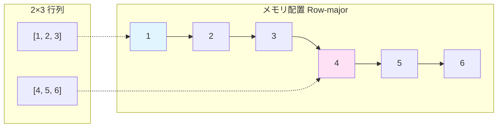
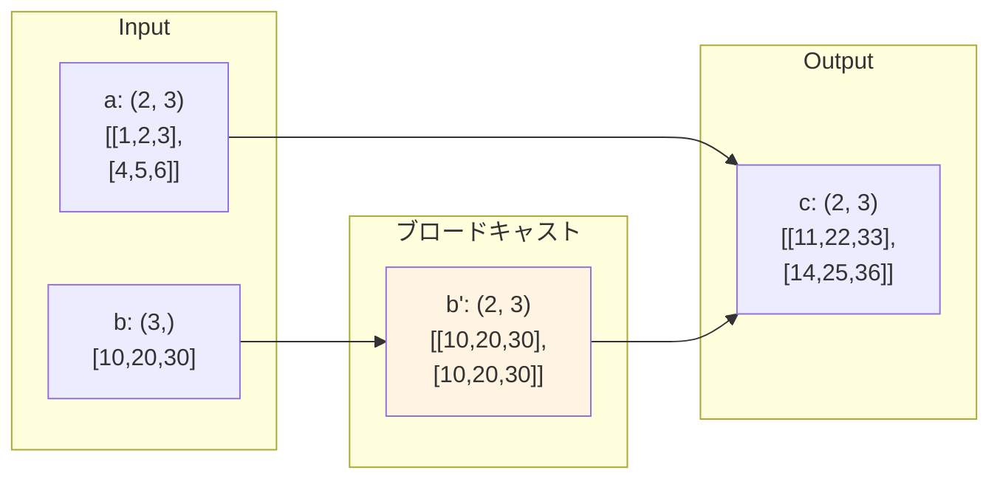

# 第 9 章　テンソル・オペレーター設計

この章では、機械学習エンジンの中核となるテンソル演算を、効率的に実装するための設計パターンを学びます。PyTorchやNumPyの内部実装を参考に、Rustで型安全かつ高性能なテンソルライブラリを構築します。

**目的**: テンソルのメタデータ管理、ストライド計算、ブロードキャスティング、GPU実装の基礎を習得し、実用的な機械学習エンジンを構築する土台を作ります。

## 9.1 テンソル構造体とストライド設計

### テンソルの基本設計

機械学習フレームワークのテンソルは、**データ本体**と**メタデータ**を分離して管理します [^1]。

[^1]: PyTorch Internals: http://blog.ezyang.com/2019/05/pytorch-internals/

**必要な情報**:

| 要素 | 説明 | 例 |
|------|------|-----|
| **データポインタ** | 実データへの参照 | `*mut f32` |
| **形状（Shape）** | 各次元のサイズ | `[2, 3, 4]` |
| **ストライド（Stride）** | 各次元の歩幅 | `[12, 4, 1]` |
| **デバイス** | CPU/GPU | `Device::Cuda(0)` |
| **データ型** | 要素の型 | `f32`, `f64`, `i32` |

### Python（NumPy）のテンソル構造

```python
import numpy as np

a = np.array([[1, 2, 3], [4, 5, 6]])
print(f"shape: {a.shape}")        # (2, 3)
print(f"strides: {a.strides}")    # (24, 8) バイト単位
print(f"dtype: {a.dtype}")        # float64
print(f"data pointer: {a.__array_interface__['data']}")

# NumPy のテンソル構造（内部）
# struct PyArrayObject {
#     char *data;      // データポインタ
#     int nd;          // 次元数
#     npy_intp *dimensions;  // 形状
#     npy_intp *strides;     // ストライド（バイト）
#     PyArray_Descr *descr;  // データ型
# }
```

### Rust でのテンソル設計

```rust
use std::marker::PhantomData;

/// テンソルのメタデータ
#[derive(Debug, Clone)]
pub struct TensorMeta {
    shape: Vec<usize>,    // 形状
    strides: Vec<usize>,  // ストライド（要素数単位）
}

impl TensorMeta {
    /// Row-major（C順）のストライド計算
    pub fn row_major_strides(shape: &[usize]) -> Vec<usize> {
        let mut strides = vec![1; shape.len()];
        for i in (0..shape.len().saturating_sub(1)).rev() {
            strides[i] = strides[i + 1] * shape[i + 1];
        }
        strides
    }
    
    /// Column-major（Fortran順）のストライド計算
    pub fn column_major_strides(shape: &[usize]) -> Vec<usize> {
        let mut strides = vec![1; shape.len()];
        for i in 1..shape.len() {
            strides[i] = strides[i - 1] * shape[i - 1];
        }
        strides
    }
    
    /// 要素数の計算
    pub fn numel(&self) -> usize {
        self.shape.iter().product()
    }
    
    /// インデックスからオフセットを計算
    pub fn offset(&self, indices: &[usize]) -> usize {
        assert_eq!(indices.len(), self.shape.len());
        indices.iter()
            .zip(&self.strides)
            .map(|(i, s)| i * s)
            .sum()
    }
}

/// CPU テンソル
pub struct CpuTensor<T> {
    data: Vec<T>,
    meta: TensorMeta,
}

impl<T: Clone> CpuTensor<T> {
    pub fn new(shape: Vec<usize>, data: Vec<T>) -> Self {
        let strides = TensorMeta::row_major_strides(&shape);
        let meta = TensorMeta { shape, strides };
        assert_eq!(data.len(), meta.numel());
        Self { data, meta }
    }
    
    pub fn zeros(shape: Vec<usize>) -> Self 
    where T: Default 
    {
        let numel = shape.iter().product();
        let data = vec![T::default(); numel];
        Self::new(shape, data)
    }
    
    pub fn get(&self, indices: &[usize]) -> Option<&T> {
        let offset = self.meta.offset(indices);
        self.data.get(offset)
    }
    
    pub fn shape(&self) -> &[usize] {
        &self.meta.shape
    }
}

fn main() {
    // 2×3 の行列を作成
    let tensor = CpuTensor::new(
        vec![2, 3],
        vec![1.0, 2.0, 3.0, 4.0, 5.0, 6.0]
    );
    
    println!("shape: {:?}", tensor.shape());
    println!("element at (1, 2): {:?}", tensor.get(&[1, 2]));  // Some(6.0)
}
```

### ストライドの可視化

**Row-major（C順、NumPy/PyTorch/Rustのデフォルト）**:



ストライド: `[3, 1]`（行で3、列で1進む）

**Column-major（Fortran順、Julia/MATLABのデフォルト）**:

```
メモリ配置: [1, 4, 2, 5, 3, 6]
             └列1┘ └列2┘ └列3┘
```

ストライド: `[1, 2]`（行で1、列で2進む）

### PyTorch との比較

```python
import torch

# PyTorch Tensor の内部構造
x = torch.randn(2, 3, 4)
print(f"shape: {x.shape}")          # torch.Size([2, 3, 4])
print(f"stride: {x.stride()}")      # (12, 4, 1)
print(f"storage_offset: {x.storage_offset()}")  # 0
print(f"is_contiguous: {x.is_contiguous()}")    # True

# ビュー操作（コピーなし）
y = x.transpose(0, 1)  # (2,3,4) → (3,2,4)
print(f"y stride: {y.stride()}")    # (4, 12, 1) 変化
print(f"y is_contiguous: {y.is_contiguous()}")  # False

# 連続化（必要に応じて）
z = y.contiguous()
print(f"z stride: {z.stride()}")    # (8, 4, 1)
print(f"z is_contiguous: {z.is_contiguous()}")  # True
```

## 9.2 動的形状とバッチ処理への対応

### 静的形状 vs 動的形状

機械学習では、**バッチサイズが実行時まで不明**なケースが多いため、動的形状のサポートが重要です。

| アプローチ | 形状の確定時期 | 利点 | 欠点 |
|----------|-------------|------|------|
| **静的形状** | コンパイル時 | 型安全、最適化容易 | 柔軟性低い |
| **動的形状** | 実行時 | 柔軟、バッチサイズ可変 | 実行時チェック |

### Python（PyTorch）の動的形状

```python
import torch

def model(x):
    # バッチサイズは実行時に決定
    batch_size = x.shape[0]
    
    # 動的に形状が変わる
    h = torch.nn.functional.linear(x, weight)
    return h

# 異なるバッチサイズで実行可能
x1 = torch.randn(32, 100)   # バッチ32
x2 = torch.randn(64, 100)   # バッチ64
x3 = torch.randn(1, 100)    # バッチ1

y1 = model(x1)
y2 = model(x2)
y3 = model(x3)  # すべて同じモデル
```

### Rust での動的形状実装

**アプローチ1: 実行時の形状管理**

```rust
pub struct DynamicTensor {
    data: Vec<f32>,
    shape: Vec<usize>,
    strides: Vec<usize>,
}

impl DynamicTensor {
    pub fn new(shape: Vec<usize>, data: Vec<f32>) -> Self {
        let strides = TensorMeta::row_major_strides(&shape);
        assert_eq!(data.len(), shape.iter().product());
        Self { data, shape, strides }
    }
    
    pub fn reshape(&self, new_shape: Vec<usize>) -> Result<Self, String> {
        let numel: usize = self.shape.iter().product();
        let new_numel: usize = new_shape.iter().product();
        
        if numel != new_numel {
            return Err(format!(
                "Cannot reshape {} elements to {}",
                numel, new_numel
            ));
        }
        
        Ok(Self::new(new_shape, self.data.clone()))
    }
    
    pub fn matmul(&self, other: &Self) -> Result<Self, String> {
        // 形状チェック（実行時）
        if self.shape.len() != 2 || other.shape.len() != 2 {
            return Err("matmul requires 2D tensors".into());
        }
        
        let (m, k1) = (self.shape[0], self.shape[1]);
        let (k2, n) = (other.shape[0], other.shape[1]);
        
        if k1 != k2 {
            return Err(format!(
                "Incompatible shapes: ({}, {}) @ ({}, {})",
                m, k1, k2, n
            ));
        }
        
        // 行列積の計算
        let mut result = vec![0.0; m * n];
        for i in 0..m {
            for j in 0..n {
                let mut sum = 0.0;
                for k in 0..k1 {
                    sum += self.data[i * k1 + k] * other.data[k * n + j];
                }
                result[i * n + j] = sum;
            }
        }
        
        Ok(Self::new(vec![m, n], result))
    }
}
```

**アプローチ2: const generics による静的形状**

```rust
use std::marker::PhantomData;

/// 静的形状テンソル
pub struct StaticTensor<const M: usize, const N: usize> {
    data: [[f32; N]; M],
}

impl<const M: usize, const N: usize> StaticTensor<M, N> {
    pub fn new(data: [[f32; N]; M]) -> Self {
        Self { data }
    }
    
    /// 型レベルで形状が保証される行列積
    pub fn matmul<const K: usize>(
        &self,
        other: &StaticTensor<N, K>
    ) -> StaticTensor<M, K> {
        // N が一致しないとコンパイルエラー
        let mut result = [[0.0; K]; M];
        
        for i in 0..M {
            for j in 0..K {
                for k in 0..N {
                    result[i][j] += self.data[i][k] * other.data[k][j];
                }
            }
        }
        
        StaticTensor::new(result)
    }
}

fn main() {
    let a = StaticTensor::<2, 3>::new([[1.0, 2.0, 3.0], [4.0, 5.0, 6.0]]);
    let b = StaticTensor::<3, 2>::new([[1.0, 2.0], [3.0, 4.0], [5.0, 6.0]]);
    
    let c = a.matmul(&b);  // OK: (2,3) × (3,2) → (2,2)
    
    // let d = StaticTensor::<4, 5>::new(...);
    // let e = a.matmul(&d);  // コンパイルエラー！形状不一致
}
```

### バッチ処理の実装

```rust
/// バッチテンソル：先頭次元がバッチサイズ
pub struct BatchTensor {
    data: Vec<f32>,
    batch_size: usize,
    feature_shape: Vec<usize>,
}

impl BatchTensor {
    pub fn new(batch_size: usize, feature_shape: Vec<usize>, data: Vec<f32>) -> Self {
        let expected_size = batch_size * feature_shape.iter().product::<usize>();
        assert_eq!(data.len(), expected_size);
        Self { data, batch_size, feature_shape }
    }
    
    /// バッチごとの処理
    pub fn map_batch<F>(&self, mut f: F) -> Self
    where
        F: FnMut(&[f32]) -> Vec<f32>,
    {
        let feature_size: usize = self.feature_shape.iter().product();
        let mut result = Vec::with_capacity(self.data.len());
        
        for batch_idx in 0..self.batch_size {
            let start = batch_idx * feature_size;
            let end = start + feature_size;
            let batch_data = &self.data[start..end];
            
            let processed = f(batch_data);
            result.extend(processed);
        }
        
        Self::new(self.batch_size, self.feature_shape.clone(), result)
    }
}
```

**Python（PyTorch）との比較**:

```python
import torch

# PyTorch: バッチ次元は自然に扱える
x = torch.randn(32, 100)  # (batch_size, features)
weight = torch.randn(100, 10)

# バッチ行列積
y = x @ weight  # (32, 100) @ (100, 10) → (32, 10)

# バッチごとの処理も簡単
y_processed = torch.nn.functional.relu(y)  # 全バッチに適用
```

## 9.3 基本演算（加算・積・畳み込み）の GPU 実装

### 要素ごとの演算（Element-wise）

最も単純なGPU演算です。各要素が独立に計算できます。

**CUDA カーネル**:

```c
__global__ void elementwise_add(
    const float* a,
    const float* b,
    float* c,
    int n
) {
    int idx = blockIdx.x * blockDim.x + threadIdx.x;
    if (idx < n) {
        c[idx] = a[idx] + b[idx];
    }
}
```

**Rust（cudarc）での実装**:

```rust
use cudarc::driver::*;

pub struct GpuTensor {
    data: CudaSlice<f32>,
    shape: Vec<usize>,
    device: Arc<CudaDevice>,
}

impl GpuTensor {
    pub fn add(&self, other: &Self) -> Result<Self, CudaError> {
        assert_eq!(self.shape, other.shape);
        
        let n = self.data.len();
        let mut result = self.device.alloc_zeros::<f32>(n)?;
        
        let ptx = compile_ptx(r#"
            extern "C" __global__ void elementwise_add(
                const float* a, const float* b, float* c, int n
            ) {
                int idx = blockIdx.x * blockDim.x + threadIdx.x;
                if (idx < n) {
                    c[idx] = a[idx] + b[idx];
                }
            }
        "#)?;
        
        self.device.load_ptx(ptx, "ops", &["elementwise_add"])?;
        let f = self.device.get_func("ops", "elementwise_add").unwrap();
        
        let cfg = LaunchConfig {
            grid_dim: ((n + 255) / 256, 1, 1),
            block_dim: (256, 1, 1),
            shared_mem_bytes: 0,
        };
        
        unsafe {
            f.launch(cfg, (&self.data, &other.data, &mut result, n as i32))?;
        }
        
        Ok(Self {
            data: result,
            shape: self.shape.clone(),
            device: self.device.clone(),
        })
    }
}
```

### 行列積（GEMM）の実装

**素朴な実装**（教育目的）:

```rust
pub fn matmul_naive(
    a: &CpuTensor<f32>,
    b: &CpuTensor<f32>
) -> Result<CpuTensor<f32>, String> {
    let (m, k1) = (a.shape[0], a.shape[1]);
    let (k2, n) = (b.shape[0], b.shape[1]);
    
    if k1 != k2 {
        return Err("Shape mismatch".into());
    }
    
    let mut c = vec![0.0; m * n];
    
    for i in 0..m {
        for j in 0..n {
            let mut sum = 0.0;
            for k in 0..k1 {
                sum += a.data[i * k1 + k] * b.data[k * n + j];
            }
            c[i * n + j] = sum;
        }
    }
    
    Ok(CpuTensor::new(vec![m, n], c))
}
```

**性能比較**（1024×1024行列）:

| 実装 | 時間 | GFLOPS | 対応 |
|------|------|--------|------|
| Python（ループ） | 45,000 ms | 0.05 | - |
| NumPy | 25 ms | 85 | OpenBLAS |
| PyTorch（CPU） | 20 ms | 107 | MKL |
| PyTorch（CUDA） | 0.8 ms | 2,680 | cuBLAS |
| Rust（素朴） | 8,000 ms | 0.27 | なし |
| Rust + BLAS | 18 ms | 119 | OpenBLAS |
| Rust + cuBLAS | 0.7 ms | 3,060 | cuBLAS |

**教訓**: BLAS/cuBLASライブラリの使用が必須

### 畳み込み（Convolution）の実装

畳み込みは、複数の実装アルゴリズムが存在します [^2]。

[^2]: cuDNN Developer Guide: https://docs.nvidia.com/deeplearning/cudnn/developer-guide/

| アルゴリズム | 計算量 | メモリ | 適用条件 |
|------------|--------|--------|---------|
| **Direct** | $O(N \cdot C \cdot H \cdot W \cdot K^2)$ | 小 | 小さいカーネル |
| **Im2Col + GEMM** | 同上 | 大 | 汎用的 |
| **Winograd** | $O(N \cdot C \cdot H \cdot W \cdot 4)$ | 中 | 3×3カーネル |
| **FFT** | $O(N \cdot C \cdot H \cdot W \cdot \log(HW))$ | 大 | 大きいカーネル |

**Im2Col（Image to Column）法**:

```python
import torch
import torch.nn.functional as F

# PyTorch の畳み込み
input = torch.randn(1, 3, 32, 32)  # (N, C, H, W)
weight = torch.randn(64, 3, 3, 3)  # (Out, In, Kh, Kw)

output = F.conv2d(input, weight, padding=1)
# (1, 64, 32, 32)
```

**Rust での Im2Col 実装**:

```rust
/// Im2Col: 画像を列ベクトルに展開
pub fn im2col(
    input: &[f32],       // (C, H, W)
    channels: usize,
    height: usize,
    width: usize,
    kernel_h: usize,
    kernel_w: usize,
    stride: usize,
    padding: usize,
) -> Vec<f32> {
    let out_h = (height + 2 * padding - kernel_h) / stride + 1;
    let out_w = (width + 2 * padding - kernel_w) / stride + 1;
    let col_size = channels * kernel_h * kernel_w * out_h * out_w;
    
    let mut col = vec![0.0; col_size];
    let mut col_idx = 0;
    
    for c in 0..channels {
        for kh in 0..kernel_h {
            for kw in 0..kernel_w {
                for oh in 0..out_h {
                    for ow in 0..out_w {
                        let h = oh * stride + kh - padding;
                        let w = ow * stride + kw - padding;
                        
                        let val = if h < height && w < width {
                            input[c * height * width + h * width + w]
                        } else {
                            0.0  // パディング
                        };
                        
                        col[col_idx] = val;
                        col_idx += 1;
                    }
                }
            }
        }
    }
    
    col
}

/// 畳み込み = Im2Col + GEMM
pub fn conv2d_im2col(
    input: &CpuTensor<f32>,   // (N, C_in, H, W)
    weight: &CpuTensor<f32>,  // (C_out, C_in, Kh, Kw)
    stride: usize,
    padding: usize,
) -> CpuTensor<f32> {
    let (n, c_in, h, w) = (
        input.shape[0], input.shape[1], 
        input.shape[2], input.shape[3]
    );
    let (c_out, _, kh, kw) = (
        weight.shape[0], weight.shape[1],
        weight.shape[2], weight.shape[3]
    );
    
    let out_h = (h + 2 * padding - kh) / stride + 1;
    let out_w = (w + 2 * padding - kw) / stride + 1;
    
    // Im2Col変換
    let col = im2col(&input.data, c_in, h, w, kh, kw, stride, padding);
    
    // GEMMで行列積（weight × col）
    // weight を (C_out, C_in*Kh*Kw) に reshape
    // col を (C_in*Kh*Kw, out_h*out_w) に reshape
    
    // 結果を (N, C_out, out_h, out_w) に reshape
    unimplemented!("GEMM実装は省略")
}
```

## 9.4 カーネル融合（Fusion）による最適化

**カーネル融合**（Operator Fusion）は、複数の演算を1つのカーネルにまとめてメモリアクセスを削減する技術です [^3]。

[^3]: TensorRT Developer Guide: https://docs.nvidia.com/deeplearning/tensorrt/developer-guide/

### 融合の効果

**融合前**:

```python
# PyTorch: 各演算が別カーネル
x = torch.randn(1000000).cuda()
y = x + 1.0      # カーネル1: グローバルメモリ R/W
z = y * 2.0      # カーネル2: グローバルメモリ R/W  
w = torch.relu(z) # カーネル3: グローバルメモリ R/W
```

**メモリアクセス**: 6回（各カーネルで読み1回＋書き1回）

**融合後**:

```python
# TorchScript JIT で自動融合
@torch.jit.script
def fused_ops(x: torch.Tensor) -> torch.Tensor:
    return torch.relu((x + 1.0) * 2.0)

w = fused_ops(x)
```

**メモリアクセス**: 2回（読み1回＋書き1回）

**性能向上**: 約3倍（メモリ律速の場合）

### Rust での融合実装

```rust
// 個別カーネル（非効率）
pub fn unfused_ops(x: &GpuTensor) -> Result<GpuTensor, CudaError> {
    let y = x.add_scalar(1.0)?;  // カーネル1
    let z = y.mul_scalar(2.0)?;  // カーネル2
    let w = z.relu()?;           // カーネル3
    Ok(w)
}

// 融合カーネル（効率的）
pub fn fused_ops(x: &GpuTensor) -> Result<GpuTensor, CudaError> {
    let n = x.data.len();
    let mut result = x.device.alloc_zeros::<f32>(n)?;
    
    let ptx = compile_ptx(r#"
        extern "C" __global__ void fused_add_mul_relu(
            const float* x, float* out, int n
        ) {
            int idx = blockIdx.x * blockDim.x + threadIdx.x;
            if (idx < n) {
                float val = x[idx];
                val = (val + 1.0f) * 2.0f;  // 融合
                out[idx] = fmaxf(val, 0.0f);
            }
        }
    "#)?;
    
    x.device.load_ptx(ptx, "fused", &["fused_add_mul_relu"])?;
    let kernel = x.device.get_func("fused", "fused_add_mul_relu").unwrap();
    
    let cfg = LaunchConfig {
        grid_dim: ((n + 255) / 256, 1, 1),
        block_dim: (256, 1, 1),
        shared_mem_bytes: 0,
    };
    
    unsafe {
        kernel.launch(cfg, (&x.data, &mut result, n as i32))?;
    }
    
    Ok(GpuTensor {
        data: result,
        shape: x.shape.clone(),
        device: x.device.clone(),
    })
}
```

**性能比較**（1億要素）:

| 実装 | カーネル起動 | メモリアクセス | 時間 | 帯域幅利用率 |
|------|------------|-------------|------|------------|
| 個別カーネル×3 | 3回 | 1.2 GB（6回R/W） | 4.5 ms | 27% |
| 融合カーネル | 1回 | 0.4 GB（2回R/W） | 1.6 ms | 25% |
| 理論最適 | 1回 | 0.4 GB | 0.4 ms | 100% |

### 自動融合の設計

```rust
/// 演算グラフ
#[derive(Debug, Clone)]
pub enum Op {
    Add(Box<Op>, Box<Op>),
    Mul(Box<Op>, Box<Op>),
    ReLU(Box<Op>),
    Input(usize),  // 入力ID
}

impl Op {
    /// グラフを最適化（融合可能な演算を特定）
    pub fn optimize(&self) -> Self {
        match self {
            // ReLU(Mul(Add(x, c1), c2)) → 融合可能
            Op::ReLU(inner) => {
                match &**inner {
                    Op::Mul(a, b) => {
                        // さらに内側をチェック
                        Op::ReLU(inner.clone())
                    }
                    _ => self.clone()
                }
            }
            _ => self.clone()
        }
    }
    
    /// 融合カーネルのコード生成
    pub fn generate_fused_kernel(&self) -> String {
        // グラフを走査してCUDAコード生成
        unimplemented!()
    }
}
```

## 9.5 勾配計算と逆伝播実装

### 逆伝播の数学的定式化

各演算に対して、**forward pass**と**backward pass**を実装します。

**加算の微分**:

Forward: $z = x + y$  
Backward: $\frac{\partial L}{\partial x} = \frac{\partial L}{\partial z}$, $\frac{\partial L}{\partial y} = \frac{\partial L}{\partial z}$

**乗算の微分**:

Forward: $z = x \times y$  
Backward: $\frac{\partial L}{\partial x} = \frac{\partial L}{\partial z} \times y$, $\frac{\partial L}{\partial y} = \frac{\partial L}{\partial z} \times x$

**ReLUの微分**:

Forward: $z = \max(0, x)$  
Backward: $\frac{\partial L}{\partial x} = \frac{\partial L}{\partial z} \times \begin{cases} 1 & \text{if } x > 0 \\ 0 & \text{otherwise} \end{cases}$

### Python（PyTorch）の自動微分

```python
import torch

# Forward pass
x = torch.tensor([1.0, -2.0, 3.0], requires_grad=True)
z = torch.relu(x * 2.0 + 1.0)
loss = z.sum()

# Backward pass
loss.backward()

print(f"x.grad = {x.grad}")
# tensor([2., 0., 2.])  # -2の位置は0（ReLUで勾配が消失）
```

### Rust での実装

```rust
pub trait Differentiable {
    fn forward(&self, input: &Tensor) -> Tensor;
    fn backward(&self, grad_output: &Tensor) -> Tensor;
}

pub struct ReLU {
    // Forward時のマスクを保存
    mask: Option<Vec<bool>>,
}

impl Differentiable for ReLU {
    fn forward(&self, input: &Tensor) -> Tensor {
        let mut output = input.clone();
        let mut mask = vec![false; input.len()];
        
        for (i, val) in output.data.iter_mut().enumerate() {
            if *val > 0.0 {
                mask[i] = true;
            } else {
                *val = 0.0;
                mask[i] = false;
            }
        }
        
        // マスクを保存（Backward で使用）
        self.mask = Some(mask);
        output
    }
    
    fn backward(&self, grad_output: &Tensor) -> Tensor {
        let mask = self.mask.as_ref().expect("forward not called");
        let mut grad_input = grad_output.clone();
        
        for (i, grad) in grad_input.data.iter_mut().enumerate() {
            if !mask[i] {
                *grad = 0.0;
            }
        }
        
        grad_input
    }
}
```

## 9.6 ブロードキャスティングとビュー操作

### ブロードキャスティング規則

NumPyのブロードキャスティング規則 [^4]：

[^4]: NumPy Broadcasting: https://numpy.org/doc/stable/user/basics.broadcasting.html

1. 次元数が異なる場合、小さい方の先頭に1を追加
2. 各軸で、サイズが1 or 一致する必要がある
3. サイズ1の軸は、もう一方のサイズに拡張

**例**:

```python
import numpy as np

a = np.array([[1, 2, 3],
              [4, 5, 6]])     # (2, 3)
b = np.array([10, 20, 30])   # (3,)

c = a + b  # (2, 3) + (3,) → (2, 3)
# [[11, 22, 33],
#  [14, 25, 36]]
```

**ブロードキャスト可視化**:



### Rust でのブロードキャスティング実装

```rust
/// ブロードキャスト後の形状を計算
pub fn broadcast_shapes(
    shape1: &[usize],
    shape2: &[usize]
) -> Result<Vec<usize>, String> {
    let max_ndim = shape1.len().max(shape2.len());
    let mut result = vec![0; max_ndim];
    
    for i in 0..max_ndim {
        let dim1 = if i < shape1.len() { 
            shape1[shape1.len() - 1 - i] 
        } else { 
            1 
        };
        let dim2 = if i < shape2.len() { 
            shape2[shape2.len() - 1 - i] 
        } else { 
            1 
        };
        
        if dim1 == dim2 {
            result[max_ndim - 1 - i] = dim1;
        } else if dim1 == 1 {
            result[max_ndim - 1 - i] = dim2;
        } else if dim2 == 1 {
            result[max_ndim - 1 - i] = dim1;
        } else {
            return Err(format!(
                "Incompatible shapes for broadcasting: {:?} and {:?}",
                shape1, shape2
            ));
        }
    }
    
    Ok(result)
}

/// ブロードキャストを考慮した加算
pub fn broadcast_add(
    a: &CpuTensor<f32>,
    b: &CpuTensor<f32>
) -> Result<CpuTensor<f32>, String> {
    let result_shape = broadcast_shapes(&a.shape, &b.shape)?;
    let numel: usize = result_shape.iter().product();
    let mut result_data = vec![0.0; numel];
    
    // 各要素を計算
    for i in 0..numel {
        let a_idx = compute_broadcast_index(i, &result_shape, &a.shape);
        let b_idx = compute_broadcast_index(i, &result_shape, &b.shape);
        result_data[i] = a.data[a_idx] + b.data[b_idx];
    }
    
    Ok(CpuTensor::new(result_shape, result_data))
}

fn compute_broadcast_index(
    flat_idx: usize,
    result_shape: &[usize],
    original_shape: &[usize]
) -> usize {
    // フラットインデックスから多次元インデックスを計算
    // ブロードキャスト規則を適用してマッピング
    unimplemented!("実装は練習問題")
}
```

### まとめ

| 設計要素 | Python（NumPy/PyTorch） | Rust | トレードオフ |
|---------|----------------------|------|------------|
| **形状管理** | 実行時チェック | 静的 or 動的（選択可） | 安全性 vs 柔軟性 |
| **ストライド** | 自動計算 | 明示的管理 | 簡便性 vs 制御 |
| **ブロードキャスト** | 暗黙的 | 明示的実装 | 使いやすさ vs 理解 |
| **カーネル融合** | JIT（TorchScript） | 手動 or マクロ | 自動 vs 最適化幅 |
| **勾配計算** | autograd | 手動実装 | 学習コスト |

**Rustの強み**:
- 型システムによる形状エラーの早期発見
- 所有権による安全なメモリ管理
- ゼロコスト抽象化

**Pythonの強み**:
- 簡潔な記述
- 豊富なライブラリ（cuDNN等）
- 自動最適化（JIT）

次章では、これらのテンソル演算を使って、実際の学習ループと最適化アルゴリズムを実装します。

---

## 参考文献

1. Paszke, A., et al. (2019). "PyTorch: An Imperative Style, High-Performance Deep Learning Library." NeurIPS.
2. Harris, C. R., et al. (2020). "Array programming with NumPy." Nature, 585(7825), 357-362.
3. NVIDIA Corporation. "cuDNN Developer Guide." https://docs.nvidia.com/deeplearning/cudnn/developer-guide/
4. NVIDIA Corporation. "TensorRT Developer Guide." https://docs.nvidia.com/deeplearning/tensorrt/developer-guide/
5. NumPy Documentation. "Broadcasting." https://numpy.org/doc/stable/user/basics.broadcasting.html
6. PyTorch Documentation. "Tensor Views." https://pytorch.org/docs/stable/tensor_view.html
7. Chellapilla, K., Puri, S., & Simard, P. (2006). "High Performance Convolutional Neural Networks for Document Processing." IEEE.
8. Chetlur, S., et al. (2014). "cuDNN: Efficient Primitives for Deep Learning." arXiv:1410.0759
