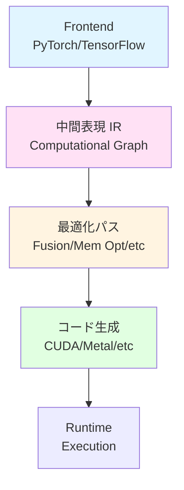
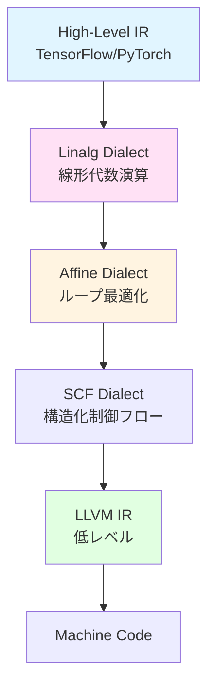

# 第 13 章　コンパイラ最適化と DSL 設計

この章では、機械学習フレームワークのコンパイラ最適化技術と、Domain-Specific Language（DSL）の設計について学びます。JITコンパイル、Rustマクロ、LLVM/MLIR、そしてTriton風の高水準カーネル記述言語の実装を扱います。

**目的**: 計算グラフの最適化、JITコンパイルによる実行時最適化、Rustマクロを使った型安全なDSLの設計を習得します。

## 13.1 機械学習コンパイラの概要

### なぜコンパイラが必要か？

**課題**:
1. **抽象化のコスト**: 高レベルAPIは柔軟だが、最適化の余地が見えにくい
2. **ハードウェアの多様性**: CPU, GPU, TPU, NPUなど
3. **演算子の爆発**: Conv, MatMul, Attention... 各ハードウェア向けに手書きは不可能

**解決策**: コンパイラによる自動最適化



### 主要な ML コンパイラ

| コンパイラ | 開発元 | 言語 | 特徴 |
|-----------|-------|------|------|
| **XLA** | Google | C++ | TensorFlow/JAX のバックエンド |
| **TVM** | Apache | C++/Python | ハードウェア非依存 |
| **MLIR** | LLVM Project | C++ | 多段階IR、拡張可能 |
| **Glow** | Facebook | C++ | PyTorch向け |
| **Triton** | OpenAI | Python | GPU カーネル記述用DSL |

## 13.2 JIT コンパイルと実行時最適化

### TorchScript: PyTorch の JIT コンパイラ

**TorchScript** [^1] は、PyTorchモデルをJITコンパイルします。

[^1]: TorchScript. https://pytorch.org/docs/stable/jit.html

**2つのモード**:

1. **Tracing**: 実行をトレースしてグラフを構築
2. **Scripting**: Python ASTから直接グラフを構築

```python
import torch

class MyModule(torch.nn.Module):
    def __init__(self):
        super().__init__()
        self.linear = torch.nn.Linear(10, 10)
    
    def forward(self, x):
        return self.linear(x).relu()

# Tracing モード
model = MyModule()
example = torch.randn(1, 10)
traced = torch.jit.trace(model, example)

# Scripting モード
scripted = torch.jit.script(model)

# グラフを確認
print(traced.graph)
```

**出力（IRグラフ）**:

```
graph(%self.1 : __torch__.MyModule,
      %x.1 : Float(1, 10)):
  %linear : __torch__.torch.nn.modules.linear.Linear = prim::GetAttr[name="linear"](%self.1)
  %4 : Tensor = prim::CallMethod[name="forward"](%linear, %x.1)
  %5 : Tensor = aten::relu(%4)
  return (%5)
```

**最適化**:

```python
# グラフ最適化
optimized = torch.jit.optimize_for_inference(scripted)

# 演算子融合を確認
print(optimized.graph)
```

### JAX: JIT コンパイルの王様

**JAX** [^2] は、NumPy風のAPIでJITコンパイルを提供します。

[^2]: JAX. https://github.com/google/jax

```python
import jax
import jax.numpy as jnp

# 通常の関数
def slow_fn(x):
    return jnp.dot(x, x.T)

# JITコンパイル
fast_fn = jax.jit(slow_fn)

x = jnp.ones((1000, 1000))

# 初回: コンパイル実行
result = fast_fn(x)  # 遅い（コンパイル時間含む）

# 2回目以降: コンパイル済み
result = fast_fn(x)  # 速い
```

**XLA最適化の確認**:

```python
# HLO (High-Level Optimizer) IRを表示
print(fast_fn.lower(x).compiler_ir(dialect="hlo"))
```

### Rust での JIT コンパイル: cranelift

**cranelift** [^3] は、Rust製のJITコンパイラです。

[^3]: cranelift. https://github.com/bytecodealliance/wasmtime/tree/main/cranelift

```rust
use cranelift::prelude::*;
use cranelift_jit::{JITBuilder, JITModule};
use cranelift_module::{DataContext, Linkage, Module};

fn jit_add() -> Result<fn(i32, i32) -> i32, String> {
    let mut builder = JITBuilder::new(cranelift_module::default_libcall_names())?;
    let mut module = JITModule::new(builder);
    
    // 関数シグネチャ: (i32, i32) -> i32
    let mut sig = module.make_signature();
    sig.params.push(AbiParam::new(types::I32));
    sig.params.push(AbiParam::new(types::I32));
    sig.returns.push(AbiParam::new(types::I32));
    
    // 関数定義
    let func_id = module
        .declare_function("add", Linkage::Export, &sig)
        .map_err(|e| e.to_string())?;
    
    // コンテキスト作成
    let mut ctx = module.make_context();
    ctx.func.signature = sig;
    
    // 関数ビルダー
    let mut builder_context = FunctionBuilderContext::new();
    let mut builder = FunctionBuilder::new(&mut ctx.func, &mut builder_context);
    
    // エントリーブロック
    let block = builder.create_block();
    builder.append_block_params_for_function_params(block);
    builder.switch_to_block(block);
    
    // 引数取得
    let arg0 = builder.block_params(block)[0];
    let arg1 = builder.block_params(block)[1];
    
    // 加算命令
    let result = builder.ins().iadd(arg0, arg1);
    
    // 戻り値
    builder.ins().return_(&[result]);
    builder.seal_all_blocks();
    builder.finalize();
    
    // コンパイル
    module
        .define_function(func_id, &mut ctx)
        .map_err(|e| e.to_string())?;
    
    module.clear_context(&mut ctx);
    module.finalize_definitions();
    
    // 関数ポインタ取得
    let code = module.get_finalized_function(func_id);
    
    Ok(unsafe { std::mem::transmute::<*const u8, fn(i32, i32) -> i32>(code) })
}

fn main() {
    let add = jit_add().unwrap();
    let result = add(2, 3);
    println!("2 + 3 = {}", result);  // 5
}
```

## 13.3 Rust マクロによる DSL 設計

### 宣言的マクロ（Declarative Macros）

**目的**: ボイラープレートコードの削減

```rust
// テンソル演算のDSL
macro_rules! tensor_op {
    ($name:ident, $op:tt) => {
        fn $name(a: &Tensor, b: &Tensor) -> Tensor {
            assert_eq!(a.shape, b.shape);
            let mut result = Tensor::zeros(a.shape);
            for i in 0..a.data.len() {
                result.data[i] = a.data[i] $op b.data[i];
            }
            result
        }
    };
}

// 使用
tensor_op!(add, +);
tensor_op!(mul, *);
tensor_op!(sub, -);

let a = Tensor::from_vec(vec![1.0, 2.0, 3.0]);
let b = Tensor::from_vec(vec![4.0, 5.0, 6.0]);
let c = add(&a, &b);  // [5.0, 7.0, 9.0]
```

### 手続き的マクロ（Procedural Macros）

**derive マクロ** で型安全なテンソル演算を実現：

```rust
// derive マクロの定義（proc-macro クレート内）
use proc_macro::TokenStream;
use quote::quote;
use syn::{parse_macro_input, DeriveInput};

#[proc_macro_derive(TensorOps)]
pub fn tensor_ops_derive(input: TokenStream) -> TokenStream {
    let input = parse_macro_input!(input as DeriveInput);
    let name = input.ident;
    
    let expanded = quote! {
        impl #name {
            pub fn add(&self, other: &Self) -> Self {
                assert_eq!(self.shape, other.shape);
                let data: Vec<f32> = self.data.iter()
                    .zip(&other.data)
                    .map(|(a, b)| a + b)
                    .collect();
                Self { shape: self.shape, data }
            }
            
            pub fn mul(&self, other: &Self) -> Self {
                assert_eq!(self.shape, other.shape);
                let data: Vec<f32> = self.data.iter()
                    .zip(&other.data)
                    .map(|(a, b)| a * b)
                    .collect();
                Self { shape: self.shape, data }
            }
        }
    };
    
    TokenStream::from(expanded)
}
```

**使用側**:

```rust
#[derive(TensorOps)]
struct Tensor {
    shape: Vec<usize>,
    data: Vec<f32>,
}

let a = Tensor { shape: vec![2, 2], data: vec![1.0, 2.0, 3.0, 4.0] };
let b = Tensor { shape: vec![2, 2], data: vec![5.0, 6.0, 7.0, 8.0] };
let c = a.add(&b);  // コンパイル時に型チェック
```

### 関数風マクロで計算グラフを構築

```rust
macro_rules! compute_graph {
    (
        inputs: { $($input:ident: $input_shape:expr),* }
        ops: { $($op_name:ident = $op:expr),* }
        output: $output:ident
    ) => {
        {
            // 入力定義
            $(
                let $input = Tensor::placeholder(stringify!($input), $input_shape);
            )*
            
            // 演算定義
            $(
                let $op_name = $op;
            )*
            
            // グラフ構築
            ComputeGraph {
                inputs: vec![$($input),*],
                operations: vec![$($op_name),*],
                output: $output,
            }
        }
    };
}

// 使用例
let graph = compute_graph! {
    inputs: {
        x: vec![None, 784],
        w: vec![784, 10]
    }
    ops: {
        matmul = Op::MatMul(x, w),
        relu = Op::ReLU(matmul)
    }
    output: relu
};
```

## 13.4 LLVM / MLIR による最適化パイプライン

### MLIR: 多段階中間表現

**MLIR (Multi-Level Intermediate Representation)** [^4] は、複数の抽象度のIRを扱います。

[^4]: Lattner, C., et al. (2021). "MLIR: Scaling Compiler Infrastructure for Domain Specific Computation." CGO.

**抽象度のレベル**:



**MLIR の例**（行列乗算）:

```mlir
// High-Level: Linalg Dialect
func.func @matmul(%A: tensor<128x256xf32>, %B: tensor<256x512xf32>) -> tensor<128x512xf32> {
  %C = linalg.matmul ins(%A, %B : tensor<128x256xf32>, tensor<256x512xf32>)
                     outs(%C_init : tensor<128x512xf32>) -> tensor<128x512xf32>
  return %C : tensor<128x512xf32>
}

// Mid-Level: Affine Dialect（ループ展開後）
func.func @matmul_affine(%A: memref<128x256xf32>, %B: memref<256x512xf32>, %C: memref<128x512xf32>) {
  affine.for %i = 0 to 128 {
    affine.for %j = 0 to 512 {
      affine.for %k = 0 to 256 {
        %a = affine.load %A[%i, %k] : memref<128x256xf32>
        %b = affine.load %B[%k, %j] : memref<256x512xf32>
        %c = affine.load %C[%i, %j] : memref<128x512xf32>
        %prod = arith.mulf %a, %b : f32
        %sum = arith.addf %c, %prod : f32
        affine.store %sum, %C[%i, %j] : memref<128x512xf32>
      }
    }
  }
  return
}
```

### Rust から MLIR を使う

**inkwell**: LLVM の Rust バインディング

```rust
use inkwell::context::Context;
use inkwell::OptimizationLevel;

fn compile_add() {
    let context = Context::create();
    let module = context.create_module("add_module");
    let builder = context.create_builder();
    
    // 関数型: i32 add(i32, i32)
    let i32_type = context.i32_type();
    let fn_type = i32_type.fn_type(&[i32_type.into(), i32_type.into()], false);
    let function = module.add_function("add", fn_type, None);
    
    let basic_block = context.append_basic_block(function, "entry");
    builder.position_at_end(basic_block);
    
    // 引数取得
    let x = function.get_nth_param(0).unwrap().into_int_value();
    let y = function.get_nth_param(1).unwrap().into_int_value();
    
    // 加算
    let result = builder.build_int_add(x, y, "addtmp");
    builder.build_return(Some(&result));
    
    // LLVM IRを表示
    module.print_to_stderr();
    
    // 最適化
    use inkwell::passes::PassManager;
    let pass_manager = PassManager::create(());
    pass_manager.add_instruction_combining_pass();
    pass_manager.add_reassociate_pass();
    pass_manager.add_gvn_pass();
    pass_manager.add_cfg_simplification_pass();
    pass_manager.run_on(&module);
    
    println!("\nOptimized:");
    module.print_to_stderr();
}
```

## 13.5 Triton 風のカーネル記述言語

### OpenAI Triton の概要

**Triton** [^5] は、GPU カーネルを Python 風の構文で記述できるDSLです。

[^5]: Tillet, P., et al. (2019). "Triton: An Intermediate Language and Compiler for Tiled Neural Network Computations." MAPL.

**特徴**:
- ブロックプログラミングモデル
- 自動的なメモリ合体
- 自動的な共有メモリ管理

**Triton の例**（ベクトル加算）:

```python
import triton
import triton.language as tl

@triton.jit
def add_kernel(x_ptr, y_ptr, output_ptr, n_elements, BLOCK_SIZE: tl.constexpr):
    # プログラムID（ブロックID）
    pid = tl.program_id(axis=0)
    
    # ブロック開始位置
    block_start = pid * BLOCK_SIZE
    
    # オフセット計算
    offsets = block_start + tl.arange(0, BLOCK_SIZE)
    
    # 境界チェック用マスク
    mask = offsets < n_elements
    
    # ロード
    x = tl.load(x_ptr + offsets, mask=mask)
    y = tl.load(y_ptr + offsets, mask=mask)
    
    # 計算
    output = x + y
    
    # ストア
    tl.store(output_ptr + offsets, output, mask=mask)

# 呼び出し
def add(x: torch.Tensor, y: torch.Tensor):
    output = torch.empty_like(x)
    n_elements = output.numel()
    
    grid = lambda meta: (triton.cdiv(n_elements, meta['BLOCK_SIZE']),)
    add_kernel[grid](x, y, output, n_elements, BLOCK_SIZE=1024)
    
    return output
```

### Rust での Triton 風 DSL 実装

**設計方針**:
1. マクロで構文を定義
2. コンパイル時にCUDA/PTXコードを生成
3. 型安全性を保証

```rust
// DSL マクロ定義
macro_rules! gpu_kernel {
    (
        fn $name:ident($($arg:ident: $arg_ty:ty),*) {
            $($body:tt)*
        }
    ) => {
        pub struct $name;
        
        impl $name {
            pub fn launch(
                grid: (u32, u32, u32),
                block: (u32, u32, u32),
                $($arg: $arg_ty),*
            ) -> Result<(), CudaError> {
                // CUDA カーネル文字列生成
                let kernel_source = format!(
                    r#"
                    extern "C" __global__ void {}({}) {{
                        {}
                    }}
                    "#,
                    stringify!($name),
                    gpu_kernel!(@args $($arg: $arg_ty),*),
                    gpu_kernel!(@body $($body)*)
                );
                
                // コンパイルして実行
                compile_and_launch(&kernel_source, grid, block, &[$($arg),*])
            }
        }
    };
    
    (@args $($arg:ident: $arg_ty:ty),*) => {
        stringify!($($arg_ty *$arg),*)
    };
    
    (@body $($token:tt)*) => {
        stringify!($($token)*)
    };
}

// 使用例
gpu_kernel! {
    fn vector_add(a: *const f32, b: *const f32, c: *mut f32, n: usize) {
        int idx = blockIdx.x * blockDim.x + threadIdx.x;
        if (idx < n) {
            c[idx] = a[idx] + b[idx];
        }
    }
}

// 実行
let a = vec![1.0f32; 1000];
let b = vec![2.0f32; 1000];
let mut c = vec![0.0f32; 1000];

vector_add::launch(
    (10, 1, 1),    // grid
    (100, 1, 1),   // block
    a.as_ptr(),
    b.as_ptr(),
    c.as_mut_ptr(),
    1000
)?;
```

### より高度な DSL: ブロックプログラミング

```rust
use ndarray::Array2;

// DSL for blocked tensor operations
#[macro_export]
macro_rules! blocked_kernel {
    (
        fn $name:ident<$block_size:expr>($($arg:ident: $arg_ty:ty),*) -> $ret:ty {
            $($body:tt)*
        }
    ) => {
        fn $name($($arg: $arg_ty),*) -> $ret {
            const BLOCK_SIZE: usize = $block_size;
            
            // ブロック単位で処理
            $($body)*
        }
    };
}

// 使用例: ブロック化行列乗算
blocked_kernel! {
    fn blocked_matmul<32>(a: &Array2<f32>, b: &Array2<f32>) -> Array2<f32> {
        let (m, k) = a.dim();
        let (_, n) = b.dim();
        let mut c = Array2::zeros((m, n));
        
        // ブロック単位でループ
        for ii in (0..m).step_by(BLOCK_SIZE) {
            for jj in (0..n).step_by(BLOCK_SIZE) {
                for kk in (0..k).step_by(BLOCK_SIZE) {
                    // ブロック内の計算
                    let i_end = (ii + BLOCK_SIZE).min(m);
                    let j_end = (jj + BLOCK_SIZE).min(n);
                    let k_end = (kk + BLOCK_SIZE).min(k);
                    
                    for i in ii..i_end {
                        for j in jj..j_end {
                            let mut sum = c[[i, j]];
                            for k in kk..k_end {
                                sum += a[[i, k]] * b[[k, j]];
                            }
                            c[[i, j]] = sum;
                        }
                    }
                }
            }
        }
        
        c
    }
}
```

## 13.6 テンプレートメタプログラミングと型レベル計算

### const generics でコンパイル時計算

```rust
// 形状を型レベルで表現
struct Tensor<T, const N: usize, const M: usize> {
    data: Vec<T>,
}

impl<T: Copy, const N: usize, const M: usize> Tensor<T, N, M> {
    fn new(data: Vec<T>) -> Self {
        assert_eq!(data.len(), N * M);
        Self { data }
    }
    
    // 型安全な行列乗算
    fn matmul<const P: usize>(
        &self,
        other: &Tensor<T, M, P>
    ) -> Tensor<T, N, P>
    where
        T: std::ops::Mul<Output = T> + std::ops::Add<Output = T> + Default,
    {
        let mut result = vec![T::default(); N * P];
        
        for i in 0..N {
            for j in 0..P {
                let mut sum = T::default();
                for k in 0..M {
                    sum = sum + self.data[i * M + k] * other.data[k * P + j];
                }
                result[i * P + j] = sum;
            }
        }
        
        Tensor::new(result)
    }
}

// 使用例
let a = Tensor::<f32, 2, 3>::new(vec![1.0, 2.0, 3.0, 4.0, 5.0, 6.0]);
let b = Tensor::<f32, 3, 2>::new(vec![7.0, 8.0, 9.0, 10.0, 11.0, 12.0]);
let c = a.matmul(&b);  // Tensor<f32, 2, 2>

// コンパイルエラー（形状が合わない）
// let d = Tensor::<f32, 2, 2>::new(vec![1.0, 2.0, 3.0, 4.0]);
// let e = a.matmul(&d);  // ERROR: expected Tensor<_, 3, _>
```

### typenum で型レベル数値

```rust
use typenum::{U2, U3, U4, Unsigned};

trait TensorShape {
    type Rows: Unsigned;
    type Cols: Unsigned;
}

struct Matrix<T, Shape: TensorShape> {
    data: Vec<T>,
    _shape: std::marker::PhantomData<Shape>,
}

impl<T: Clone, S: TensorShape> Matrix<T, S> {
    fn new(data: Vec<T>) -> Self {
        assert_eq!(data.len(), S::Rows::USIZE * S::Cols::USIZE);
        Self {
            data,
            _shape: std::marker::PhantomData,
        }
    }
}

// 型レベル行列乗算
impl<T, S1, S2> std::ops::Mul<Matrix<T, S2>> for Matrix<T, S1>
where
    T: Clone + std::ops::Mul<Output = T> + std::ops::Add<Output = T> + Default,
    S1: TensorShape,
    S2: TensorShape,
    S1::Cols: std::ops::IsEqual<S2::Rows>,  // 型レベルで形状チェック
{
    type Output = Matrix<T, MatMulShape<S1, S2>>;
    
    fn mul(self, rhs: Matrix<T, S2>) -> Self::Output {
        // 実装...
        todo!()
    }
}
```

---

## まとめ

| 側面 | Python | Rust |
|------|--------|------|
| **JIT** | TorchScript, JAX（成熟） | cranelift, LLVM（発展中） |
| **DSL** | Triton, NumPy構文 | マクロシステム強力 |
| **型安全性** | ランタイムチェック | コンパイル時保証 |
| **最適化** | XLA, TVM（自動） | LLVM, 手動最適化 |
| **開発速度** | 速い | 中（型定義必要） |

**Rust の優位性**:
- **型レベル計算**: 形状不一致をコンパイル時に検出
- **ゼロコスト抽象化**: マクロ展開後のコストなし
- **明示的制御**: メモリレイアウトを完全制御

**Python の優位性**:
- **エコシステム**: XLA, TVM, Triton など成熟
- **プロトタイピング**: 高速な実験サイクル

---

## 参考文献

1. TorchScript. https://pytorch.org/docs/stable/jit.html
2. JAX. https://github.com/google/jax
3. Lattner, C., et al. (2021). "MLIR: Scaling Compiler Infrastructure for Domain Specific Computation." CGO.
4. Tillet, P., et al. (2019). "Triton: An Intermediate Language and Compiler for Tiled Neural Network Computations." MAPL.
5. Chen, T., et al. (2018). "TVM: An Automated End-to-End Optimizing Compiler for Deep Learning." OSDI.
6. Sabne, A. (2020). "XLA: Compiling Machine Learning for Peak Performance." IEEE Micro.
7. Roesch, J., et al. (2018). "Relay: A New IR for Machine Learning Frameworks." MAPL.
8. cranelift. https://github.com/bytecodealliance/wasmtime/tree/main/cranelift
9. inkwell. https://github.com/TheDan64/inkwell
10. Rust macro book. https://danielkeep.github.io/tlborm/book/
