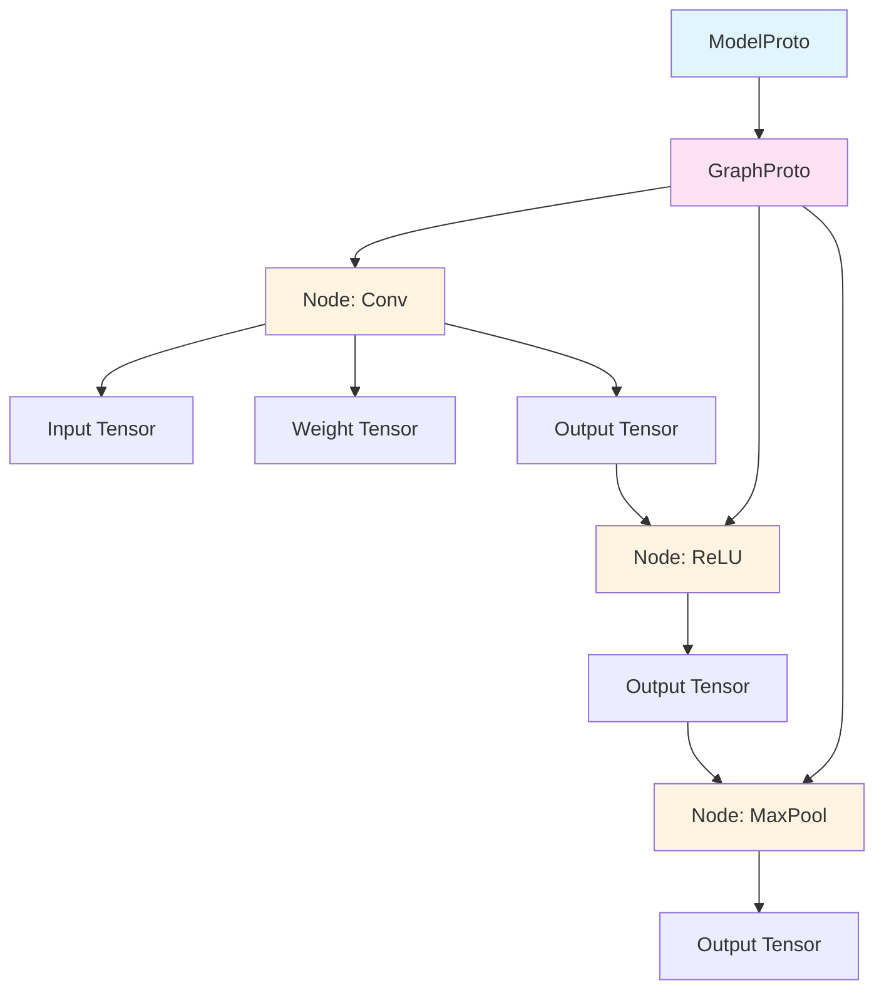
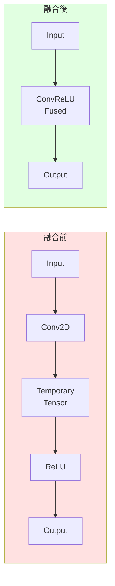
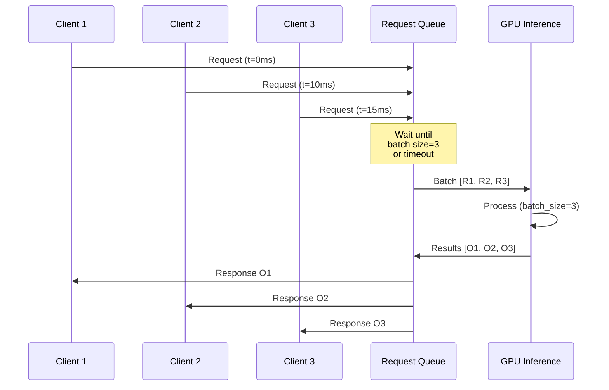
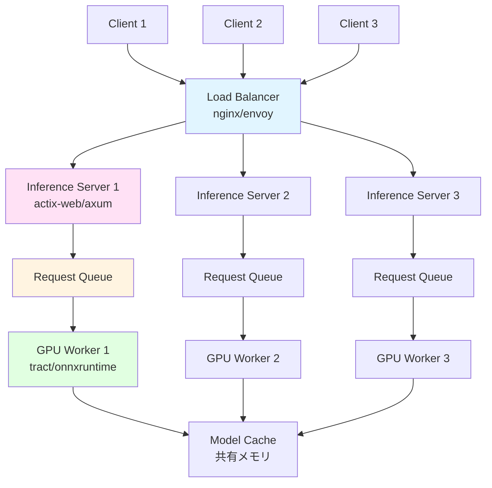

# 第 12 章　モデル推論と ONNX 互換

この章では、学習済みモデルの推論（Inference）に焦点を当て、ONNX（Open Neural Network Exchange）フォーマットとの互換性、推論パイプラインの最適化、Rustでの実装について学びます。

**目的**: プロダクション環境での高速・低レイテンシな推論システムを構築し、PyTorchやTensorFlowで学習したモデルをRustで動作させる方法を習得します。

## 12.1 推論と学習の違い

### 計算グラフの違い

**学習（Training）**:
- Forward + Backward の両方が必要
- 中間値を全て保存（勾配計算のため）
- バッチサイズは大きい（例: 32〜512）
- メモリ使用量が大きい

**推論（Inference）**:
- Forward のみ
- 中間値の保存が不要
- バッチサイズは小さい（例: 1〜16、リアルタイム推論では1）
- レイテンシが重要

### 最適化の方向性の違い

| 項目 | 学習 | 推論 |
|------|------|------|
| **目標** | スループット最大化 | レイテンシ最小化 |
| **バッチサイズ** | 大（メモリ限界まで） | 小（リアルタイム性優先） |
| **精度** | FP32/FP16（数値安定性） | FP16/INT8/INT4（速度優先） |
| **メモリ** | 大量使用可 | 省メモリ |
| **並列化** | データ並列 | 演算子並列、パイプライン |
| **最適化** | Backward考慮 | Forward最適化のみ |

### Python（PyTorch）での推論

```python
import torch

# 学習モード → 推論モード
model.eval()  # Dropout/BatchNormを無効化

with torch.no_grad():  # 勾配計算を無効化
    output = model(input_data)

# または torch.inference_mode()（PyTorch 1.9+）
with torch.inference_mode():
    output = model(input_data)
```

**最適化例**:

```python
# TorchScript でJITコンパイル
scripted_model = torch.jit.script(model)
scripted_model.save("model.pt")

# または traced model
traced_model = torch.jit.trace(model, example_input)
traced_model.save("model_traced.pt")
```

## 12.2 ONNX フォーマットの理解

### ONNX とは

**ONNX (Open Neural Network Exchange)** [^1] は、異なるフレームワーク間でモデルを交換するための標準フォーマットです。

[^1]: ONNX. https://onnx.ai/

**対応フレームワーク**:
- **エクスポート**: PyTorch, TensorFlow, scikit-learn, Keras, MXNet
- **インポート**: ONNX Runtime, TensorRT, OpenVINO, Core ML, TVM

### ONNX の構造



**主要コンポーネント**:

1. **ModelProto**: モデル全体の定義
2. **GraphProto**: 計算グラフ
3. **NodeProto**: 個別の演算子（Conv, ReLU等）
4. **TensorProto**: 重みデータ
5. **ValueInfoProto**: テンソルの形状・型情報

### PyTorch から ONNX へのエクスポート

```python
import torch
import torch.onnx

class SimpleModel(torch.nn.Module):
    def __init__(self):
        super().__init__()
        self.conv1 = torch.nn.Conv2d(3, 64, 3, padding=1)
        self.relu = torch.nn.ReLU()
        self.pool = torch.nn.MaxPool2d(2)
        self.fc = torch.nn.Linear(64 * 16 * 16, 10)
    
    def forward(self, x):
        x = self.conv1(x)
        x = self.relu(x)
        x = self.pool(x)
        x = x.view(x.size(0), -1)
        x = self.fc(x)
        return x

model = SimpleModel()
dummy_input = torch.randn(1, 3, 32, 32)

# ONNXエクスポート
torch.onnx.export(
    model,
    dummy_input,
    "model.onnx",
    export_params=True,       # パラメータを含める
    opset_version=17,         # ONNX opset バージョン
    do_constant_folding=True, # 定数畳み込み最適化
    input_names=['input'],
    output_names=['output'],
    dynamic_axes={            # 動的な次元
        'input': {0: 'batch_size'},
        'output': {0: 'batch_size'}
    }
)
```

### ONNX の検証とビジュアライゼーション

```python
import onnx

# モデルの読み込みと検証
onnx_model = onnx.load("model.onnx")
onnx.checker.check_model(onnx_model)

# グラフ情報の表示
print(onnx.helper.printable_graph(onnx_model.graph))

# Netron でビジュアライゼーション（ブラウザベース）
# https://netron.app/ でmodel.onnxを開く
```

## 12.3 Rust での ONNX 推論

### tract: Rust ネイティブ推論エンジン

**tract** [^2] は、Rust製のONNX/TensorFlow推論エンジンです。

[^2]: tract: https://github.com/sonos/tract

**特徴**:
- ゼロ依存（外部ライブラリ不要）
- WASM対応
- 軽量（バイナリサイズ小）
- 型安全

**Cargo.toml**:

```toml
[dependencies]
tract-onnx = "0.21"
ndarray = "0.15"
```

**基本的な推論**:

```rust
use tract_onnx::prelude::*;

fn main() -> TractResult<()> {
    // ONNXモデルのロード
    let model = tract_onnx::onnx()
        .model_for_path("model.onnx")?
        .into_optimized()?
        .into_runnable()?;
    
    // 入力データの準備
    let input = ndarray::Array4::<f32>::zeros((1, 3, 32, 32));
    let input_tensor = input.into_tensor();
    
    // 推論実行
    let result = model.run(tvec!(input_tensor.into()))?;
    
    // 結果の取得
    let output = result[0].to_array_view::<f32>()?;
    println!("Output shape: {:?}", output.shape());
    println!("Output: {:?}", output);
    
    Ok(())
}
```

### Python（ONNX Runtime）との比較

**Python 実装**:

```python
import onnxruntime as ort
import numpy as np

# セッション作成
session = ort.InferenceSession(
    "model.onnx",
    providers=['CUDAExecutionProvider', 'CPUExecutionProvider']
)

# 入力データ
input_data = np.random.randn(1, 3, 32, 32).astype(np.float32)

# 推論実行
outputs = session.run(
    None,  # すべての出力を取得
    {'input': input_data}
)

print(f"Output shape: {outputs[0].shape}")
print(f"Output: {outputs[0]}")
```

**Rust 実装（tract）**:

```rust
use tract_onnx::prelude::*;
use ndarray::Array4;

fn inference() -> TractResult<()> {
    let model = tract_onnx::onnx()
        .model_for_path("model.onnx")?
        .into_optimized()?
        .into_runnable()?;
    
    let input = Array4::<f32>::from_shape_fn((1, 3, 32, 32), |_| {
        rand::random::<f32>()
    });
    
    let result = model.run(tvec!(input.into_tensor().into()))?;
    let output: ArrayViewD<f32> = result[0].to_array_view()?;
    
    println!("Output shape: {:?}", output.shape());
    println!("Output: {:?}", output.slice(s![0, ..5]));  // 最初の5要素
    
    Ok(())
}
```

### onnxruntime-rs: ONNX Runtime の Rust バインディング

**onnxruntime-rs** [^3] は、Microsoft の ONNX Runtime への Rust バインディングです。

[^3]: onnxruntime-rs: https://github.com/pykeio/onnxruntime-rs

**利点**:
- ONNX Runtime の全機能が使える
- CUDA, TensorRT, DirectMLなどのバックエンド対応
- 最高レベルのパフォーマンス

**欠点**:
- ONNX Runtime ライブラリへの依存
- バイナリサイズが大きい

```rust
use onnxruntime::{environment::Environment, GraphOptimizationLevel, LoggingLevel};
use ndarray::Array4;

fn main() -> Result<(), Box<dyn std::error::Error>> {
    // 環境初期化
    let environment = Environment::builder()
        .with_name("inference")
        .with_log_level(LoggingLevel::Warning)
        .build()?
        .into_arc();
    
    // セッション作成
    let session = environment
        .new_session_builder()?
        .with_optimization_level(GraphOptimizationLevel::Level3)?
        .with_intra_threads(4)?
        .with_model_from_file("model.onnx")?;
    
    // 入力データ準備
    let input = Array4::<f32>::zeros((1, 3, 32, 32));
    
    // 推論実行
    let outputs = session.run(vec![input.into()])?;
    
    let output = outputs[0]
        .try_extract::<f32>()?
        .view()
        .to_owned();
    
    println!("Output shape: {:?}", output.shape());
    
    Ok(())
}
```

### パフォーマンス比較

| ライブラリ | スループット | レイテンシ | メモリ | バイナリサイズ |
|-----------|------------|----------|--------|--------------|
| **Python (ONNX Runtime)** | 高 | 中 | 大 | - |
| **Rust (tract)** | 中 | 低 | 小 | 小 (5-10 MB) |
| **Rust (onnxruntime-rs)** | 高 | 低 | 中 | 大 (50-100 MB) |
| **Rust (candle)** | 中〜高 | 低 | 小 | 中 (20-30 MB) |

## 12.4 推論最適化テクニック

### Graph Fusion（演算子融合）

**目的**: 複数の演算子を1つのカーネルに統合し、メモリアクセスを削減

**例**: Conv + ReLU → ConvReLU



**Python（TorchScript）**:

```python
import torch

model = torch.nn.Sequential(
    torch.nn.Conv2d(3, 64, 3),
    torch.nn.ReLU()
)

# JIT compile with fusion
scripted = torch.jit.script(model)
scripted = torch.jit.freeze(scripted)  # 最適化

# 融合されたグラフを確認
print(scripted.graph)
```

**Rust（tract）での融合**:

```rust
use tract_onnx::prelude::*;

fn optimize_model() -> TractResult<()> {
    let model = tract_onnx::onnx()
        .model_for_path("model.onnx")?
        .with_input_fact(0, f32::fact([1, 3, 224, 224]).into())?
        .into_optimized()?;  // ← 自動的に融合が適用される
    
    // 最適化されたモデルをダンプ
    println!("{:#?}", model);
    
    Ok(())
}
```

### 量子化（Quantization）

**量子化** [^4] は、FP32 → INT8 などの低精度化により、メモリと計算を削減します。

[^4]: Jacob, B., et al. (2018). "Quantization and Training of Neural Networks for Efficient Integer-Arithmetic-Only Inference." CVPR.

**量子化の種類**:

| 種類 | タイミング | 精度 | 速度 |
|------|----------|------|------|
| **Post-Training Quantization (PTQ)** | 学習後 | 中 | 簡単 |
| **Quantization-Aware Training (QAT)** | 学習中 | 高 | 複雑 |

**Python（PyTorch）での PTQ**:

```python
import torch
import torch.quantization

model = MyModel()
model.eval()

# Dynamic Quantization（簡単）
quantized_model = torch.quantization.quantize_dynamic(
    model,
    {torch.nn.Linear},  # 量子化する層
    dtype=torch.qint8
)

# Static Quantization（精度高い）
model.qconfig = torch.quantization.get_default_qconfig('fbgemm')
torch.quantization.prepare(model, inplace=True)

# キャリブレーション（代表的なデータで実行）
with torch.no_grad():
    for data in calibration_loader:
        model(data)

torch.quantization.convert(model, inplace=True)

# モデルサイズ比較
print(f"Original: {model_size(original_model) / 1e6:.2f} MB")
print(f"Quantized: {model_size(quantized_model) / 1e6:.2f} MB")
```

**効果**:
- モデルサイズ: 75% 削減（FP32 → INT8）
- 推論速度: 2〜4倍高速化（CPUで顕著）
- 精度劣化: 通常 1% 以内

### KV キャッシュ（Transformer 専用最適化）

**KV キャッシュ** [^5] は、Transformerの自己注意機構で、過去のKey/Valueを再利用します。

[^5]: Pope, R., et al. (2022). "Efficiently Scaling Transformer Inference." MLSys.

**通常の実装**:

```python
def self_attention(query, key, value):
    # Q, K, V: (batch, seq_len, dim)
    scores = torch.matmul(query, key.transpose(-2, -1))  # (batch, seq_len, seq_len)
    scores = scores / math.sqrt(key.size(-1))
    attn = torch.softmax(scores, dim=-1)
    output = torch.matmul(attn, value)  # (batch, seq_len, dim)
    return output

# 自己回帰生成
for i in range(max_len):
    # 毎回全シーケンスを再計算 ← 非効率
    output = model(input_ids[:, :i+1])
```

**KV キャッシュ版**:

```python
class TransformerWithCache:
    def __init__(self):
        self.cache = {'key': [], 'value': []}
    
    def forward(self, x, use_cache=False):
        query = self.query_proj(x)
        key = self.key_proj(x)
        value = self.value_proj(x)
        
        if use_cache:
            # 過去のK, Vと連結
            if self.cache['key']:
                key = torch.cat([self.cache['key'], key], dim=1)
                value = torch.cat([self.cache['value'], value], dim=1)
            
            # キャッシュ更新
            self.cache['key'] = key
            self.cache['value'] = value
        
        # Attention計算（過去のK, Vも使用）
        scores = torch.matmul(query, key.transpose(-2, -1))
        attn = torch.softmax(scores / math.sqrt(key.size(-1)), dim=-1)
        output = torch.matmul(attn, value)
        
        return output

# 自己回帰生成（高速化）
model = TransformerWithCache()
for i in range(max_len):
    # 新しいトークンのみ処理 ← 高速
    output = model(new_token, use_cache=True)
```

**効果**:
- **計算量**: $O(n^2) \rightarrow O(n)$（シーケンス長に対して線形）
- **メモリ**: 増加（キャッシュ保存のため）
- **速度**: 生成時 5〜10倍高速化

**Rust での実装例**:

```rust
use ndarray::{Array2, Array3};
use std::collections::HashMap;

pub struct KVCache {
    key_cache: Vec<Array3<f32>>,    // (layer, batch, seq, dim)
    value_cache: Vec<Array3<f32>>,
}

impl KVCache {
    pub fn new(num_layers: usize) -> Self {
        Self {
            key_cache: Vec::with_capacity(num_layers),
            value_cache: Vec::with_capacity(num_layers),
        }
    }
    
    pub fn update(&mut self, layer: usize, key: Array3<f32>, value: Array3<f32>) {
        if layer >= self.key_cache.len() {
            self.key_cache.push(key);
            self.value_cache.push(value);
        } else {
            // 既存のキャッシュと連結
            let cached_key = &self.key_cache[layer];
            let new_key = ndarray::concatenate(
                ndarray::Axis(1),
                &[cached_key.view(), key.view()]
            ).unwrap();
            self.key_cache[layer] = new_key;
            
            let cached_value = &self.value_cache[layer];
            let new_value = ndarray::concatenate(
                ndarray::Axis(1),
                &[cached_value.view(), value.view()]
            ).unwrap();
            self.value_cache[layer] = new_value;
        }
    }
    
    pub fn get(&self, layer: usize) -> Option<(&Array3<f32>, &Array3<f32>)> {
        if layer < self.key_cache.len() {
            Some((&self.key_cache[layer], &self.value_cache[layer]))
        } else {
            None
        }
    }
    
    pub fn clear(&mut self) {
        self.key_cache.clear();
        self.value_cache.clear();
    }
}
```

## 12.5 動的バッチング（Dynamic Batching）

### 動的バッチングとは

複数のリクエストを動的にまとめて処理し、GPUスループットを最大化する技術です。



### Python（NVIDIA Triton）での実装

**Triton Inference Server** [^6] は、動的バッチングを自動で行います。

[^6]: NVIDIA Triton Inference Server. https://github.com/triton-inference-server/server

```python
# config.pbtxt（Tritonの設定）
name: "my_model"
platform: "onnxruntime_onnx"
max_batch_size: 32

dynamic_batching {
  preferred_batch_size: [ 8, 16, 32 ]
  max_queue_delay_microseconds: 5000  # 5ms
}

input [
  {
    name: "input"
    data_type: TYPE_FP32
    dims: [ 3, 224, 224 ]
  }
]

output [
  {
    name: "output"
    data_type: TYPE_FP32
    dims: [ 1000 ]
  }
]
```

### Rust での簡易実装

```rust
use tokio::sync::mpsc;
use tokio::time::{timeout, Duration};
use std::sync::Arc;

pub struct DynamicBatcher<I, O> {
    max_batch_size: usize,
    max_wait_time: Duration,
    model: Arc<dyn Fn(Vec<I>) -> Vec<O> + Send + Sync>,
}

impl<I, O> DynamicBatcher<I, O>
where
    I: Send + 'static,
    O: Send + 'static,
{
    pub fn new(
        max_batch_size: usize,
        max_wait_time: Duration,
        model: Arc<dyn Fn(Vec<I>) -> Vec<O> + Send + Sync>,
    ) -> Self {
        Self {
            max_batch_size,
            max_wait_time,
            model,
        }
    }
    
    pub async fn run(
        &self,
        mut rx: mpsc::Receiver<(I, tokio::sync::oneshot::Sender<O>)>,
    ) {
        let mut batch = Vec::new();
        let mut senders = Vec::new();
        
        loop {
            // バッチ収集
            match timeout(self.max_wait_time, rx.recv()).await {
                Ok(Some((input, sender))) => {
                    batch.push(input);
                    senders.push(sender);
                    
                    // バッチサイズに達したら処理
                    if batch.len() >= self.max_batch_size {
                        self.process_batch(&mut batch, &mut senders);
                    }
                }
                Ok(None) => break,  // チャネル閉じた
                Err(_) => {
                    // タイムアウト → 溜まっているバッチを処理
                    if !batch.is_empty() {
                        self.process_batch(&mut batch, &mut senders);
                    }
                }
            }
        }
    }
    
    fn process_batch(
        &self,
        batch: &mut Vec<I>,
        senders: &mut Vec<tokio::sync::oneshot::Sender<O>>,
    ) {
        if batch.is_empty() {
            return;
        }
        
        // モデル実行
        let outputs = (self.model)(batch.drain(..).collect());
        
        // 結果を各クライアントに返す
        for (output, sender) in outputs.into_iter().zip(senders.drain(..)) {
            let _ = sender.send(output);
        }
    }
}

// 使用例
#[tokio::main]
async fn main() {
    let (tx, rx) = mpsc::channel(100);
    
    let model = Arc::new(|inputs: Vec<Array2<f32>>| {
        // バッチ推論
        inputs.into_iter()
            .map(|input| {
                // 実際の推論処理
                input.map(|x| x * 2.0)
            })
            .collect()
    });
    
    let batcher = DynamicBatcher::new(
        32,                           // max_batch_size
        Duration::from_millis(10),    // max_wait_time
        model,
    );
    
    // バッチャー起動
    tokio::spawn(async move {
        batcher.run(rx).await;
    });
    
    // クライアントからのリクエスト
    let (result_tx, result_rx) = tokio::sync::oneshot::channel();
    tx.send((ndarray::Array2::zeros((224, 224)), result_tx)).await.unwrap();
    
    let result = result_rx.await.unwrap();
    println!("Result: {:?}", result);
}
```

## 12.6 推論サーバの構築

### アーキテクチャ



### Rust（axum）での実装

```rust
use axum::{
    extract::State,
    http::StatusCode,
    response::IntoResponse,
    routing::post,
    Json, Router,
};
use serde::{Deserialize, Serialize};
use std::sync::Arc;
use tokio::sync::Semaphore;
use tract_onnx::prelude::*;

#[derive(Deserialize)]
struct InferenceRequest {
    input: Vec<Vec<Vec<Vec<f32>>>>,  // (batch, channels, height, width)
}

#[derive(Serialize)]
struct InferenceResponse {
    output: Vec<Vec<f32>>,  // (batch, classes)
}

struct AppState {
    model: Arc<RunnableModel<TypedFact, Box<dyn TypedOp>, Graph<TypedFact, Box<dyn TypedOp>>>>,
    semaphore: Arc<Semaphore>,  // 並行リクエスト数制限
}

async fn inference(
    State(state): State<Arc<AppState>>,
    Json(request): Json<InferenceRequest>,
) -> Result<Json<InferenceResponse>, StatusCode> {
    // セマフォで並行数制御
    let _permit = state.semaphore.acquire().await
        .map_err(|_| StatusCode::INTERNAL_SERVER_ERROR)?;
    
    // 入力をndarrayに変換
    let input_shape = (
        request.input.len(),
        request.input[0].len(),
        request.input[0][0].len(),
        request.input[0][0][0].len(),
    );
    
    let input_vec: Vec<f32> = request.input
        .into_iter()
        .flat_map(|batch| batch.into_iter()
            .flat_map(|channel| channel.into_iter()
                .flat_map(|row| row.into_iter())))
        .collect();
    
    let input = ndarray::Array4::from_shape_vec(input_shape, input_vec)
        .map_err(|_| StatusCode::BAD_REQUEST)?;
    
    // 推論実行
    let result = state.model
        .run(tvec!(input.into_tensor().into()))
        .map_err(|_| StatusCode::INTERNAL_SERVER_ERROR)?;
    
    let output: ArrayViewD<f32> = result[0]
        .to_array_view()
        .map_err(|_| StatusCode::INTERNAL_SERVER_ERROR)?;
    
    // 結果をVecに変換
    let output_vec: Vec<Vec<f32>> = output
        .outer_iter()
        .map(|row| row.to_vec())
        .collect();
    
    Ok(Json(InferenceResponse { output: output_vec }))
}

#[tokio::main]
async fn main() {
    // モデルロード
    let model = tract_onnx::onnx()
        .model_for_path("model.onnx")
        .unwrap()
        .into_optimized()
        .unwrap()
        .into_runnable()
        .unwrap();
    
    let state = Arc::new(AppState {
        model: Arc::new(model),
        semaphore: Arc::new(Semaphore::new(4)),  // 最大4並行
    });
    
    let app = Router::new()
        .route("/predict", post(inference))
        .with_state(state);
    
    println!("Starting inference server on 0.0.0.0:3000");
    
    axum::Server::bind(&"0.0.0.0:3000".parse().unwrap())
        .serve(app.into_make_service())
        .await
        .unwrap();
}
```

---

## まとめ

| 側面 | Python | Rust |
|------|--------|------|
| **エコシステム** | 成熟（ONNX Runtime, TensorRT） | 発展中（tract, onnxruntime-rs, candle） |
| **パフォーマンス** | 高（ネイティブライブラリ） | 高（ゼロコストRC抽象化） |
| **デプロイ** | 複雑（依存関係多い） | 簡単（単一バイナリ） |
| **メモリ** | GC依存 | 明示的制御 |
| **型安全性** | ランタイム | コンパイル時 |

**Rust の優位性**:
- 軽量デプロイ（依存なし、小さいバイナリ）
- 低レイテンシ（GCなし）
- 型安全（ONNX互換性のコンパイル時チェック）

**Python の優位性**:
- 豊富なツール（Triton, TensorRT, OpenVINO）
- 簡単なプロトタイピング

---

## 参考文献

1. ONNX: Open Neural Network Exchange. https://onnx.ai/
2. tract: Rust Neural Network Inference. https://github.com/sonos/tract
3. onnxruntime-rs. https://github.com/pykeio/onnxruntime-rs
4. Jacob, B., et al. (2018). "Quantization and Training of Neural Networks for Efficient Integer-Arithmetic-Only Inference." CVPR.
5. Pope, R., et al. (2022). "Efficiently Scaling Transformer Inference." MLSys.
6. NVIDIA Triton Inference Server. https://github.com/triton-inference-server/server
7. HuggingFace candle. https://github.com/huggingface/candle
8. Kim, S., et al. (2023). "Full Stack Optimization of Transformer Inference." arXiv:2302.14017
9. ONNX Runtime. https://onnxruntime.ai/docs/
10. Gholami, A., et al. (2021). "A Survey of Quantization Methods for Efficient Neural Network Inference." arXiv:2103.13630
