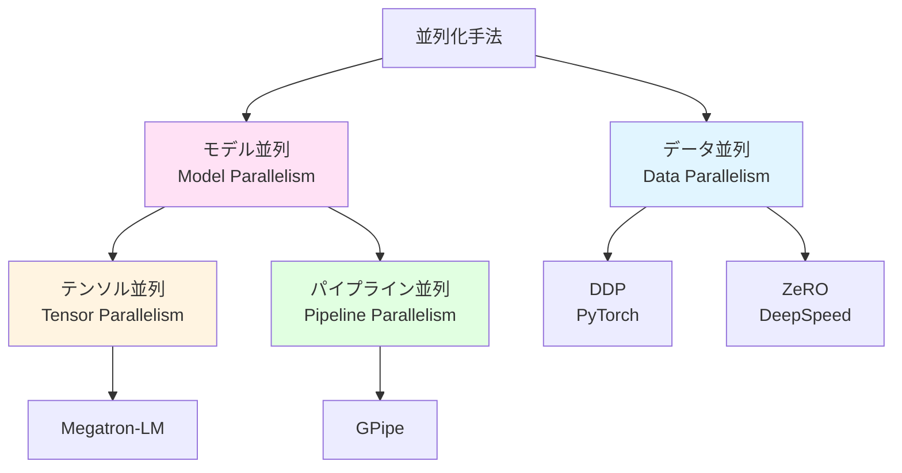
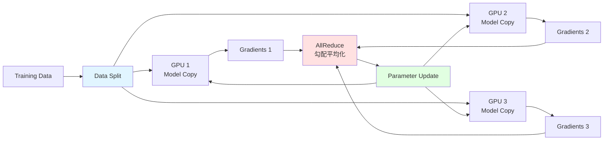
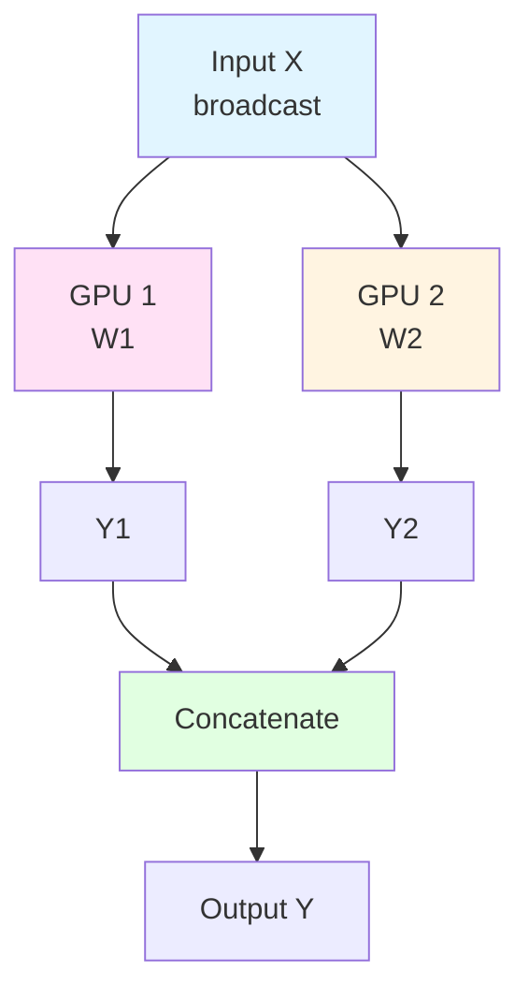
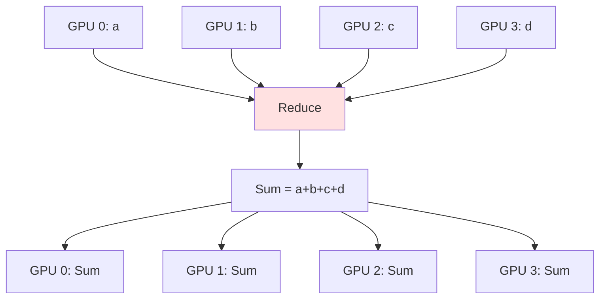

[📚 目次](../README.md) | [⬅️ 第16章](05-16-コンパイラ最適化とDSL設計.md) | [➡️ 第18章](05-18-セキュリティと信頼性.md)

---

# 第 14 章　分散・クラスタ対応

この章では、複数のGPUやノードを使った分散学習の技術を学びます。データ並列、モデル並列、Pipeline Parallelism、NCCL通信、RustでのMPI実装などを扱います。

**目的**: 大規模モデルの学習に必要な分散技術を理解し、Rustで実装できるようになります。

## 14.1 なぜ分散学習が必要か？

### スケーリングの課題

| モデル | パラメータ数 | FP32サイズ | 必要VRAM（学習時） |
|-------|------------|-----------|------------------|
| **ResNet-50** | 25M | 100 MB | ~4 GB |
| **BERT-Base** | 110M | 440 MB | ~16 GB |
| **GPT-2** | 1.5B | 6 GB | ~24 GB |
| **GPT-3** | 175B | 700 GB | ~2.8 TB |
| **Llama-2-70B** | 70B | 280 GB | ~1.12 TB |

**1枚のGPUの限界**:
- NVIDIA A100: 80 GB VRAM
- NVIDIA H100: 80 GB VRAM

→ **GPT-3以上のモデルは1枚では学習不可能**

### 並列化の種類



## 14.2 データ並列（Data Parallelism）

### 基本的なデータ並列

**アイデア**: 同じモデルを複数GPUにコピーし、異なるデータで学習



### Python（PyTorch DDP）

```python
import torch
import torch.nn as nn
import torch.distributed as dist
from torch.nn.parallel import DistributedDataParallel as DDP
from torch.utils.data.distributed import DistributedSampler

def setup(rank, world_size):
    # 分散環境初期化
    dist.init_process_group(
        backend='nccl',  # GPU通信にNCCL使用
        init_method='env://',
        world_size=world_size,
        rank=rank
    )

def cleanup():
    dist.destroy_process_group()

def train(rank, world_size):
    setup(rank, world_size)
    
    # モデル作成
    model = MyModel().to(rank)
    ddp_model = DDP(model, device_ids=[rank])
    
    # データローダー（各GPUで異なるデータ）
    dataset = MyDataset()
    sampler = DistributedSampler(
        dataset,
        num_replicas=world_size,
        rank=rank
    )
    dataloader = DataLoader(
        dataset,
        batch_size=32,
        sampler=sampler
    )
    
    optimizer = torch.optim.Adam(ddp_model.parameters())
    
    for epoch in range(10):
        sampler.set_epoch(epoch)  # シャッフル用
        
        for batch in dataloader:
            # Forward
            output = ddp_model(batch)
            loss = criterion(output, target)
            
            # Backward（自動的にAllReduceされる）
            optimizer.zero_grad()
            loss.backward()
            optimizer.step()
    
    cleanup()

# 起動（各プロセスで実行）
if __name__ == '__main__':
    world_size = 4  # 4 GPU
    torch.multiprocessing.spawn(
        train,
        args=(world_size,),
        nprocs=world_size
    )
```

### Rust での実装（MPI）

**mpi crate** を使用:

```rust
use mpi::traits::*;
use ndarray::Array2;

fn data_parallel_training() {
    let universe = mpi::initialize().unwrap();
    let world = universe.world();
    let rank = world.rank();
    let size = world.size();
    
    println!("Rank {} of {}", rank, size);
    
    // モデル初期化（全ランクで同じ初期値）
    let mut model = Model::new();
    
    // データ分割（各ランクで異なるデータ）
    let data = load_data_shard(rank, size);
    
    for epoch in 0..10 {
        let mut local_grads = Array2::zeros((784, 10));
        
        // ローカル勾配計算
        for batch in &data {
            let grad = model.backward(batch);
            local_grads = local_grads + grad;
        }
        
        // AllReduce で勾配平均化
        let mut global_grads = Array2::zeros((784, 10));
        world.all_reduce_into(
            local_grads.as_slice().unwrap(),
            global_grads.as_slice_mut().unwrap(),
            mpi::collective::SystemOperation::sum(),
        );
        
        global_grads = global_grads / size as f32;
        
        // パラメータ更新（全ランクで同じ）
        model.update(&global_grads, 0.01);
    }
}
```

### ZeRO（Zero Redundancy Optimizer）

**ZeRO** [^1] は、DeepSpeed で提案されたメモリ効率的なデータ並列手法です。

[^1]: Rajbhandari, S., et al. (2020). "ZeRO: Memory Optimizations Toward Training Trillion Parameter Models." SC20.

**3つのステージ**:

| ステージ | 分割対象 | メモリ削減 | 通信オーバーヘッド |
|---------|---------|-----------|-----------------|
| **ZeRO-1** | Optimizer States | 4x | 低 |
| **ZeRO-2** | + Gradients | 8x | 中 |
| **ZeRO-3** | + Parameters | $N$x | 高 |

**Python（DeepSpeed）**:

```python
import deepspeed

# DeepSpeed設定
ds_config = {
    "train_batch_size": 32,
    "gradient_accumulation_steps": 1,
    "optimizer": {
        "type": "Adam",
        "params": {"lr": 0.001}
    },
    "zero_optimization": {
        "stage": 3,  # ZeRO-3
        "offload_optimizer": {
            "device": "cpu"  # Optimizer状態をCPUに
        },
        "offload_param": {
            "device": "cpu"  # パラメータをCPUに
        }
    }
}

# モデル初期化
model_engine, optimizer, _, _ = deepspeed.initialize(
    model=model,
    model_parameters=model.parameters(),
    config=ds_config
)

# 学習ループ
for batch in dataloader:
    loss = model_engine(batch)
    model_engine.backward(loss)
    model_engine.step()
```

## 14.3 Pipeline Parallelism（パイプライン並列）

### 基本的なパイプライン並列

**アイデア**: モデルを層ごとに複数GPUに分割

```mermaid
graph LR
    Input[Input] --> GPU1[GPU 1<br/>Layer 1-5]
    GPU1 --> GPU2[GPU 2<br/>Layer 6-10]
    GPU2 --> GPU3[GPU 3<br/>Layer 11-15]
    GPU3 --> GPU4[GPU 4<br/>Layer 16-20]
    GPU4 --> Output[Output]
    
    Output --> Loss[Loss]
    Loss --> BW4[Backward<br/>GPU 4]
    BW4 --> BW3[Backward<br/>GPU 3]
    BW3 --> BW2[Backward<br/>GPU 2]
    BW2 --> BW1[Backward<br/>GPU 1]
    
    style GPU1 fill:#e1f5ff
    style GPU2 fill:#ffe1f5
    style GPU3 fill:#fff4e1
    style GPU4 fill:#e1ffe1
```



**問題点**: GPUアイドル時間（バブル）

### GPipe: マイクロバッチでバブルを削減

**GPipe** [^2] は、バッチをマイクロバッチに分割してパイプライン化します。

[^2]: Huang, Y., et al. (2019). "GPipe: Efficient Training of Giant Neural Networks using Pipeline Parallelism." NeurIPS.

```mermaid
gantt
    title Pipeline Parallelism with Micro-batches
    dateFormat X
    axisFormat %L
    
    section GPU 1
    F1 :f1, 0, 1
    F2 :f2, 1, 1
    F3 :f3, 2, 1
    F4 :f4, 3, 1
    B1 :b1, 7, 1
    B2 :b2, 8, 1
    B3 :b3, 9, 1
    B4 :b4, 10, 1
    
    section GPU 2
    F1 :f5, 1, 1
    F2 :f6, 2, 1
    F3 :f7, 3, 1
    F4 :f8, 4, 1
    B1 :b5, 6, 1
    B2 :b6, 7, 1
    B3 :b7, 8, 1
    B4 :b8, 9, 1
    
    section GPU 3
    F1 :f9, 2, 1
    F2 :f10, 3, 1
    F3 :f11, 4, 1
    F4 :f12, 5, 1
    B1 :b9, 5, 1
    B2 :b10, 6, 1
    B3 :b11, 7, 1
    B4 :b12, 8, 1
```



**Python（PyTorch PipelineParallel）**:

```python
from torch.distributed.pipeline.sync import Pipe

# モデルを層に分割
class Model(nn.Module):
    def __init__(self):
        super().__init__()
        self.layer1 = nn.Sequential(*[layer for i in range(5)])   # GPU 0
        self.layer2 = nn.Sequential(*[layer for i in range(5)])   # GPU 1
        self.layer3 = nn.Sequential(*[layer for i in range(5)])   # GPU 2
        self.layer4 = nn.Sequential(*[layer for i in range(5)])   # GPU 3
    
    def forward(self, x):
        x = self.layer1(x)
        x = self.layer2(x)
        x = self.layer3(x)
        x = self.layer4(x)
        return x

model = Model()

# パイプライン化
model = Pipe(
    model,
    chunks=8,  # マイクロバッチ数
    balance=[5, 5, 5, 5],  # 各GPUの層数
    devices=[0, 1, 2, 3]
)

# 学習
for batch in dataloader:
    output = model(batch).local_value()  # パイプライン実行
    loss = criterion(output, target)
    loss.backward()
```

## 14.4 Tensor Parallelism（テンソル並列）

### Megatron-LM のテンソル並列

**Megatron-LM** [^3] は、Transformer の行列演算を複数GPUに分割します。

[^3]: Shoeybi, M., et al. (2019). "Megatron-LM: Training Multi-Billion Parameter Language Models Using Model Parallelism." arXiv:1909.08053

**行列乗算の分割**:

$$
Y = XW
$$

を2つのGPUに分割:

$$
\begin{align}
Y_1 &= X W_1 \quad \text{(GPU 1)} \\
Y_2 &= X W_2 \quad \text{(GPU 2)} \\
Y &= [Y_1 | Y_2]
\end{align}
$$



**Python 実装例**:

```python
import torch
import torch.distributed as dist

class ColumnParallelLinear(nn.Module):
    """列方向に分割された線形層"""
    def __init__(self, in_features, out_features, world_size):
        super().__init__()
        assert out_features % world_size == 0
        self.out_features_per_partition = out_features // world_size
        
        self.weight = nn.Parameter(
            torch.empty(self.out_features_per_partition, in_features)
        )
        self.bias = nn.Parameter(
            torch.empty(self.out_features_per_partition)
        )
    
    def forward(self, x):
        # ローカル計算
        output = F.linear(x, self.weight, self.bias)
        return output

class RowParallelLinear(nn.Module):
    """行方向に分割された線形層"""
    def __init__(self, in_features, out_features, world_size):
        super().__init__()
        assert in_features % world_size == 0
        self.in_features_per_partition = in_features // world_size
        
        self.weight = nn.Parameter(
            torch.empty(out_features, self.in_features_per_partition)
        )
        self.bias = nn.Parameter(torch.empty(out_features))
    
    def forward(self, x):
        # ローカル計算
        output = F.linear(x, self.weight)
        
        # AllReduce で結果を集約
        dist.all_reduce(output, op=dist.ReduceOp.SUM)
        
        # バイアスは1回だけ加算
        if dist.get_rank() == 0:
            output = output + self.bias
        
        return output
```

## 14.5 NCCL と集団通信

### NCCL（NVIDIA Collective Communications Library）

**NCCL** [^4] は、GPU間の高速通信ライブラリです。

[^4] NCCL. https://developer.nvidia.com/nccl

**主要な集団通信操作**:

#### AllReduce

全GPUで値を集約し、結果を全GPUに配布:

$$
\text{AllReduce}([a_0, a_1, a_2, a_3]) = [a_0 + a_1 + a_2 + a_3, ...]
$$



**Python**:

```python
import torch.distributed as dist

tensor = torch.tensor([rank], device='cuda')
dist.all_reduce(tensor, op=dist.ReduceOp.SUM)
# rank=0,1,2,3 → すべて6になる
```

#### AllGather

全GPUのデータを収集:

```mermaid
graph TD
    GPU0[GPU 0: a] --> Gather[Gather]
    GPU1[GPU 1: b] --> Gather
    GPU2[GPU 2: c] --> Gather
    GPU3[GPU 3: d] --> Gather
    
    Gather --> Out0[GPU 0: [a,b,c,d]]
    Gather --> Out1[GPU 1: [a,b,c,d]]
    Gather --> Out2[GPU 2: [a,b,c,d]]
    Gather --> Out3[GPU 3: [a,b,c,d]]
```

**Python**:

```python
tensor = torch.tensor([rank], device='cuda')
tensor_list = [torch.zeros(1, device='cuda') for _ in range(world_size)]
dist.all_gather(tensor_list, tensor)
# tensor_list = [0, 1, 2, 3]
```

#### Reduce-Scatter

集約して分散:

```mermaid
graph TD
    GPU0[GPU 0: [a0,a1,a2,a3]] --> RS[Reduce-Scatter]
    GPU1[GPU 1: [b0,b1,b2,b3]] --> RS
    GPU2[GPU 2: [c0,c1,c2,c3]] --> RS
    GPU3[GPU 3: [d0,d1,d2,d3]] --> RS
    
    RS --> Out0[GPU 0: a0+b0+c0+d0]
    RS --> Out1[GPU 1: a1+b1+c1+d1]
    RS --> Out2[GPU 2: a2+b2+c2+d2]
    RS --> Out3[GPU 3: a3+b3+c3+d3]
```

### Rust での NCCL 使用

**nccl-sys** crate を使用:

```rust
use nccl_sys::*;
use std::ptr;

unsafe fn nccl_allreduce_example() {
    let device_count = 4;
    let mut comms: Vec<ncclComm_t> = vec![ptr::null_mut(); device_count];
    
    // NCCL 初期化
    ncclCommInitAll(
        comms.as_mut_ptr(),
        device_count as i32,
        (0..device_count as i32).collect::<Vec<_>>().as_ptr(),
    );
    
    // 各GPU上でAllReduce
    for rank in 0..device_count {
        let mut data = vec![rank as f32; 1000];
        
        // AllReduce実行
        ncclAllReduce(
            data.as_ptr() as *const _,
            data.as_mut_ptr() as *mut _,
            data.len(),
            ncclDataType_t::ncclFloat,
            ncclRedOp_t::ncclSum,
            comms[rank],
            ptr::null_mut(),
        );
    }
    
    // クリーンアップ
    for comm in comms {
        ncclCommDestroy(comm);
    }
}
```

## 14.6 RPC・gRPC によるノード通信

### gRPC for Rust

**tonic** crate でgRPCサーバ/クライアント:

```rust
// proto ファイル定義
// distributed_training.proto
syntax = "proto3";

service ParameterServer {
    rpc PushGradients(GradientRequest) returns (EmptyResponse);
    rpc PullParameters(EmptyRequest) returns (ParameterResponse);
}

message GradientRequest {
    repeated float gradients = 1;
    int32 worker_id = 2;
}

message ParameterResponse {
    repeated float parameters = 1;
}
```

**サーバ実装**:

```rust
use tonic::{transport::Server, Request, Response, Status};

pub struct ParameterServerImpl {
    parameters: Arc<RwLock<Vec<f32>>>,
}

#[tonic::async_trait]
impl ParameterServer for ParameterServerImpl {
    async fn push_gradients(
        &self,
        request: Request<GradientRequest>,
    ) -> Result<Response<EmptyResponse>, Status> {
        let req = request.into_inner();
        let mut params = self.parameters.write().unwrap();
        
        // 勾配を適用（簡略化）
        for (param, grad) in params.iter_mut().zip(&req.gradients) {
            *param -= 0.01 * grad;
        }
        
        Ok(Response::new(EmptyResponse {}))
    }
    
    async fn pull_parameters(
        &self,
        _request: Request<EmptyRequest>,
    ) -> Result<Response<ParameterResponse>, Status> {
        let params = self.parameters.read().unwrap();
        
        Ok(Response::new(ParameterResponse {
            parameters: params.clone(),
        }))
    }
}

#[tokio::main]
async fn main() -> Result<(), Box<dyn std::error::Error>> {
    let addr = "0.0.0.0:50051".parse()?;
    let server = ParameterServerImpl {
        parameters: Arc::new(RwLock::new(vec![0.0; 10000])),
    };
    
    Server::builder()
        .add_service(ParameterServerServer::new(server))
        .serve(addr)
        .await?;
    
    Ok(())
}
```

**クライアント実装**:

```rust
use tonic::transport::Channel;

#[tokio::main]
async fn main() -> Result<(), Box<dyn std::error::Error>> {
    let mut client = ParameterServerClient::connect("http://127.0.0.1:50051").await?;
    
    // 勾配をプッシュ
    let request = tonic::Request::new(GradientRequest {
        gradients: vec![0.1; 10000],
        worker_id: 0,
    });
    client.push_gradients(request).await?;
    
    // パラメータをプル
    let request = tonic::Request::new(EmptyRequest {});
    let response = client.pull_parameters(request).await?;
    
    println!("Received {} parameters", response.into_inner().parameters.len());
    
    Ok(())
}
```

## 14.7 フォールトトレランスとチェックポイント

### チェックポイント保存

```rust
use serde::{Deserialize, Serialize};
use std::fs::File;
use std::io::Write;

#[derive(Serialize, Deserialize)]
struct Checkpoint {
    epoch: usize,
    parameters: Vec<f32>,
    optimizer_state: Vec<f32>,
    loss: f32,
}

impl Checkpoint {
    fn save(&self, path: &str) -> std::io::Result<()> {
        let serialized = bincode::serialize(&self)
            .map_err(|e| std::io::Error::new(std::io::ErrorKind::Other, e))?;
        let mut file = File::create(path)?;
        file.write_all(&serialized)?;
        Ok(())
    }
    
    fn load(path: &str) -> std::io::Result<Self> {
        let data = std::fs::read(path)?;
        bincode::deserialize(&data)
            .map_err(|e| std::io::Error::new(std::io::ErrorKind::Other, e))
    }
}

// 使用例
fn train_with_checkpointing() {
    for epoch in 0..100 {
        // 学習...
        
        // 定期的にチェックポイント保存
        if epoch % 10 == 0 {
            let checkpoint = Checkpoint {
                epoch,
                parameters: model.parameters(),
                optimizer_state: optimizer.state(),
                loss: current_loss,
            };
            checkpoint.save(&format!("checkpoint_epoch_{}.bin", epoch)).unwrap();
        }
    }
}
```

---

## まとめ

| 手法 | メモリ効率 | 通信量 | 実装難易度 | 用途 |
|------|-----------|--------|-----------|------|
| **Data Parallel** | 低 | 中 | 易 | 小〜中規模モデル |
| **ZeRO** | 高 | 中〜高 | 中 | 中〜大規模モデル |
| **Pipeline Parallel** | 高 | 低 | 中 | 深いモデル |
| **Tensor Parallel** | 最高 | 高 | 難 | 超大規模モデル |

**Rust の優位性**:
- **低レベル制御**: NCCL、MPIの直接制御
- **型安全**: 分散通信の型チェック
- **ゼロコピー**: 効率的なメモリ転送

**Python の優位性**:
- **エコシステム**: PyTorch DDP, DeepSpeed, Megatron
- **簡単**: 高レベルAPIで自動化

---

## 参考文献

1. Rajbhandari, S., et al. (2020). "ZeRO: Memory Optimizations Toward Training Trillion Parameter Models." SC20.
2. Huang, Y., et al. (2019). "GPipe: Efficient Training of Giant Neural Networks using Pipeline Parallelism." NeurIPS.
3. Shoeybi, M., et al. (2019). "Megatron-LM: Training Multi-Billion Parameter Language Models Using Model Parallelism." arXiv:1909.08053
4. NCCL. https://developer.nvidia.com/nccl
5. Li, M., et al. (2014). "Scaling Distributed Machine Learning with the Parameter Server." OSDI.
6. Narayanan, D., et al. (2021). "Efficient Large-Scale Language Model Training on GPU Clusters Using Megatron-LM." SC21.
7. Rasley, J., et al. (2020). "DeepSpeed: System Optimizations Enable Training Deep Learning Models with Over 100 Billion Parameters." KDD.
8. tonic (gRPC for Rust). https://github.com/hyperium/tonic
9. mpi crate. https://github.com/rsmpi/rsmpi
10. PyTorch Distributed. https://pytorch.org/tutorials/beginner/dist_overview.html
---

[📚 目次に戻る](../README.md) | [⬅️ 第16章: コンパイラ最適化とDSL設計](05-16-コンパイラ最適化とDSL設計.md) | [➡️ 第18章: セキュリティと信頼性](05-18-セキュリティと信頼性.md)